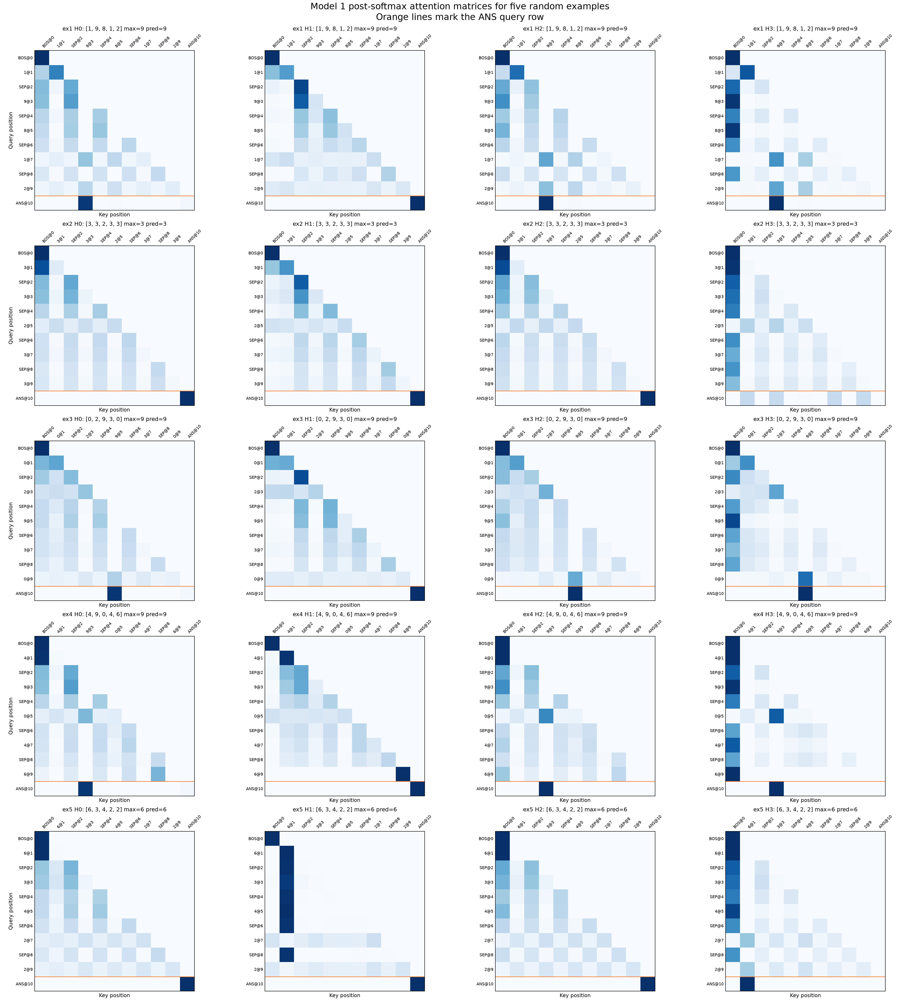
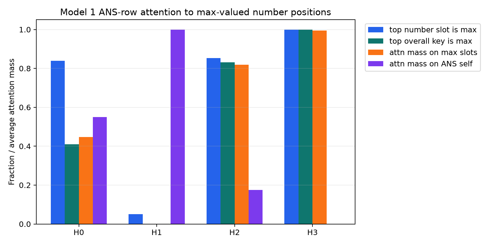
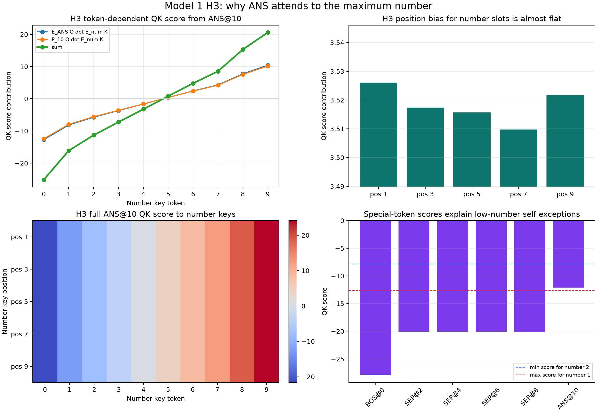

# 2026-06-29

## Model 1: Random Attention Matrices

Question:

What do the actual post-softmax attention matrices look like on concrete Model
1 examples?

Method:

Generated 5 deterministic random length-5 number lists with seed `20260629`.
For each example, ran the loaded Model 1 forward pass and plotted the returned
post-softmax attention pattern for all 4 heads. Each heatmap is `11 x 11`.

Rows are query positions and columns are key positions. The orange horizontal
lines mark the `[ANS]` query row, which is the row that matters for the max
prediction.

Repro script: `scripts/analysis/model1_random_attention_examples.py`.

Examples:

| Example | Numbers | Max | Prediction |
|---:|---|---:|---:|
| 1 | `[1, 9, 8, 1, 2]` | 9 | 9 |
| 2 | `[3, 3, 2, 3, 3]` | 3 | 3 |
| 3 | `[0, 2, 9, 3, 0]` | 9 | 9 |
| 4 | `[4, 9, 0, 4, 6]` | 9 | 9 |
| 5 | `[6, 3, 4, 2, 2]` | 6 | 6 |

Result:



The raw example metadata is saved at
[model1_random_attention_examples.json](assets/model1_random_attention_examples.json).

Initial observations:

- Head 1 often puts very high attention on `[ANS]` itself at the `[ANS]` query
  row, matching earlier evidence that it is mostly nonessential.
- Heads 0, 2, and 3 show more task-relevant source attention behavior.
- The `[ANS]` row is sparse or strongly peaked in many cases, so looking at the
  actual row values should be more informative than only the full heatmaps.

Next step:

Plot just the `[ANS]` attention row for many examples, with columns restricted
to number positions, so it is easier to see whether heads attend to the max,
high numbers, or specific positions.

## Model 1: How Often Does ANS Attend To The Max?

Question:

Does the `[ANS]` query row usually attend to a maximum-valued number token in
heads 0, 2, and 3?

Method:

Evaluated all `10^5` length-5 inputs. For each head, inspected the
post-softmax attention row at query position 10 (`[ANS]`).

Metrics:

- `top number slot is max`: among only the five number positions, whether the
  most-attended number slot has max value.
- `top overall key is max`: among all 11 positions, whether the most-attended
  key is a max-valued number position.
- `attn mass on max slots`: total attention mass assigned to all positions
  whose token equals the example maximum. This includes duplicate max tokens.
- `attn mass on ANS self`: attention mass assigned to position 10.

Repro script: `scripts/analysis/model1_ans_attention_max_stats.py`.

Result:

| Head | Top number slot is max | Top overall key is max | Avg mass on max slots | Avg mass on number slots | Avg mass on ANS self |
|---:|---:|---:|---:|---:|---:|
| 0 | 0.839200 | 0.409510 | 0.446727 | 0.449556 | 0.550444 |
| 1 | 0.050500 | 0.000000 | 0.000000 | 0.000000 | 1.000000 |
| 2 | 0.853570 | 0.831930 | 0.818654 | 0.825136 | 0.174864 |
| 3 | 1.000000 | 0.999680 | 0.995286 | 0.999841 | 0.000158 |



Raw stats:
[model1_ans_attention_max_stats.json](assets/model1_ans_attention_max_stats.json).

Interpretation:

Head 3 is the clean max-attending head: among number positions, its top
attention target is a max-valued number on every input, and its average
attention mass on max positions is `0.995286`.

Head 2 is also strongly max-biased but not perfect: its top number position is
max-valued on `85.357%` of inputs, and its top overall key is a max-valued
number on `83.193%`.

Head 0 is max-biased among number positions (`83.920%`) but puts substantial
mass on `[ANS]` itself (`0.550444` average), so its top overall key is often
not a number position.

Head 1 is not part of this behavior: it attends almost entirely to `[ANS]`
self.

Answer:

The pattern is not "always in heads 0, 2, and 3." It is basically always true
for head 3, common for head 2, and common only among number slots for head 0.

Next step:

Analyze the failure cases for heads 0 and 2: when their top number slot is not
the max, check whether they attend to second-largest values, repeated values,
or fixed positions.

## Model 1: Why Does Head 3 Attend To The Max?

Question:

What in head 3's Q and K matrices makes the `[ANS]` token attend to the
maximum-valued number?

Method:

For head 3, decomposed the runtime QK score from query `[ANS]@pos10` to a
number key `n@pos`:

```text
score(n, pos) =
  (E[ANS] @ W_Q.T) dot (E[n] @ W_K.T)
+ (P[10]  @ W_Q.T) dot (E[n] @ W_K.T)
+ (E[ANS] @ W_Q.T) dot (P[pos] @ W_K.T)
+ (P[10]  @ W_Q.T) dot (P[pos] @ W_K.T)
```

with the usual `/ sqrt(d_head)` scaling applied to each dot product.

Repro script: `scripts/analysis/model1_h3_ans_qk_decomposition.py`.

Result:



Exact values:
[model1_h3_ans_qk_decomposition.json](assets/model1_h3_ans_qk_decomposition.json).

The token-dependent part is strictly increasing in the number token:

| Number | Token-token | Position-token | Sum |
|---:|---:|---:|---:|
| 0 | -12.734412 | -12.411697 | -25.146111 |
| 1 | -8.163300 | -7.955429 | -16.118729 |
| 2 | -5.736211 | -5.589944 | -11.326155 |
| 3 | -3.667756 | -3.575244 | -7.243001 |
| 4 | -1.646724 | -1.606588 | -3.253313 |
| 5 | 0.424070 | 0.410417 | 0.834488 |
| 6 | 2.444630 | 2.378282 | 4.822911 |
| 7 | 4.329752 | 4.219590 | 8.549341 |
| 8 | 7.769526 | 7.571474 | 15.341000 |
| 9 | 10.441162 | 10.175906 | 20.617069 |

The position-dependent bias for number slots is almost constant:

| Position | Position bias |
|---:|---:|
| 1 | 3.526071 |
| 3 | 3.517399 |
| 5 | 3.515650 |
| 7 | 3.509740 |
| 9 | 3.521702 |

Special-token scores from `[ANS]@10`:

| Key | QK score |
|---|---:|
| `BOS@0` | -27.865440 |
| `SEP@2` | -20.066750 |
| `SEP@4` | -20.081558 |
| `SEP@6` | -20.097527 |
| `SEP@8` | -20.172600 |
| `ANS@10` | -12.100517 |

Interpretation:

Head 3 works because the `[ANS]@pos10` query is aligned with a key-space
direction that orders number-token keys by value. Both parts of the query
contribute:

- the token query from `E[ANS]` gives a monotonic score from `0` to `9`;
- the positional query from `P[10]` gives almost the same monotonic score from
  `0` to `9`.

The key-position terms are almost flat across the five number slots, so head 3
is mostly position-invariant over the list. At any fixed number position,
higher-valued tokens get higher QK scores. Because softmax preserves ordering,
the maximum-valued number receives the highest attention among number tokens.

The few exceptions where head 3's top overall key is `[ANS]` self happen only
when all numbers are `0` or `1`. In those cases, `ANS@10 = -12.100517` is
slightly above the score for a single `1` key, while any token `2` or above
beats `[ANS]` self.

Answer:

`W_Q` maps `[ANS]@pos10` to a query direction that tests "number magnitude,"
and `W_K` maps number token embeddings onto that same magnitude direction. The
position terms do not disrupt the ordering, so head 3 becomes an almost pure
max-selector.

Next step:

Repeat this decomposition for heads 0 and 2 to see why they are max-biased but
less clean than head 3.
