# 2026-06-30

## Model 1: ANS Query Dot Number Keys

Question:

Confirm directly whether the `[ANS]` query vector scores number-token keys in
increasing order, especially for head 3.

Method:

For each head, computed the exact score:

```text
q_h = (E[ANS] + P[10]) @ W_Q_h.T
k_h(n) = E[n] @ W_K_h.T
score_h(n) = q_h dot k_h(n) / sqrt(d_head)
```

This includes the `[ANS]` token embedding and the `[ANS]` position embedding,
because `[ANS]` is always at position 10. It intentionally does not include key
position embeddings, matching the requested confirmation: `W_K` is applied only
to the number-token embeddings `E[0]` through `E[9]`.

Repro script: `scripts/analysis/model1_ans_query_number_key_scores.py`.

Result:

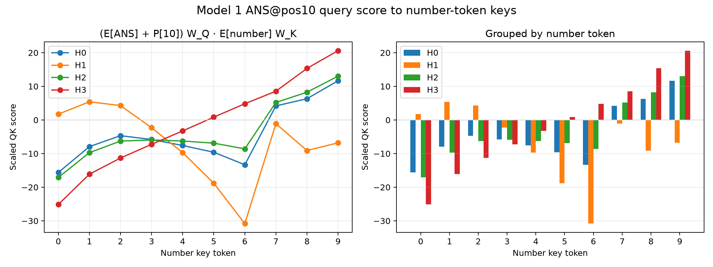

Exact values:
[model1_ans_query_number_key_scores.json](assets/model1_ans_query_number_key_scores.json).

| Number | H0 | H1 | H2 | H3 |
|---:|---:|---:|---:|---:|
| 0 | -15.616951 | 1.720255 | -17.096748 | -25.146109 |
| 1 | -7.926450 | 5.403625 | -9.712423 | -16.118729 |
| 2 | -4.675313 | 4.280929 | -6.277059 | -11.326155 |
| 3 | -5.806170 | -2.289793 | -5.935635 | -7.243000 |
| 4 | -7.592203 | -9.701243 | -6.261564 | -3.253313 |
| 5 | -9.595482 | -18.790287 | -6.894694 | 0.834487 |
| 6 | -13.316802 | -30.833551 | -8.590084 | 4.822911 |
| 7 | 4.184974 | -1.109894 | 5.206847 | 8.549342 |
| 8 | 6.315356 | -9.081999 | 8.259645 | 15.341000 |
| 9 | 11.660625 | -6.795495 | 13.028159 | 20.617067 |

Summary:

| Head | corr(score, number) | Strictly increasing? |
|---:|---:|---|
| 0 | 0.757610 | false |
| 1 | -0.490383 | false |
| 2 | 0.884629 | false |
| 3 | 0.994673 | true |

Interpretation:

Head 3 is the clean confirmation: the `[ANS]@pos10` query has a strictly
increasing dot product with number-token keys `0` through `9`. This means that,
ignoring key-position terms, head 3's QK circuit directly implements a
number-magnitude ordering.

Heads 0 and 2 also prefer high tokens overall, especially `7`, `8`, and `9`,
but they are not monotonic across all numbers. Head 1 is not aligned with the
max-attending behavior.

Next step:

Add the key-position embeddings back in for heads 0, 2, and 3 and compare the
full `[ANS]@pos10 -> number@position` QK score surfaces side by side.

## Model 1: QK Self-Threshold Plot

Question:

Can we see each head's number-recruitment threshold directly by plotting
`[ANS]` query dot number keys, with the `[ANS]` self-key score as a horizontal
line?

Method:

For each head, used the actual `[ANS]@pos10` query:

```text
q_h = (E[ANS] + P[10]) @ W_Q_h.T
```

Then plotted token-only number-key scores:

```text
score_h(n) = q_h dot (E[n] @ W_K_h.T) / sqrt(d_head)
```

against the actual `[ANS]@pos10` self-key threshold:

```text
self_h = q_h dot ((E[ANS] + P[10]) @ W_K_h.T) / sqrt(d_head)
```

Repro script: `scripts/analysis/model1_ans_qk_threshold_plot.py`.

Result:

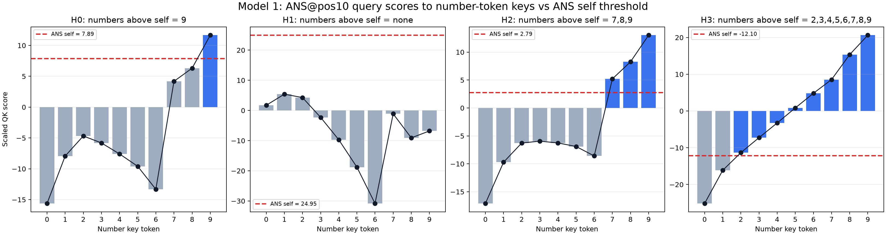

Exact values:
[model1_ans_qk_threshold_plot.json](assets/model1_ans_qk_threshold_plot.json).

| Head | `[ANS]` self score | Number keys above self |
|---:|---:|---|
| H0 | 7.890304 | `9` |
| H1 | 24.950905 | none |
| H2 | 2.794378 | `7, 8, 9` |
| H3 | -12.100517 | `2, 3, 4, 5, 6, 7, 8, 9` |

Interpretation:

This is the QK-side reason for the staircase recruitment pattern:

```text
H3 crosses [ANS] self for 2..9.
H2 crosses [ANS] self for 7..9.
H0 crosses [ANS] self only for 9.
H1 never crosses [ANS] self.
```

So each head has an effective number threshold. A head attends to a number when
that number's key score beats the head's `[ANS]` self-key score. The full
attention behavior includes small key-position terms and softmax, but the
token-only threshold plot already explains the observed switch points.

Next step:

Plot the matching OV-side logit contributions for these recruited reads:
H3 reading `2..9`, H2 reading `7..9`, and H0 reading `9`.

## Model 1: W_V Number Value Norms And Angles

Question:

For each head, what structure appears in the ten value vectors:

```text
value_h(n) = E[n] @ W_V_h.T        # 1 x 16
```

Do their norms increase with number value? What angles do the ten value vectors
make with each other?

Method:

Used token-only number embeddings, excluding position embeddings. For each
head, computed the `10 x 16` matrix:

```text
V_h = E_numbers @ W_V_h.T
```

Then measured:

- L2 norm of each row `V_h[n]`;
- pairwise cosine and angle between each pair of rows.

Repro script: `scripts/analysis/model1_wv_value_norms_angles.py`.

Result:

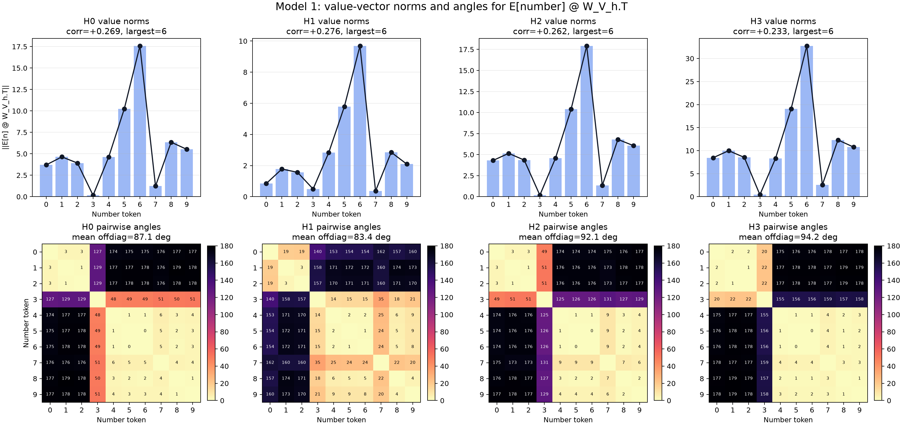

Exact values:
[model1_wv_value_norms_angles.json](assets/model1_wv_value_norms_angles.json).

Summary:

| Head | corr(norm, number) | Largest-norm token | Smallest-norm token | Mean adjacent angle | Mean off-diag angle | Norm order, descending |
|---:|---:|---:|---:|---:|---:|---|
| H0 | +0.268755 | 6 | 3 | 21.420002 | 87.062347 | `6-5-8-9-1-4-2-0-7-3` |
| H1 | +0.276308 | 6 | 7 | 27.296728 | 83.436523 | `6-5-8-4-9-1-2-0-3-7` |
| H2 | +0.261573 | 6 | 3 | 22.094742 | 92.113052 | `6-5-8-9-1-4-2-0-7-3` |
| H3 | +0.232704 | 6 | 3 | 20.972075 | 94.196785 | `6-5-8-9-1-2-0-4-7-3` |

Value-vector norms:

| Number | H0 | H1 | H2 | H3 |
|---:|---:|---:|---:|---:|
| 0 | 3.704523 | 0.844833 | 4.300997 | 8.448741 |
| 1 | 4.638824 | 1.776477 | 5.148234 | 9.980194 |
| 2 | 3.920006 | 1.562922 | 4.347740 | 8.525043 |
| 3 | 0.158924 | 0.491881 | 0.176936 | 0.420453 |
| 4 | 4.614099 | 2.828136 | 4.571043 | 8.311018 |
| 5 | 10.242005 | 5.782251 | 10.389660 | 19.077124 |
| 6 | 17.580301 | 9.687391 | 17.916973 | 32.736969 |
| 7 | 1.232402 | 0.366823 | 1.339622 | 2.576250 |
| 8 | 6.353718 | 2.851942 | 6.801573 | 12.317195 |
| 9 | 5.518601 | 2.092402 | 6.060476 | 10.764711 |

Interpretation:

The value-vector norms are not numerically ordered. Token `6` has the largest
value norm in every head, and token `3` is nearly zero in heads 0, 2, and 3.
The norm/number correlation is only weakly positive.

The pairwise angles show more structure than the norms:

- In heads 0, 2, and 3, tokens `0, 1, 2` are nearly collinear.
- Tokens `4, 5, 6, 7, 8, 9` are also nearly collinear, though with very
  different norms.
- Those two groups are close to opposite directions, often around
  `175-179` degrees apart.
- Token `3` is a small-norm intermediate/outlier between the two directions.

So `W_V` is not representing number magnitude by a simple increasing norm. It
mostly maps number embeddings onto a near-1D signed value axis: low numbers on
one side, high-ish numbers on the other side, with token `3` near the center.
The exact answer still depends on how these 16d value vectors are read through
each head's `W_O` slice and then projected onto the unembedding directions.

Next step:

Plot the OV-logit effect:

```text
(E[n] @ W_V_h.T) @ W_O_h.T @ W_U.T
```

to see how this value-axis geometry becomes logit corrections for each output
digit.

## Model 1: Per-Head OV Logit Effects

Question:

If a head's `[ANS]` row one-hot attends to a source number `n`, what direct
effect does that head have on the output-number logits?

Method:

For each head and each source number `n`, computed the isolated head output:

```text
value_h(n) = E[n] @ W_V_h.T                         # 1 x 16
head_out_h(n) = value_h(n) @ W_O_h.T                # 1 x 64
logit_effect_h(n) = head_out_h(n) @ W_U_numbers.T   # 1 x 10
```

Also computed a position-aware version by replacing `E[n]` with
`E[n] + P[pos]` for number positions `1, 3, 5, 7, 9`, then averaging the logit
effects over those positions.

This is not the full model prediction. It is the direct logit contribution of
one isolated head read.

Repro script: `scripts/analysis/model1_head_ov_logit_effects.py`.

Result:

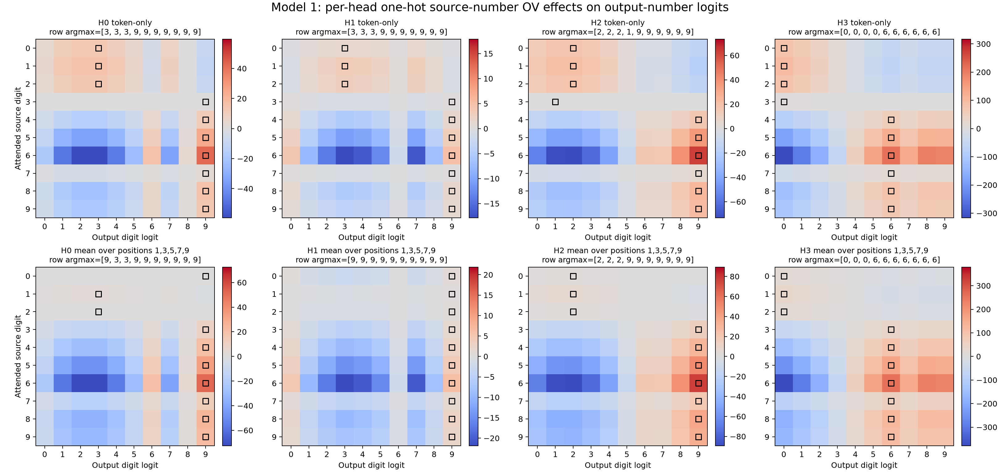

Exact values:
[model1_head_ov_logit_effects.json](assets/model1_head_ov_logit_effects.json).

Each row is the source number being attended to. Each column is an output digit
logit. The black square marks the largest logit contribution in that row.

Row argmax output digit for token-only effects:

| Source digit | H0 | H1 | H2 | H3 |
|---:|---:|---:|---:|---:|
| 0 | 3 | 3 | 2 | 0 |
| 1 | 3 | 3 | 2 | 0 |
| 2 | 3 | 3 | 2 | 0 |
| 3 | 9 | 9 | 1 | 0 |
| 4 | 9 | 9 | 9 | 6 |
| 5 | 9 | 9 | 9 | 6 |
| 6 | 9 | 9 | 9 | 6 |
| 7 | 9 | 9 | 9 | 6 |
| 8 | 9 | 9 | 9 | 6 |
| 9 | 9 | 9 | 9 | 6 |

Row argmax output digit after averaging over number positions:

| Source digit | H0 | H1 | H2 | H3 |
|---:|---:|---:|---:|---:|
| 0 | 9 | 9 | 2 | 0 |
| 1 | 3 | 9 | 2 | 0 |
| 2 | 3 | 9 | 2 | 0 |
| 3 | 9 | 9 | 9 | 6 |
| 4 | 9 | 9 | 9 | 6 |
| 5 | 9 | 9 | 9 | 6 |
| 6 | 9 | 9 | 9 | 6 |
| 7 | 9 | 9 | 9 | 6 |
| 8 | 9 | 9 | 9 | 6 |
| 9 | 9 | 9 | 9 | 6 |

Selected recruited-read token-only effects:

| Head | Source read | Largest pushed output logit | Largest logit effect |
|---:|---:|---:|---:|
| H3 | 2 | 0 | 82.324158 |
| H3 | 3 | 0 | 3.684890 |
| H3 | 4 | 6 | 54.092918 |
| H3 | 5 | 6 | 124.168526 |
| H3 | 6 | 6 | 213.082428 |
| H3 | 7 | 6 | 16.722696 |
| H3 | 8 | 6 | 80.140724 |
| H3 | 9 | 6 | 69.987602 |
| H2 | 7 | 9 | 4.717655 |
| H2 | 8 | 9 | 24.033039 |
| H2 | 9 | 9 | 21.429199 |
| H0 | 9 | 9 | 13.316565 |

Interpretation:

This confirms why isolated H3 did not decode the correct answer. H3's direct OV
effect is not "read source digit `n`, write output digit `n`." For most
recruited source digits, H3 pushes the output-`6` direction. For source `2` and
`3`, token-only H3 instead pushes output `0`, although the position-averaged
source `3` effect shifts to output `6`.

H2 and H0 are also not exact decoders. When H2 reads `7, 8, 9`, its isolated
largest effect is output `9`. When H0 reads `9`, it also pushes output `9`.

So the OV side looks like logit correction features rather than standalone
answers:

```text
H3 max-read: broad low/mid-vs-high feature, often strongest on output 6.
H2 high max-read: top-end correction, strongest on output 9.
H0 max-9 read: additional 9-specific correction.
```

The final exact digit comes from summing residual stream plus all head outputs,
not from any single head's isolated OV effect.

Next step:

For each true max value, plot the summed logit contributions from:

```text
residual, H0, H1, H2, H3, final sum
```

under the verified attention abstraction table.

## Model 1: Example-Level 7-vs-6 Margin Decomposition

Question:

When the true max changes from `6` to `7`, does H2's recruitment create the
`logit[7] - logit[6]` margin?

Method:

Used ten fixed examples:

- five examples with true max `6`;
- five examples with true max `7`.

For each example, decomposed the final `[ANS]` residual into:

```text
final_vec = ans_resid + H0_vec + H1_vec + H2_vec + H3_vec
```

where each `Hh_vec` includes that head's output slice:

```text
Hh_vec = (attn_h[ANS, :] @ V_h) @ W_O_h.T
```

Then projected each component into number-logit space and measured:

```text
margin_7v6(component) = component_logit[7] - component_logit[6]
```

Repro script: `scripts/analysis/model1_margin_7v6_examples.py`.

Result:

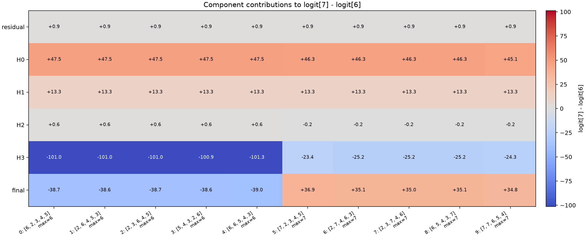

Exact values:
[model1_margin_7v6_examples.json](assets/model1_margin_7v6_examples.json).

Average `logit[7] - logit[6]` margin over the five examples in each group:

| True max | residual | H0 | H1 | H2 | H3 | final |
|---:|---:|---:|---:|---:|---:|---:|
| 6 | +0.919425 | +47.482788 | +13.285652 | +0.639893 | -101.037308 | -38.709526 |
| 7 | +0.919425 | +46.033485 | +13.285652 | -0.182287 | -24.664097 | +35.392178 |

Attention summary:

| True max | H0 top | H1 top | H2 top | H3 top |
|---:|---|---|---|---|
| 6 | `[ANS]` | `[ANS]` | `[ANS]` | max `6` |
| 7 | `[ANS]` | `[ANS]` | max `7` | max `7` |

Interpretation:

This falsifies the first simple guess. H2's recruitment at max `7` is not what
directly creates a positive `7-vs-6` margin in these examples. H2 contributes
near zero to this specific margin and is slightly negative when it reads max
`7`.

The actual `7-vs-6` flip in these examples is mostly:

```text
H0 + H1 provide a stable positive margin favoring 7 over 6.
H3 reading 6 gives a very large negative 7-vs-6 margin.
H3 reading 7 gives a much less negative 7-vs-6 margin.
The stable H0/H1 positive baseline then wins, making final 7-vs-6 positive.
```

So H3 is still central for the `6 -> 7` boundary, but not by directly favoring
`7`; rather, its anti-`7`/pro-`6` contribution becomes much weaker when it reads
`7` instead of `6`.

Next step:

Run the same component-margin decomposition for other decision boundaries,
especially:

```text
8-vs-7
9-vs-8
true-vs-runner-up for every true max
```

H2 may matter more for another competing logit than for `7-vs-6`.

## Model 1: H3 ANS Self Score vs Number Keys

Question:

For head 3, how does the `[ANS]@pos10` self-key score compare to the number-key
scores?

Method:

Used the same `[ANS]@pos10` query as above:

```text
q = (E[ANS] + P[10]) @ W_Q_3.T
```

Compared the self-key score:

```text
q dot ((E[ANS] + P[10]) @ W_K_3.T) / sqrt(d_head)
```

against number-key scores both without and with key-position embeddings:

```text
q dot (E[n] @ W_K_3.T) / sqrt(d_head)
q dot ((E[n] + P[pos]) @ W_K_3.T) / sqrt(d_head)
```

Repro script: `scripts/analysis/model1_h3_ans_self_vs_numbers.py`.

Result:

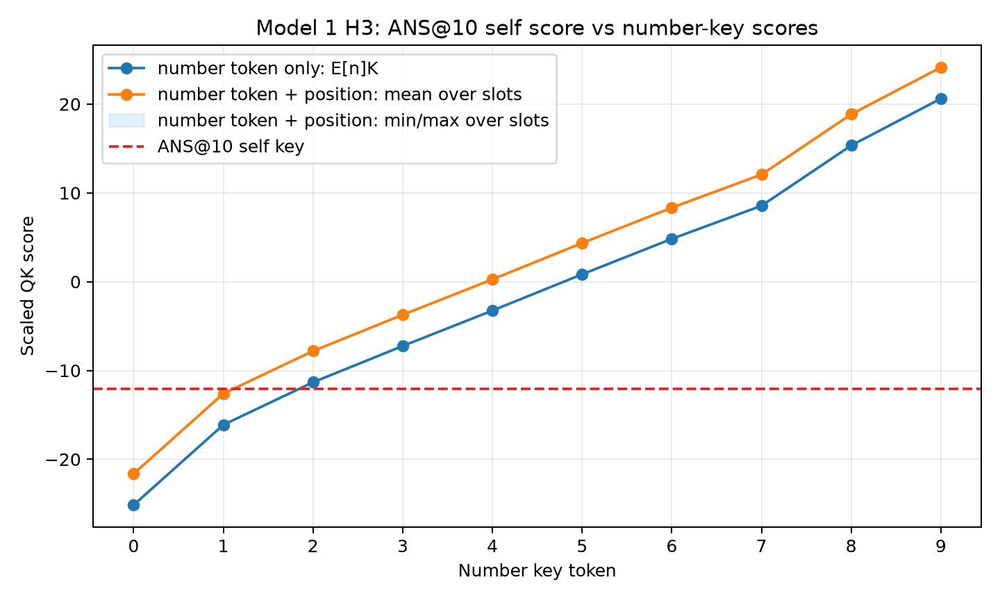

Exact values:
[model1_h3_ans_self_vs_numbers.json](assets/model1_h3_ans_self_vs_numbers.json).

The `[ANS]@10` self-key score is:

```text
-12.100517
```

Token-only number-key scores:

| Number | Score |
|---:|---:|
| 0 | -25.146111 |
| 1 | -16.118729 |
| 2 | -11.326155 |
| 3 | -7.243001 |
| 4 | -3.253313 |
| 5 | 0.834488 |
| 6 | 4.822910 |
| 7 | 8.549341 |
| 8 | 15.340998 |
| 9 | 20.617069 |

With number-key position embeddings included, averaged over positions
`1, 3, 5, 7, 9`:

| Number | Mean full score |
|---:|---:|
| 0 | -21.627996 |
| 1 | -12.600615 |
| 2 | -7.808042 |
| 3 | -3.724888 |
| 4 | 0.264799 |
| 5 | 4.352599 |
| 6 | 8.341023 |
| 7 | 12.067453 |
| 8 | 18.859110 |
| 9 | 24.135181 |

Interpretation:

Head 3's `[ANS]` self score beats number keys `0` and `1`, but any number key
`2` or higher beats `[ANS]` self. This holds both for token-only number keys
and for full number keys with position embeddings.

This explains the rare head-3 exceptions from the exhaustive attention check:
when all input numbers are only `0` and `1`, `[ANS]` self can be the highest
attention key. When any number `2` or higher is present, that number beats
`[ANS]` self and head 3 attends to the maximum-valued number.

Next step:

For heads 0 and 2, make the same self-vs-number comparison to understand why
they are less clean max-attenders than head 3.

## Model 1: Only The ANS Query Row Matters For ANS Logits

Question:

For the one-layer Model 1 circuit, can we ignore non-`[ANS]` attention query
rows when explaining the final `[ANS]` prediction?

Method:

Tested all `8^5 = 32768` inputs where every number is `>= 2`. In a manual
forward pass, zeroed either:

- every non-`[ANS]` query-position attention output before `W_O`; or
- the `[ANS]` query-position attention output before `W_O`.

Then compared final logits at position 10 (`[ANS]`).

Repro script: `scripts/analysis/model1_ans_query_output_dependency.py`.

Result:

| Intervention | Max abs diff in final `[ANS]` logits | Accuracy |
|---|---:|---:|
| none | 0.000000 vs baseline | 1.000000 |
| zero non-`[ANS]` query outputs | 0.000000 | 1.000000 |
| zero `[ANS]` query output | 314.322601 | 0.141937 |

Interpretation:

For Model 1, yes: when explaining the final prediction at `[ANS]`, only the
last row of the attention pattern matters. The non-last query rows do not
contribute to the final `[ANS]` residual stream or logits.

The previous tokens still matter as keys and values in the last row:

```text
ANS attention output = sum_j attn[ANS, j] * value[j]
```

But the outputs computed for earlier query positions are irrelevant to the
final `[ANS]` logits in this one-layer model.

Important caveat:

This is specific to Model 1's single-layer architecture. In a multi-layer
transformer, non-last query outputs in earlier layers can affect later-layer
keys and values, so they can matter indirectly.

Next step:

For inputs with all numbers `>= 2`, explain the model using only each head's
`[ANS]` attention row, value vectors at source positions, and the per-head
`W_O` slice.

## Model 1: H3 One-Hot Attention To The Max Token

Question:

If head 3's `[ANS]` attention is essentially one-hot on the maximum token, what
does that head write through `W_V` and its `W_O` slice?

Method:

Used a concrete all-`>=2` example:

```text
nums = [6, 8, 4, 7, 5]
tokens = [BOS, 6, SEP, 8, SEP, 4, SEP, 7, SEP, 5, ANS]
max = 8 at token position 3
```

For each head at `[ANS]`, the relevant computation is:

```text
value_j^h = (E[token_j] + P[j]) @ W_V_h.T
head_value_h = sum_j attn_h[ANS, j] * value_j^h        # 1 x 16
head_out_h = head_value_h @ W_O_h.T                    # 1 x 64
```

For head 3, compared the actual attention-weighted value to a one-hot
intervention that puts all attention on the max token position.

Repro script: `scripts/analysis/model1_onehot_h3_example.py`.

Result:

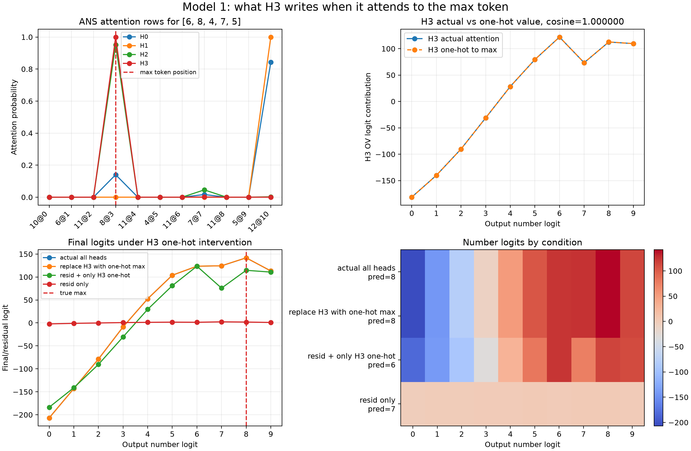

Exact values:
[model1_onehot_h3_example.json](assets/model1_onehot_h3_example.json).

Head 3 actual attention to the max position:

```text
0.998859
```

Cosine between actual H3 value vector and one-hot-to-max H3 value vector:

```text
1.000000
```

Final predictions under conditions:

| Condition | Prediction |
|---|---:|
| actual all heads | 8 |
| replace H3 with one-hot max | 8 |
| residual + only H3 one-hot | 6 |
| residual only | 7 |

Interpretation:

For this example, head 3 really is reading almost exactly the max token. Its
actual value vector is essentially identical to the value vector produced by a
one-hot attention pattern on the max position.

However, head 3 alone does not select the exact answer. `residual + only H3
one-hot` predicts `6`, not `8`. H3 writes a strong high-number signal, but the
exact final winner is produced by combining H3 with the other heads. Replacing
actual H3 attention by one-hot max attention barely changes the final logits,
which confirms that H3's role on this input is well approximated as "read the
max token, write its head-specific OV signal."

Answer:

For all-`>=2` inputs, we can analyze head 3 by focusing on the last attention
row. When that row is one-hot or nearly one-hot on the max token, the head's
value path reduces to:

```text
head3_out ~= ((E[max_token] + P[max_position]) @ W_V_3.T) @ W_O_3.T
```

This is only head 3's contribution. The full model sums this with heads 0, 1,
and 2 plus the original `[ANS]` residual stream before unembedding.

Next step:

Compute the per-head logit contribution decomposition on many all-`>=2` inputs:
residual-only logits, each head's `[ANS]` OV logits, and the final sum.

## Model 1: Does H3 OV Alone Decode The Max?

Question:

If head 3's `[ANS]` attention reads the max-valued token for inputs where every
number is `>= 2`, does head 3's OV contribution alone decode to the correct
answer after unembedding?

Method:

Evaluated all `8^5 = 32768` inputs where every number is in `2..9`. For head 3
at the `[ANS]` query row, computed:

```text
V_3[j] = (E[token_j] + P[j]) @ W_V_3.T
H3 actual OV = (attn_3[ANS, :] @ V_3) @ W_O_3.T
H3 one-hot OV = V_3[p_max] @ W_O_3.T
```

where `p_max` is a max-valued number position. If the max appears multiple
times, `p_max` is the max-valued position receiving the largest head-3 attention
mass. Then projected the resulting `1 x 64` vector onto the number
unembeddings.

Also compared `residual + H3` and the full model with actual H3 replaced by the
one-hot max value.

Repro script: `scripts/analysis/model1_h3_ov_logit_accuracy.py`.

Result:

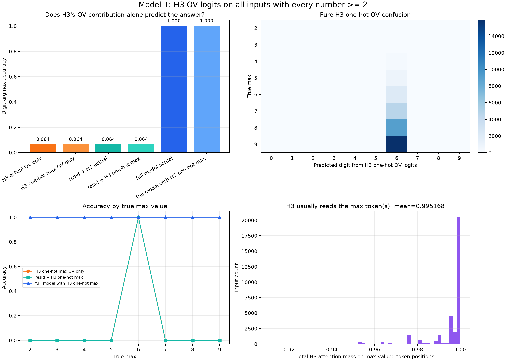

Exact values:
[model1_h3_ov_logit_accuracy.json](assets/model1_h3_ov_logit_accuracy.json).

| Condition | Digit argmax accuracy |
|---|---:|
| H3 actual OV only | 0.064117 |
| H3 one-hot max OV only | 0.064117 |
| residual + H3 actual | 0.064117 |
| residual + H3 one-hot max | 0.064117 |
| full model actual | 1.000000 |
| full model with H3 one-hot max | 1.000000 |

Head 3 attention is still doing the max-read:

| Metric | Value |
|---|---:|
| H3 top key is a max token | 32768 / 32768 |
| Mean H3 attention mass on max-valued positions | 0.995168 |
| Minimum H3 attention mass on max-valued positions | 0.911304 |

Pure H3 one-hot OV logits are correct only when the true max is `6`. For every
input with true max `3` through `9`, the digit argmax of the pure H3 OV logits
is `6`; for the single all-`2` input, it is `0`.

Representative examples:

| Numbers | True max | H3 one-hot OV pred | residual + H3 one-hot pred | Full pred |
|---|---:|---:|---:|---:|
| `[6, 8, 4, 7, 5]` | 8 | 6 | 6 | 8 |
| `[2, 3, 4, 5, 6]` | 6 | 6 | 6 | 6 |
| `[9, 2, 3, 4, 5]` | 9 | 6 | 6 | 9 |
| `[7, 7, 2, 3, 4]` | 7 | 6 | 6 | 7 |
| `[2, 2, 2, 2, 2]` | 2 | 0 | 0 | 2 |

Interpretation:

The proposed computation is correct as a tensor path:

```text
max token residual -> W_V_3 -> 16d value -> W_O_3 -> 64d residual contribution
-> W_U -> vocab logits
```

But that isolated H3 OV path is not a complete answer decoder. H3 reliably
finds the max-valued token, and replacing actual H3 attention with one-hot
max-token attention leaves the full model at 100% accuracy. However, the H3
residual contribution by itself mostly unembeds as digit `6`.

So head 3's role is better described as: "read the max token and write a
head-specific max/high-number feature." The exact answer is produced only after
combining this with heads 0 and 2 plus the original `[ANS]` residual stream.

Next step:

Decompose logits by true max value for residual, H0, H2, and H3 to see how the
other components move the generic H3 signal into the exact output digit.

## Model 1: ANS Attention To Max Tokens By True Max

Question:

Is max-token attention split by number value across heads? For each head, when
the true max is `i`, what percentage of the `[ANS]` attention row goes to
number positions containing `i`?

Method:

Evaluated all `10^5 = 100000` possible inputs. For each input and head, measured
the `[ANS]` query row after softmax. The metric is:

```text
sum_j attn_h[ANS, j] for number positions j where token_j == true_max
```

If the max appears multiple times, this sums attention over all repeated max
positions. Also recorded whether the top overall attended key is a max-token
position.

Repro script: `scripts/analysis/model1_ans_attention_by_true_max.py`.

Result:

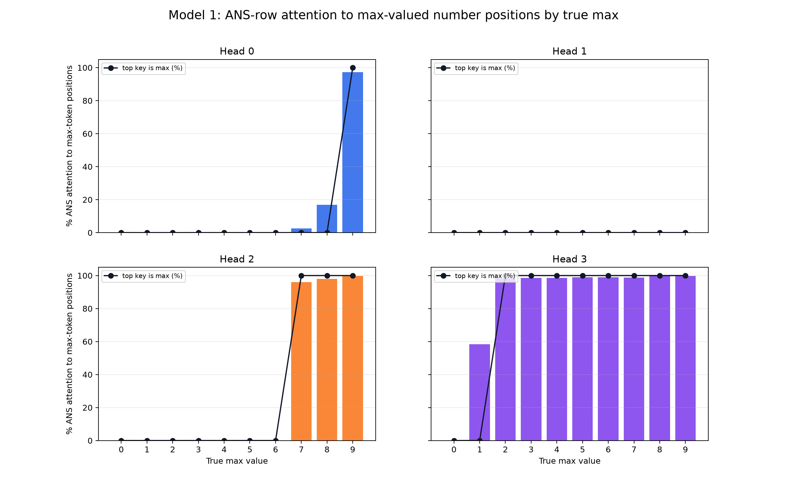

Exact values:
[model1_ans_attention_by_true_max.json](assets/model1_ans_attention_by_true_max.json).

Average percentage of `[ANS]` attention mass assigned to max-valued number
positions:

| True max | Count | H0 | H1 | H2 | H3 |
|---:|---:|---:|---:|---:|---:|
| 0 | 1 | 0.000000 | 0.000000 | 0.000002 | 0.036350 |
| 1 | 31 | 0.000028 | 0.000000 | 0.001785 | 58.398777 |
| 2 | 211 | 0.000542 | 0.000000 | 0.041188 | 98.239672 |
| 3 | 781 | 0.000149 | 0.000000 | 0.049466 | 98.511112 |
| 4 | 2101 | 0.000023 | 0.000000 | 0.032406 | 98.651844 |
| 5 | 4651 | 0.000003 | 0.000000 | 0.016118 | 98.956186 |
| 6 | 9031 | 0.000000 | 0.000000 | 0.002823 | 99.002731 |
| 7 | 15961 | 2.481152 | 0.000000 | 96.002436 | 98.861617 |
| 8 | 26281 | 16.832253 | 0.000000 | 97.901541 | 99.950784 |
| 9 | 40951 | 97.318691 | 0.000000 | 99.657506 | 99.803072 |

Fraction of inputs where the top overall `[ANS]` key is a max-token position:

| True max | H0 | H1 | H2 | H3 |
|---:|---:|---:|---:|---:|
| 0 | 0.000000 | 0.000000 | 0.000000 | 0.000000 |
| 1 | 0.000000 | 0.000000 | 0.000000 | 0.000000 |
| 2 | 0.000000 | 0.000000 | 0.000000 | 1.000000 |
| 3 | 0.000000 | 0.000000 | 0.000000 | 1.000000 |
| 4 | 0.000000 | 0.000000 | 0.000000 | 1.000000 |
| 5 | 0.000000 | 0.000000 | 0.000000 | 1.000000 |
| 6 | 0.000000 | 0.000000 | 0.000000 | 1.000000 |
| 7 | 0.000000 | 0.000000 | 1.000000 | 1.000000 |
| 8 | 0.000000 | 0.000000 | 1.000000 | 1.000000 |
| 9 | 1.000000 | 0.000000 | 1.000000 | 1.000000 |

Interpretation:

Yes, the heads are number-specialized on the attention side:

- H3 is the broad max-attender for true max `2..9`.
- H2 becomes a clean max-attender only for true max `7..9`.
- H0 becomes a clean max-attender only for true max `9`, with some partial
  mass for max `8`.
- H1 does not attend to max-token positions.

For max `0` and max `1`, no head's top overall key is a max token. H3 still
puts substantial total mass on max-valued positions for true max `1`, but the
top key remains something else, usually `[ANS]` self from the earlier low-value
case check. The low-count rows also matter: true max `0` has only one input,
and true max `1` has only 31 inputs.

Next step:

For each true max value, decompose final logits into residual, H0, H2, and H3
contributions. The attention pattern suggests that H3 handles broad max
detection, H2 specializes in high values `7..9`, and H0 specializes in `9`.

## Model 1: One-Hot Replacements For The Other Heads

Question:

When H3 reads the max but is not enough to decode the exact answer, what are H0
and H2 reading? Can we replace their `[ANS]` attention rows by one-hot vectors,
as we did for H3, and preserve final accuracy?

Method:

Evaluated all `8^5 = 32768` inputs where every number is in `2..9`. For each
head, grouped the `[ANS]` attention row by destination:

- max-valued number positions;
- non-max number positions;
- `[ANS]` self;
- `[BOS]`/`[SEP]` positions.

Then tested one-hot replacements at the `[ANS]` row:

- `H3 max one-hot`: replace only H3 by one-hot to a max-token position.
- `H0/H2 top + H3 max one-hot`: replace H0 and H2 by one-hot to their actual
  top key, replace H3 by one-hot to a max-token position, keep H1 actual.
- `all heads top one-hot`: replace every head by one-hot to that head's actual
  top key.
- `H0/H2/H3 max one-hot`: force H0, H2, and H3 to one-hot attend to a
  max-token position, keep H1 actual.
- `only H3 max one-hot`: ablate H0 and H2, keep H1 actual, and replace H3 by
  one-hot to a max-token position.

Repro script: `scripts/analysis/model1_other_heads_onehot_interventions.py`.

Result:

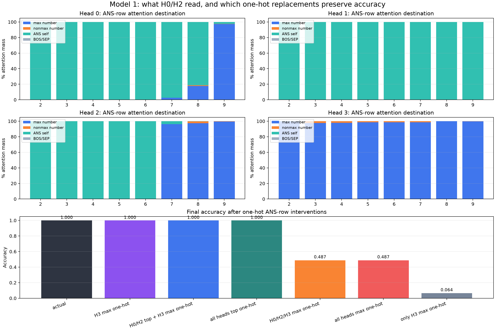

Exact values:
[model1_other_heads_onehot_interventions.json](assets/model1_other_heads_onehot_interventions.json).

Final accuracy:

| Condition | Accuracy |
|---|---:|
| actual | 1.000000 |
| H3 max one-hot | 1.000000 |
| H0/H2 top + H3 max one-hot | 1.000000 |
| all heads top one-hot | 1.000000 |
| H0/H2/H3 max one-hot | 0.487122 |
| all heads max one-hot | 0.487091 |
| only H3 max one-hot | 0.064148 |

Average `[ANS]` attention destinations by true max:

| Head | True max range | Main destination |
|---:|---|---|
| H0 | `2..8` | mostly `[ANS]` self |
| H0 | `9` | max-valued number positions |
| H1 | `2..9` | `[ANS]` self |
| H2 | `2..6` | mostly `[ANS]` self |
| H2 | `7..9` | max-valued number positions |
| H3 | `2..9` | max-valued number positions |

Exact average destination percentages:

| Head | True max | Max number | Non-max number | `[ANS]` self | `[BOS]/[SEP]` |
|---:|---:|---:|---:|---:|---:|
| H0 | 2 | 0.001413 | 0.000000 | 99.998581 | 0.000000 |
| H0 | 3 | 0.000235 | 0.000684 | 99.999077 | 0.000000 |
| H0 | 4 | 0.000029 | 0.000576 | 99.999390 | 0.000000 |
| H0 | 5 | 0.000003 | 0.000436 | 99.999557 | 0.000000 |
| H0 | 6 | 0.000000 | 0.000343 | 99.999649 | 0.000000 |
| H0 | 7 | 2.685550 | 0.000275 | 97.314178 | 0.000000 |
| H0 | 8 | 17.612795 | 0.988533 | 81.398674 | 0.000000 |
| H0 | 9 | 97.345161 | 0.247435 | 2.407413 | 0.000000 |
| H1 | 2..9 | 0.000000 | 0.000000 | 100.000000 | 0.000000 |
| H2 | 2 | 0.107233 | 0.000000 | 99.892769 | 0.000000 |
| H2 | 3 | 0.077849 | 0.051877 | 99.870277 | 0.000000 |
| H2 | 4 | 0.041803 | 0.079498 | 99.878700 | 0.000000 |
| H2 | 5 | 0.018955 | 0.082239 | 99.898811 | 0.000000 |
| H2 | 6 | 0.003158 | 0.074632 | 99.922218 | 0.000000 |
| H2 | 7 | 96.202789 | 0.002504 | 3.794706 | 0.000000 |
| H2 | 8 | 97.410957 | 2.401747 | 0.187287 | 0.000000 |
| H2 | 9 | 99.577141 | 0.421185 | 0.001666 | 0.000000 |
| H3 | 2 | 99.726967 | 0.000000 | 0.272670 | 0.000365 |
| H3 | 3 | 97.749428 | 2.239928 | 0.010629 | 0.000014 |
| H3 | 4 | 97.981461 | 2.018278 | 0.000268 | 0.000000 |
| H3 | 5 | 98.518799 | 1.481195 | 0.000005 | 0.000000 |
| H3 | 6 | 98.650406 | 1.349601 | 0.000000 | 0.000000 |
| H3 | 7 | 98.517044 | 1.482953 | 0.000000 | 0.000000 |
| H3 | 8 | 99.937653 | 0.062353 | 0.000000 | 0.000000 |
| H3 | 9 | 99.756569 | 0.243429 | 0.000000 | 0.000000 |

Interpretation:

H0 and H2 are not always extra max-readers. They are conditional:

- For lower maxima, H0 and H2 mostly read `[ANS]` itself.
- For high maxima, H2 switches to reading max-valued positions at `7..9`.
- H0 switches strongly only at `9`, with partial max attention at `8`.
- H1 is a pure self-reader in this regime.

The one-hot intervention confirms the right abstraction. It is possible to
replace the attention patterns by one-hot vectors and preserve 100% accuracy,
but the one-hot target must be each head's actual top key. Forcing H0 and H2 to
read the max token is wrong and drops accuracy to about 48.7%.

So H0/H2 help by writing their own OV contributions from whichever source their
QK circuits select. Sometimes that source is the max token, but often it is
`[ANS]` self. Their self-read outputs act like conditional/default logit
corrections that combine with H3's max-token feature.

Next step:

Inspect the OV logits written by H0 and H2 when they read `[ANS]` self versus
when they read a max token. This should show how the self-read default and
high-number max-read corrections combine with H3.

## Model 1: Low/Mid Max One-Hot Scheme

!!! success "Key result: exact one-hot attention circuit for max 2..6"

    On all `3125` inputs with numbers in `2..6`, the following one-hot
    attention scheme preserves perfect accuracy:

    ```text
    H0 -> [ANS] self
    H1 -> [ANS] self
    H2 -> [ANS] self
    H3 -> max-valued number token
    ```

    ```text
    actual model:   3125 / 3125
    one-hot scheme: 3125 / 3125
    ```

    This is the first fully specified attention-level subcircuit for the
    low/mid max regime. It says H3 supplies the max-token read, while H0/H1/H2
    supply self-read/default OV contributions.

Question:

For true max `2..6`, is the simple attention scheme exactly:

```text
H0 -> [ANS] self
H1 -> [ANS] self
H2 -> [ANS] self
H3 -> max-valued number token
```

And if so, does replacing those `[ANS]` attention rows by one-hot vectors keep
the model correct?

Method:

Evaluated all `5^5 = 3125` inputs where every number is in `2..6`. This is
equivalent to the all-`>=2` subset whose true max is in `2..6`.

Intervention:

```text
H0 one-hot to [ANS] position 10
H1 one-hot to [ANS] position 10
H2 one-hot to [ANS] position 10
H3 one-hot to a max-valued number position
```

Then passed each head's resulting `1 x 16` value through its own `W_O` slice,
summed heads plus the original `[ANS]` residual stream, and unembedded.

Repro script: `scripts/analysis/model1_low_mid_onehot_scheme.py`.

Exact values:
[model1_low_mid_onehot_scheme.json](assets/model1_low_mid_onehot_scheme.json).

Result:

| Metric | Value |
|---|---:|
| Inputs | 3125 |
| Actual model accuracy | 3125 / 3125 |
| One-hot scheme accuracy | 3125 / 3125 |
| Max abs digit-logit difference vs actual | 9.156006 |

Top-key rates:

| Check | Rate |
|---|---:|
| H0 top key is `[ANS]` | 1.000000 |
| H1 top key is `[ANS]` | 1.000000 |
| H2 top key is `[ANS]` | 1.000000 |
| H3 top key is a max token | 1.000000 |

Average attention mass:

| Destination | Avg mass |
|---|---:|
| H0 on `[ANS]` | 0.999996 |
| H1 on `[ANS]` | 1.000000 |
| H2 on `[ANS]` | 0.999129 |
| H3 on max-valued number positions | 0.985637 |

Accuracy by true max:

| True max | Count | Actual acc | One-hot acc |
|---:|---:|---:|---:|
| 2 | 1 | 1.000000 | 1.000000 |
| 3 | 31 | 1.000000 | 1.000000 |
| 4 | 211 | 1.000000 | 1.000000 |
| 5 | 781 | 1.000000 | 1.000000 |
| 6 | 2101 | 1.000000 | 1.000000 |

Interpretation:

Yes. For the true-max `2..6` regime, the simplified attention circuit is exactly
correct at the level of top keys and sufficient for 100% accuracy:

```text
H0/H1/H2 read [ANS] self, H3 reads the max token.
```

Replacing those attention rows by one-hot vectors preserves 100% accuracy. The
logits are not identical to the real model, but the correct digit remains the
argmax for every input in this subset.

Next step:

Analyze the `2..6` regime as a two-part output circuit: H0/H1/H2 write
self-read default vectors, while H3 writes the max-token vector.

## Model 1: High Max One-Hot Schemes

!!! success "Key result: conditional one-hot attention circuit for max 7..9"

    On all `29643` all-`>=2` inputs whose true max is `7`, `8`, or `9`, this
    conditional one-hot scheme preserves perfect accuracy:

    ```text
    true max 7: H0 -> [ANS], H1 -> [ANS], H2 -> max token, H3 -> max token
    true max 8: H0 -> [ANS], H1 -> [ANS], H2 -> max token, H3 -> max token
    true max 9: H0 -> max token, H1 -> [ANS], H2 -> max token, H3 -> max token
    ```

    ```text
    actual model:               29643 / 29643
    high conditional one-hot:   29643 / 29643
    all heads top-key one-hot:  29643 / 29643
    ```

    H2 and H3 are max-readers throughout the high regime. H0 is the switch:
    it reads `[ANS]` for true max `7` and `8`, then reads the max token for
    true max `9`.

Question:

For the high-max regime `7..9`, what does `[ANS]` attend to in each head, and
can the attention rows be replaced by one-hot vectors while preserving accuracy?

Method:

Evaluated all all-`>=2` inputs with true max in `7..9`:

```text
true max 7 count = 4651
true max 8 count = 9031
true max 9 count = 15961
total = 29643
```

Tested these one-hot interventions at the `[ANS]` row:

- `high_conditional_onehot`: H0 reads `[ANS]` for max `7/8` and max token for
  max `9`; H1 reads `[ANS]`; H2/H3 read max token.
- `all_heads_top_onehot`: every head reads its actual top key.
- `force_h0_self_h2_h3_max`: H0/H1 read `[ANS]`; H2/H3 read max token.
- `force_h0_h2_h3_max`: H0/H2/H3 read max token; H1 reads `[ANS]`.

Repro script: `scripts/analysis/model1_high_max_onehot_scheme.py`.

Exact values:
[model1_high_max_onehot_scheme.json](assets/model1_high_max_onehot_scheme.json).

Result:

| Condition | Accuracy |
|---|---:|
| actual | 29643 / 29643 |
| high conditional one-hot | 29643 / 29643 |
| all heads top-key one-hot | 29643 / 29643 |
| force H0 self, H2/H3 max | 13682 / 29643 |
| force H0/H2/H3 max | 15961 / 29643 |

Accuracy by true max:

| Condition | Max 7 | Max 8 | Max 9 |
|---|---:|---:|---:|
| high conditional one-hot | 4651 / 4651 | 9031 / 9031 | 15961 / 15961 |
| all heads top-key one-hot | 4651 / 4651 | 9031 / 9031 | 15961 / 15961 |
| force H0 self, H2/H3 max | 4651 / 4651 | 9031 / 9031 | 0 / 15961 |
| force H0/H2/H3 max | 0 / 4651 | 0 / 9031 | 15961 / 15961 |

Top-key rates:

| Check | Max 7 | Max 8 | Max 9 |
|---|---:|---:|---:|
| H0 top key is `[ANS]` | 1.000000 | 1.000000 | 0.000000 |
| H0 top key is max token | 0.000000 | 0.000000 | 1.000000 |
| H1 top key is `[ANS]` | 1.000000 | 1.000000 | 1.000000 |
| H2 top key is max token | 1.000000 | 1.000000 | 1.000000 |
| H3 top key is max token | 1.000000 | 1.000000 | 1.000000 |

Average attention mass:

| Destination | Max 7 | Max 8 | Max 9 |
|---|---:|---:|---:|
| H0 on `[ANS]` | 0.973142 | 0.813987 | 0.024074 |
| H0 on max token(s) | 0.026856 | 0.176128 | 0.973451 |
| H1 on `[ANS]` | 1.000000 | 1.000000 | 1.000000 |
| H2 on max token(s) | 0.962028 | 0.974110 | 0.995771 |
| H3 on max token(s) | 0.985170 | 0.999376 | 0.997566 |

Interpretation:

The high regime has two subcircuits:

```text
max 7/8: H0 and H1 read [ANS]; H2 and H3 read max.
max 9:   H1 reads [ANS]; H0, H2, and H3 read max.
```

The intervention confirms that this is not just descriptive. The conditional
one-hot scheme is sufficient for 100% accuracy. Forcing H0 to the wrong source
breaks the corresponding subrange: H0 self works for `7/8` but fails for `9`;
H0 max works for `9` but fails for `7/8`.

Next step:

Compare the OV logits for H0 self-read versus H0 max-read. H0 appears to be the
explicit `9` detector/correction head.

## Model 1: Low 0/1 Scheme And Complete Attention Table

!!! warning "Key result: max 1 is not captured by a pure one-hot H3 replacement"

    For max `1`, every head's top key is `[ANS]`, but replacing H3 by one-hot
    attention to `[ANS]` fails:

    ```text
    low 0/1 actual model:                         32 / 32
    low 0/1 H0/H1/H2 -> [ANS], H3 actual soft:    32 / 32
    low 0/1 all heads top-key one-hot:             1 / 32
    low 0/1 H3 top-key one-hot, others actual:     1 / 32
    low 0/1 H3 max one-hot, others [ANS]:          0 / 32

    full 0..9 input space, complete table with H3 soft for max 1: 100000 / 100000
    full 0..9 input space, pure one-hot H3 for max 1:             99969 / 100000
    ```

    So max `1` is different from max `2..9`: H3's soft attention mixture is
    behaviorally important. H3's top key is `[ANS]`, but it also places
    substantial total mass on max-valued `1` positions.

Question:

Can the same one-hot attention abstraction be extended to true max `0` and `1`?
And what is the complete table of `[ANS]` attention destinations by true max?

Method:

Evaluated all `2^5 = 32` inputs where every number is either `0` or `1`:

```text
true max 0 count = 1
true max 1 count = 31
```

Tested one-hot replacements of the `[ANS]` query row:

- all heads one-hot to `[ANS]`;
- all heads one-hot to their actual top key;
- H0/H1/H2 one-hot to `[ANS]`, H3 one-hot to a max token;
- H0/H1/H2 one-hot to `[ANS]`, H3 kept at its actual soft attention output.

Repro script: `scripts/analysis/model1_low01_onehot_scheme.py`.

Full-space verification script:
`scripts/analysis/model1_complete_attention_scheme.py`.

Exact values:
[model1_low01_onehot_scheme.json](assets/model1_low01_onehot_scheme.json).

Full-space exact values:
[model1_complete_attention_scheme.json](assets/model1_complete_attention_scheme.json).

Result for max `0/1`:

| Condition | Overall | Max 0 | Max 1 |
|---|---:|---:|---:|
| actual | 32 / 32 | 1 / 1 | 31 / 31 |
| H0/H1/H2 `[ANS]` one-hot, H3 actual soft | 32 / 32 | 1 / 1 | 31 / 31 |
| H3 top one-hot, other heads actual | 1 / 32 | 1 / 1 | 0 / 31 |
| all heads `[ANS]` one-hot | 1 / 32 | 1 / 1 | 0 / 31 |
| all heads top-key one-hot | 1 / 32 | 1 / 1 | 0 / 31 |
| H3 max one-hot, others `[ANS]` | 0 / 32 | 0 / 1 | 0 / 31 |
| all heads max one-hot | 1 / 32 | 1 / 1 | 0 / 31 |

Full-space verification over all `10^5 = 100000` possible inputs:

| Condition | Overall | Failing true-max rows |
|---|---:|---|
| actual | 100000 / 100000 | none |
| complete piecewise table, with H3 actual soft for max `1` | 100000 / 100000 | none |
| pure one-hot table, H3 -> `[ANS]` for max `1` | 99969 / 100000 | max `1`: 0 / 31 |
| pure one-hot table, H3 -> max token for max `1` | 99969 / 100000 | max `1`: 0 / 31 |

Top-key rates:

| Check | Max 0 | Max 1 |
|---|---:|---:|
| H0 top key is `[ANS]` | 1.000000 | 1.000000 |
| H1 top key is `[ANS]` | 1.000000 | 1.000000 |
| H2 top key is `[ANS]` | 1.000000 | 1.000000 |
| H3 top key is `[ANS]` | 1.000000 | 1.000000 |
| Any head top key is max token | 0.000000 | 0.000000 |

Average attention mass:

| Destination | Max 0 | Max 1 |
|---|---:|---:|
| H0 on `[ANS]` | 1.000000 | 1.000000 |
| H1 on `[ANS]` | 1.000000 | 1.000000 |
| H2 on `[ANS]` | 1.000000 | 0.999982 |
| H3 on `[ANS]` | 0.998301 | 0.415376 |
| H3 on max-valued positions | 0.000364 | 0.583988 |

Complete attention abstraction by true max, verified on all `100000` inputs:

| True max | Count in full input space | H0 `[ANS]` attends to | H1 `[ANS]` attends to | H2 `[ANS]` attends to | H3 `[ANS]` attends to | Verified replacement |
|---:|---:|---|---|---|---|---|
| 0 | 1 | `[ANS]` | `[ANS]` | `[ANS]` | `[ANS]` | all-head one-hot works |
| 1 | 31 | `[ANS]` | `[ANS]` | `[ANS]` | soft mix: `[ANS]` + max-`1` positions | H0/H1/H2 one-hot, H3 actual soft works; pure H3 one-hot fails |
| 2 | 211 | `[ANS]` | `[ANS]` | `[ANS]` | max token | one-hot works |
| 3 | 781 | `[ANS]` | `[ANS]` | `[ANS]` | max token | one-hot works |
| 4 | 2101 | `[ANS]` | `[ANS]` | `[ANS]` | max token | one-hot works |
| 5 | 4651 | `[ANS]` | `[ANS]` | `[ANS]` | max token | one-hot works |
| 6 | 9031 | `[ANS]` | `[ANS]` | `[ANS]` | max token | one-hot works |
| 7 | 15961 | `[ANS]` | `[ANS]` | max token | max token | one-hot works |
| 8 | 26281 | `[ANS]` | `[ANS]` | max token | max token | one-hot works |
| 9 | 40951 | max token | `[ANS]` | max token | max token | one-hot works |

Interpretation:

The clean one-hot abstraction covers max `0` and max `2..9`, but max `1` is the
exception. For max `1`, H3's top key is still `[ANS]`, yet its soft attention
places about `58.4%` total mass on max-valued `1` positions. Collapsing H3 to a
single one-hot destination loses the behavior needed to distinguish max `1`.

Thus the current attention-level picture is:

```text
max 0:   all heads read [ANS]
max 1:   H0/H1/H2 read [ANS], H3 needs a soft [ANS] + max-token mixture
max 2-6: H0/H1/H2 read [ANS], H3 reads max
max 7-8: H0/H1 read [ANS], H2/H3 read max
max 9:   H1 reads [ANS], H0/H2/H3 read max
```

Next step:

Analyze H3's value output on max-`1` inputs as a function of its soft mixture
between `[ANS]` and max-valued `1` positions.

## Model 1: Do Other Heads Handle The 0/1 H3 Self Cases?

Question:

When head 3 attends most to `[ANS]` self on all-`0/1` inputs, do heads 0 or 2
instead attend to the max-valued number?

Method:

Evaluated all `2^5 = 32` inputs where every number is either `0` or `1`.
Measured the `[ANS]` query row after softmax for all heads.

Repro script: `scripts/analysis/model1_low01_attention.py`.

Result:

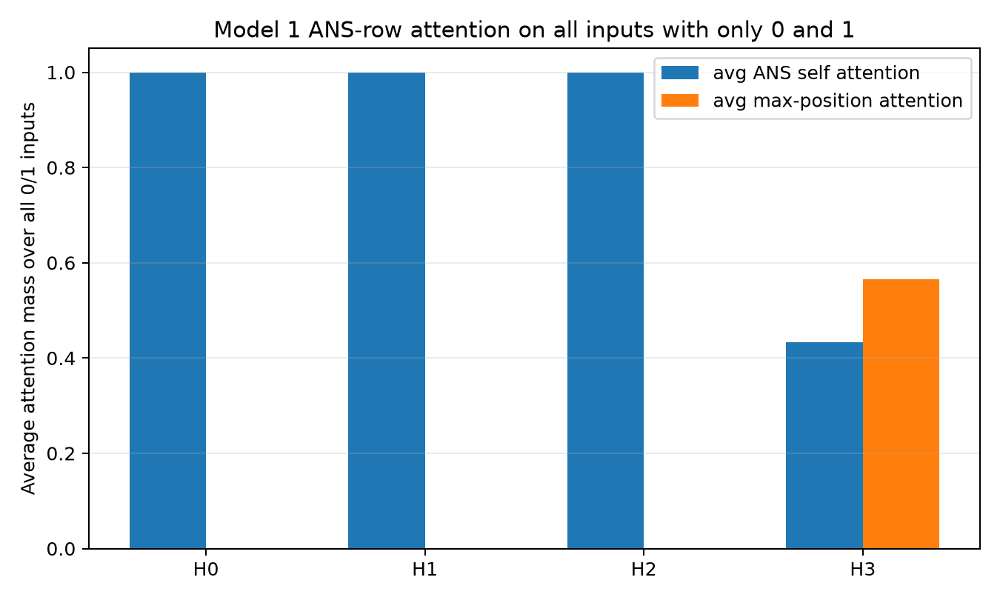

Exact values:
[model1_low01_attention.json](assets/model1_low01_attention.json).

| Head | Avg `[ANS]` self mass | Avg max-position mass | Top overall key is max count |
|---:|---:|---:|---:|
| 0 | 1.000000 | 0.000000 | 0 / 32 |
| 1 | 1.000000 | 0.000000 | 0 / 32 |
| 2 | 0.999983 | 0.000017 | 0 / 32 |
| 3 | 0.433592 | 0.565749 | 0 / 32 |

The model still predicts all 32 cases correctly.

Interpretation:

The hypothesis is false for attention: on all-`0/1` inputs, heads 0 and 2 do
not rescue head 3 by attending to the max. They also attend almost entirely to
`[ANS]` self. Head 3 still assigns nontrivial mass to max positions, but its
top key is also `[ANS]` self.

Therefore low-number cases must be solved by something other than "another
head directly attends to the max number." Likely explanations include:

- the residual stream at `[ANS]` already biases logits toward `0`/`1`;
- self-attention through `[ANS]` writes a useful default low-number output;
- OV effects from small residual attention mass are enough because the
  decision boundary between `0` and `1` is simple.

Next step:

Analyze logits for the all-`0/1` cases by decomposing residual stream,
self-attention, and each head's contribution at `[ANS]`.
