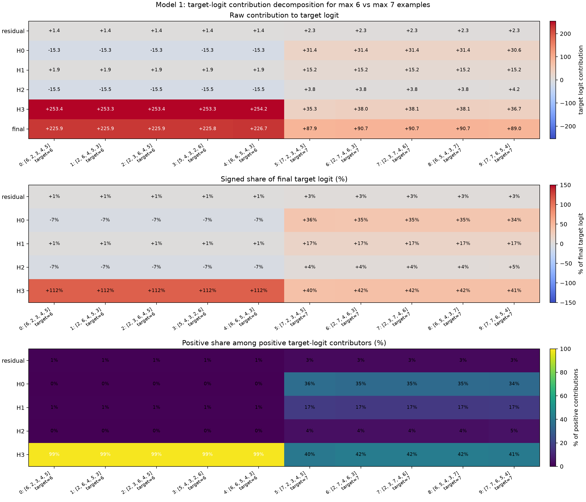
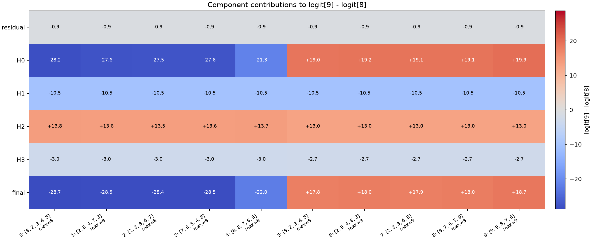
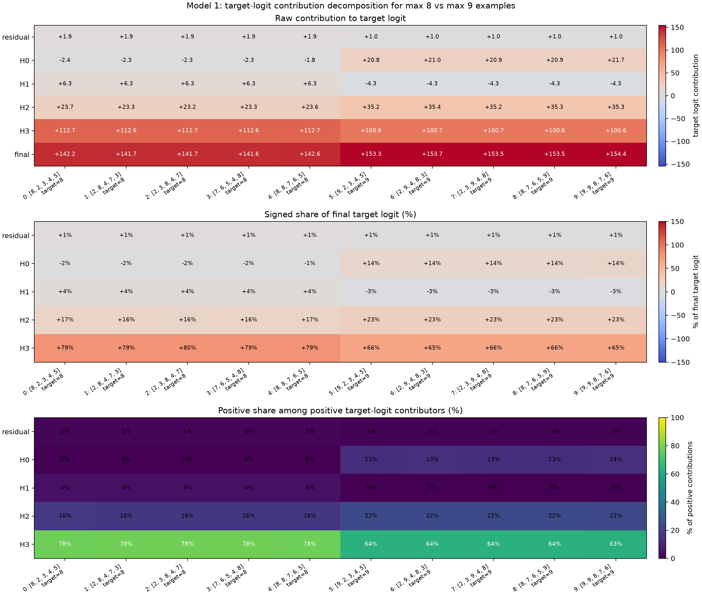
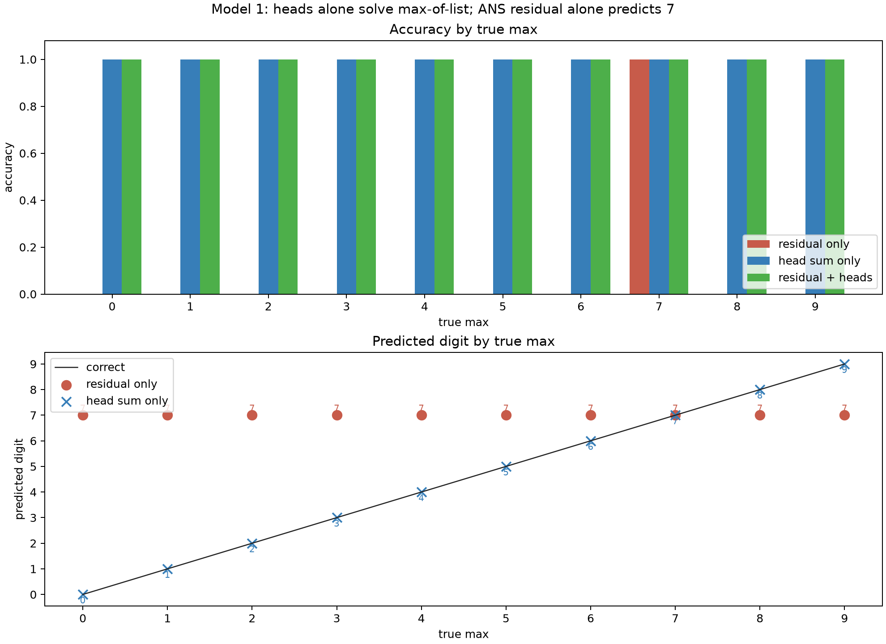
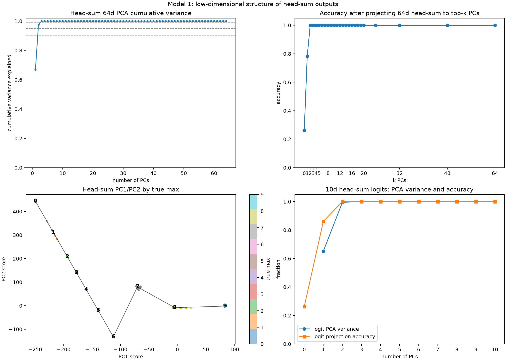
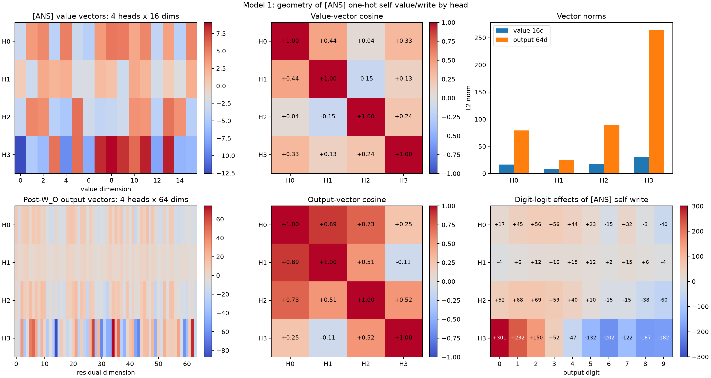
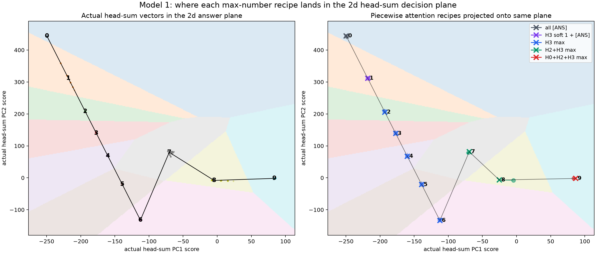

# 2026-07-02

## Model 1: Target-Logit Contribution Percentages

Question:

For the same max-`6` and max-`7` examples from the previous margin
decomposition, how much does each component contribute to the correct target
logit itself?

Method:

Used the same ten fixed examples as the `7-vs-6` margin decomposition. For
max-`6` examples, the target logit is `logit[6]`. For max-`7` examples, the
target logit is `logit[7]`.

For each example, decomposed the `[ANS]` residual into:

```text
final_vec = ans_resid + H0_vec + H1_vec + H2_vec + H3_vec
```

Then projected each component through the number unembedding:

```text
component_logits = component_vec @ W_U_numbers.T
target_contribution = component_logits[target]
```

Reported three views:

- raw additive contribution to the target logit;
- signed share of the final target logit, `component / final`;
- positive share among only positive contributors,
  `max(component, 0) / sum_positive_components`.

The signed share can be negative or exceed `100%` because components cancel.
The positive-share view is the cleaner percentage view for "who supplies
positive support to this target logit?"

Repro script: `scripts/analysis/model1_target_logit_contribution_examples.py`.

Result:



Exact values:
[model1_target_logit_contribution_examples.json](assets/model1_target_logit_contribution_examples.json).

Average raw target-logit contributions:

| Target logit | residual | H0 | H1 | H2 | H3 | final |
|---:|---:|---:|---:|---:|---:|---:|
| 6 | +1.390797 | -15.299893 | +1.884123 | -15.451223 | +253.515259 | +226.039062 |
| 7 | +2.310222 | +31.202707 | +15.169775 | +3.856662 | +37.251808 | +89.791176 |

Average positive share among positive target-logit contributors:

| Target logit | residual | H0 | H1 | H2 | H3 |
|---:|---:|---:|---:|---:|---:|
| 6 | 0.005416 | 0.000000 | 0.007337 | 0.000000 | 0.987247 |
| 7 | 0.025733 | 0.347544 | 0.168973 | 0.042967 | 0.414783 |

Interpretation:

For max-`6` examples, H3 overwhelmingly supplies the positive support for the
correct target logit. H3 contributes about `253.5` raw logit units, or `98.7%`
of positive target-logit support. H0 and H2 are negative for `logit[6]` in
these examples.

For max-`7` examples, the target-logit support is distributed:

```text
H3: about 41.5%
H0: about 34.8%
H1: about 16.9%
H2: about 4.3%
residual: about 2.6%
```

This complements the margin result. H2 is recruited at max `7`, but its direct
positive support for `logit[7]` is small in these examples. The larger shift
from predicting `6` to predicting `7` still has to be understood through
competing logits and cancellations, not through target-logit support alone.

Next step:

Run this target-logit percentage decomposition for every true max value, then
pair it with true-vs-runner-up margin decompositions. That should separate
"which heads support the correct logit?" from "which heads suppress the most
dangerous competing logit?"

## Model 1: 8-vs-9 Boundary Decomposition

Question:

For the top-end boundary, does H2's recruitment explain the difference between
predicting `8` and predicting `9`?

Method:

Used ten fixed examples:

- five examples with true max `8`;
- five examples with true max `9`.

For each example, decomposed the final `[ANS]` residual into:

```text
final_vec = ans_resid + H0_vec + H1_vec + H2_vec + H3_vec
```

where each head vector includes the actual `[ANS]` attention row, the head's
value vectors, and that head's `W_O` slice:

```text
Hh_vec = (attn_h[ANS, :] @ V_h) @ W_O_h.T
```

Then measured both:

```text
margin_9v8(component) = component_logit[9] - component_logit[8]
target_contribution = component_logit[true_max]
```

Repro script: `scripts/analysis/model1_boundary_8v9_examples.py`.

Result:



Exact margin values:
[model1_margin_9v8_examples.json](assets/model1_margin_9v8_examples.json).

Average `logit[9] - logit[8]` margin over the five examples in each group:

| True max | residual | H0 | H1 | H2 | H3 | final |
|---:|---:|---:|---:|---:|---:|---:|
| 8 | -0.867604 | -26.448471 | -10.546738 | +13.655060 | -3.015179 | -27.222919 |
| 9 | -0.867604 | +19.266367 | -10.546738 | +12.992563 | -2.742226 | +18.102375 |

Attention summary:

| True max | H0 top | H1 top | H2 top | H3 top |
|---:|---|---|---|---|
| 8 | `[ANS]` | `[ANS]` | max `8` | max `8` |
| 9 | max `9` | `[ANS]` | max `9` | max `9` |

Target-logit support:



Exact target-logit values:
[model1_target_logit_contribution_8v9_examples.json](assets/model1_target_logit_contribution_8v9_examples.json).

Average raw target-logit contributions:

| Target logit | residual | H0 | H1 | H2 | H3 | final |
|---:|---:|---:|---:|---:|---:|---:|
| 8 | +1.851185 | -2.229407 | +6.254406 | +23.409374 | +112.661865 | +141.947418 |
| 9 | +0.983581 | +21.076212 | -4.292332 | +35.276520 | +100.652390 | +153.696381 |

Average positive share among positive target-logit contributors:

| Target logit | residual | H0 | H1 | H2 | H3 |
|---:|---:|---:|---:|---:|---:|
| 8 | 0.012840 | 0.000000 | 0.043380 | 0.162364 | 0.781416 |
| 9 | 0.006226 | 0.133399 | 0.000000 | 0.223286 | 0.637089 |

Interpretation:

The attention-recruitment story is still correct, but it is a QK/attention
statement, not a direct logit statement. For true max `8`, H2 and H3 already
attend to the max token. For true max `9`, H2 and H3 continue to attend to the
max token, and H0 newly switches from `[ANS]` to max `9`.

The `9-vs-8` margin shows that H2 is not the switch for this boundary. H2
contributes a positive `logit[9] - logit[8]` margin in both groups:

```text
true max 8: H2 = +13.66
true max 9: H2 = +12.99
```

So H2 actually favors `9` over `8` even when the correct answer is `8`. The
model still predicts `8` because H0 and H1 provide enough negative `9-vs-8`
margin when H0 is attending to `[ANS]`.

The boundary flip is mostly H0:

```text
true max 8: H0 = -26.45 on logit[9] - logit[8]
true max 9: H0 = +19.27 on logit[9] - logit[8]
```

This matches the earlier QK threshold result: H0 only crosses the `[ANS]`
self-threshold for token `9`. H0 is therefore the specialized top-end
correction that lets the model distinguish `9` from `8`.

The target-logit percentages say a slightly different thing. H2 does help make
`logit[9]` large: it supplies about `22.3%` of positive support for target
`9`. But it also supplies about `16.2%` of positive support for target `8`, and
its `9-vs-8` margin is similar in both cases. So H2 is useful support, not the
decisive boundary switch.

Next step:

Run this same paired analysis for every adjacent boundary:

```text
1-vs-0, 2-vs-1, ..., 9-vs-8
```

The likely pattern is that attention thresholds tell us which heads become
available, while margin decompositions tell us which recruited or self-attending
heads actually decide each boundary.

## Model 1: H0 Ablation Confirms The Max-9 Switch

Question:

If H0 is the decisive `9-vs-8` boundary head, does removing H0's contribution
make true-max-`9` accuracy collapse?

Method:

Ran all `10^5` possible five-number inputs. Compared three variants:

- baseline final logits;
- `zero_H0_vector`: remove H0's `[ANS]` output vector before unembedding;
- `zero_H0_logit9_only`: remove only H0's direct contribution to output digit
  `9`.

The clean mechanistic intervention is:

```text
zero_H0_vector = ans_resid + H1_vec + H2_vec + H3_vec
```

The `zero_H0_logit9_only` variant is less mechanistic, but it tests the
literal target-logit question.

Repro script: `scripts/analysis/model1_h0_ablation_max9.py`.

Exact values:
[model1_h0_ablation_max9.json](assets/model1_h0_ablation_max9.json).

Result:

| Group | Count | Baseline acc | zero H0 vector acc | zero H0 logit-9-only acc |
|---|---:|---:|---:|---:|
| all inputs | 100000 | 1.000000 | 0.363110 | 0.327680 |
| true max `8` | 26281 | 1.000000 | 1.000000 | 0.000000 |
| true max `9` | 40951 | 1.000000 | 0.000000 | 0.000000 |
| true max `9`, contains `8` | 14670 | 1.000000 | 0.000000 | 0.000000 |
| true max `9`, no `8` | 26281 | 1.000000 | 0.000000 | 0.000000 |

For true-max-`9` inputs, every H0-ablated prediction is `8`:

| Group | zero H0 vector prediction distribution |
|---|---|
| true max `9` | `8`: 40951 |
| true max `9`, contains `8` | `8`: 14670 |
| true max `9`, no `8` | `8`: 26281 |

Average `logit[9] - logit[8]` margins:

| Group | Baseline | H0 component | zero H0 vector |
|---|---:|---:|---:|
| true max `8` | -27.085941 | -26.416144 | -0.669796 |
| true max `9` | +18.133751 | +19.285502 | -1.151744 |
| true max `9`, contains `8` | +18.116569 | +19.263502 | -1.146926 |
| true max `9`, no `8` | +18.143343 | +19.297782 | -1.154433 |

Interpretation:

This confirms H0 is necessary for max-`9` behavior. Removing H0's output vector
does not merely reduce confidence; it makes all `40951 / 40951` true-max-`9`
inputs predict `8`.

The margin table explains why. For true-max-`9`, the baseline average
`logit[9] - logit[8]` margin is `+18.13`. H0 alone contributes `+19.29`.
Without H0, the average margin becomes `-1.15`, so `8` wins.

For true max `8`, removing H0's full vector leaves accuracy intact. The
`9-vs-8` margin becomes much smaller, but remains negative on every max-`8`
input. This is why H0 is specifically the max-`9` switch, not a general
high-number-support head.

The artificial `zero_H0_logit9_only` intervention also produces `0%` max-`9`
accuracy, but it should not be overinterpreted. On max-`8` inputs, H0 normally
pushes against output `9`; removing only that negative logit-9 contribution
also breaks max-`8`. The full-vector ablation is the cleaner circuit test.

## Model 1: Head Sum Alone Solves The Task

Question:

Is the original `[ANS]` residual stream necessary for correctness, or do the
attention heads alone already contain the answer after their `W_O` projections?

Method:

Ran all `10^5` possible five-number inputs. At the `[ANS]` position, compared
three logit computations:

```text
residual_only = ans_resid @ W_U_numbers.T
head_sum_only = (H0_vec + H1_vec + H2_vec + H3_vec) @ W_U_numbers.T
full = (ans_resid + H0_vec + H1_vec + H2_vec + H3_vec) @ W_U_numbers.T
```

where each `Hh_vec` is the actual head output after that head's `W_O` slice:

```text
Hh_vec = (attn_h[ANS, :] @ V_h) @ W_O_h.T
```

Repro script: `scripts/analysis/model1_residual_vs_head_sum_accuracy.py`.

Result:



Exact values:
[model1_residual_vs_head_sum_accuracy.json](assets/model1_residual_vs_head_sum_accuracy.json).

Accuracy by true max:

| True max | Count | residual only | head sum only | full model | residual-only output | head-sum-only output |
|---:|---:|---:|---:|---:|---|---|
| 0 | 1 | 0.000000 | 1.000000 | 1.000000 | `7` | `0` |
| 1 | 31 | 0.000000 | 1.000000 | 1.000000 | `7` | `1` |
| 2 | 211 | 0.000000 | 1.000000 | 1.000000 | `7` | `2` |
| 3 | 781 | 0.000000 | 1.000000 | 1.000000 | `7` | `3` |
| 4 | 2101 | 0.000000 | 1.000000 | 1.000000 | `7` | `4` |
| 5 | 4651 | 0.000000 | 1.000000 | 1.000000 | `7` | `5` |
| 6 | 9031 | 0.000000 | 1.000000 | 1.000000 | `7` | `6` |
| 7 | 15961 | 1.000000 | 1.000000 | 1.000000 | `7` | `7` |
| 8 | 26281 | 0.000000 | 1.000000 | 1.000000 | `7` | `8` |
| 9 | 40951 | 0.000000 | 1.000000 | 1.000000 | `7` | `9` |

The residual-only logits are constant across inputs:

```text
0:-2.150847
1:-0.986216
2:-0.137806
3:+0.712118
4:+1.254116
5:+1.647622
6:+1.390797
7:+2.310222
8:+1.851185
9:+0.983581
```

Interpretation:

The `[ANS]` residual stream alone always predicts `7`. It is only correct on
the true-max-`7` slice. The attention heads alone are already sufficient for
perfect accuracy across all `100000 / 100000` inputs.

So the heads are not merely small corrections on top of a useful residual
answer. In this model, the answer is fully present in the summed head outputs
after `W_O`; the original residual stream behaves like a fixed output bias that
is added afterward.

This also justifies focusing on head-output logit decompositions:

```text
full_logits = residual_logits + H0_logits + H1_logits + H2_logits + H3_logits
```

but the result here shows that:

```text
argmax(H0_logits + H1_logits + H2_logits + H3_logits)
```

is already exactly correct.

Next step:

Use head-sum-only logits as the main object for the staircase mechanism
summary. The residual term can still affect margins, but it is not necessary
for correctness.

## Model 1: Head-Sum Outputs Are Low-Dimensional

Question:

Does the `[ANS]` head-sum vector live in a low-dimensional subspace, and is
that low-dimensional projection sufficient for the actual max-of-list decision?

Method:

Collected the actual head-sum vector at `[ANS]` for all `10^5` inputs:

```text
head_sum = H0_vec + H1_vec + H2_vec + H3_vec      # 100000 x 64
```

where each head vector is after the corresponding `W_O` slice. Then ran PCA on
the centered `100000 x 64` matrix. For the causal test, reconstructed the
head-sum vector from only the top `k` PCs and unembedded:

```text
head_sum_k = mean + project_to_top_k_pcs(head_sum - mean)
logits_k = head_sum_k @ W_U_numbers.T
```

Also ran the same PCA/projection test directly in the `10`-dimensional
head-sum logit space.

Repro script: `scripts/analysis/model1_head_sum_pca_lowdim.py`.

Result:



Exact values:
[model1_head_sum_pca_lowdim.json](assets/model1_head_sum_pca_lowdim.json).

Head-sum-only baseline accuracy:

```text
100000 / 100000
```

PCA variance in 64d head-sum space:

| PC | Variance explained | Cumulative |
|---:|---:|---:|
| 1 | 0.669577 | 0.669577 |
| 2 | 0.305588 | 0.975164 |
| 3 | 0.024836 | 1.000000 |

Number of PCs required by variance threshold:

| Threshold | PCs |
|---:|---:|
| 90% | 2 |
| 95% | 2 |
| 99% | 3 |

Accuracy after projecting the 64d head-sum vector to top `k` PCs:

| k PCs | Accuracy | Prediction summary |
|---:|---:|---|
| 0 | 0.262810 | all inputs predict `8` |
| 1 | 0.783630 | predicts mostly `5`, `8`, `9`; misses low/mid classes |
| 2 | 1.000000 | exact true-max distribution |
| 3 | 1.000000 | exact true-max distribution |

PCA variance in 10d head-sum logit space:

| PC | Variance explained | Cumulative |
|---:|---:|---:|
| 1 | 0.651377 | 0.651377 |
| 2 | 0.343516 | 0.994894 |
| 3 | 0.005106 | 1.000000 |

Accuracy after projecting the 10d head-sum logits to top `k` PCs:

| k PCs | Accuracy |
|---:|---:|
| 0 | 0.262810 |
| 1 | 0.860750 |
| 2 | 1.000000 |

Interpretation:

The head-sum computation is extremely low-dimensional. In 64d residual space,
three PCs explain essentially all variance, and two PCs already preserve
`100%` decision accuracy after reconstruction and unembedding.

The logit-space result is even sharper: two logit PCs explain `99.49%` of
variance and preserve `100%` accuracy. This means the output decision lies on a
2d decision surface, even though the vectors live in 64d.

The PC1/PC2 plot shows a structured trajectory by true max. Max values `0..6`
lie along one curved branch, `7` bends away, and `8/9` occupy the top-end
branch. This matches the staircase mechanism:

```text
H3 broad pathway for 2..6,
H2 joins for 7/8,
H0 joins for 9.
```

Important caveat:

The third 64d PC contains real variance, about `2.48%`, but it is not needed
for the final argmax decision. So the representation is not literally rank-2 in
64d, but the decision-relevant subspace is already captured by two PCs.

Next step:

Interpret the two decision PCs by projecting each source-specific head write
onto them:

```text
Hh@[ANS], Hh@0, Hh@1, ..., Hh@9
```

That should show which head/source writes move the representation along the
low/mid branch versus the 7/8/9 branch.

## Model 1: ANS Self-Write Value Geometry

Question:

When a head's `[ANS]` query attends one-hot to `[ANS]` itself, what value vector
does that head read, and what does that value become after the head's `W_O`
slice?

Method:

Used the actual `[ANS]` residual at position 10:

```text
source = E[ANS] + P[10]                         # 1 x 64
value_h = source @ W_V_h.T                      # 1 x 16
output_h = value_h @ W_O_h.T                    # 1 x 64
digit_effect_h = output_h @ W_U_numbers.T       # 1 x 10
```

This is the exact vector a head writes at `[ANS]` if its `[ANS]` attention row
is one-hot on the `[ANS]` source position.

Repro script: `scripts/analysis/model1_ans_self_value_geometry.py`.

Result:



Exact values:
[model1_ans_self_value_geometry.json](assets/model1_ans_self_value_geometry.json).

Vector norms:

| Head | `value_h` norm, 16d | `output_h` norm, 64d | output digit argmax |
|---:|---:|---:|---:|
| H0 | 16.622002 | 79.300797 | 3 |
| H1 | 8.701168 | 24.628391 | 3 |
| H2 | 16.963669 | 89.185280 | 2 |
| H3 | 31.101879 | 264.866333 | 0 |

Pairwise cosine in 16d value space:

|  | H0 | H1 | H2 | H3 |
|---:|---:|---:|---:|---:|
| H0 | +1.000000 | +0.442091 | +0.040500 | +0.327411 |
| H1 | +0.442091 | +1.000000 | -0.145974 | +0.134436 |
| H2 | +0.040500 | -0.145974 | +1.000000 | +0.238202 |
| H3 | +0.327411 | +0.134436 | +0.238202 | +1.000000 |

Pairwise cosine after `W_O` in 64d output space:

|  | H0 | H1 | H2 | H3 |
|---:|---:|---:|---:|---:|
| H0 | +1.000000 | +0.885531 | +0.733549 | +0.249573 |
| H1 | +0.885531 | +1.000000 | +0.514098 | -0.107768 |
| H2 | +0.733549 | +0.514098 | +1.000000 | +0.523191 |
| H3 | +0.249573 | -0.107768 | +0.523191 | +1.000000 |

SVD energy fractions:

| Space | PC1 / SV1 | PC2 / SV2 | PC3 / SV3 | PC4 / SV4 |
|---|---:|---:|---:|---:|
| 16d value vectors | 0.640822 | 0.178705 | 0.146490 | 0.033983 |
| 64d output vectors | 0.859787 | 0.120264 | 0.019303 | 0.000647 |

Digit-logit effects of each `[ANS]` self-write:

| Head | 0 | 1 | 2 | 3 | 4 | 5 | 6 | 7 | 8 | 9 |
|---:|---:|---:|---:|---:|---:|---:|---:|---:|---:|---:|
| H0 | +17.117685 | +44.990227 | +55.954155 | +56.224960 | +43.577084 | +22.576611 | -15.299953 | +32.183006 | -3.139061 | -39.907715 |
| H1 | -3.984296 | +6.460329 | +12.232366 | +15.886344 | +14.781888 | +11.544221 | +1.884123 | +15.169775 | +6.254405 | -4.292332 |
| H2 | +51.795769 | +68.296684 | +69.260735 | +59.108902 | +40.038624 | +9.623316 | -15.468858 | -14.828217 | -37.625561 | -59.739128 |
| H3 | +300.723114 | +232.201004 | +149.667404 | +51.884739 | -46.856102 | -131.714066 | -202.404846 | -121.776932 | -186.841965 | -181.822571 |

Interpretation:

The 16d `[ANS]` value vectors are not all pointing in the same direction.
H0/H1 are moderately aligned, H0/H2 are nearly orthogonal, and H1/H2 are
slightly opposed. H3 has the largest value norm, but it is only weakly to
moderately aligned with the other heads.

After `W_O`, the geometry becomes much more structured. The four 64d
self-write vectors are close to low-rank: the first singular direction accounts
for about `86.0%` of the energy, and the first two account for about `98.0%`.
H0, H1, and H2 become fairly aligned after `W_O`, especially H0/H1 and H0/H2.

The digit-logit effects explain several earlier interventions:

- H3's `[ANS]` self-write is a huge low-number feature, with strongest effect
  on output `0`. This explains why H3 attending to `[ANS]` is sufficient for
  the max-`0` case.
- H2's `[ANS]` self-write strongly pushes `0, 1, 2, 3` and suppresses high
  digits. This explains why forcing H2 to `[ANS]` in max-`7` or max-`8` cases
  is catastrophic: it injects a low/mid-number write.
- H0's `[ANS]` self-write strongly favors `7` over `6`
  (`+32.18 - (-15.30)`). This explains why H0 can help the `7-vs-6` boundary
  while still attending to `[ANS]`, not to the token `7`.

So `[ANS]` self-attention is not a neutral no-op. Each head's `[ANS]` value,
after that head's `W_O`, writes a specific digit-logit feature.

Next step:

Make the analogous source-token table for `0..9` per head:

```text
((E[token] + P[pos]) @ W_V_h.T) @ W_O_h.T @ W_U_numbers.T
```

This should let us compare the `[ANS]` self-write features against the max-token
read features in the same logit-effect basis.

## Model 1: Piecewise Attention Recipes In The 2D Answer Plane

Question:

Given the piecewise attention abstraction,

```text
max 0:   H0/H1/H2/H3 -> [ANS]
max 1:   H0/H1/H2 -> [ANS], H3 uses its actual soft [ANS]+1 mixture
max 2-6: H0/H1/H2 -> [ANS], H3 -> max token
max 7-8: H0/H1 -> [ANS], H2/H3 -> max token
max 9:   H1 -> [ANS], H0/H2/H3 -> max token
```

where does each max-number recipe land in the 2D head-sum PCA plane?

Method:

Fit PCA on the actual head-sum output at `[ANS]` for all `100000` inputs:

```text
head_sum = H0_vec + H1_vec + H2_vec + H3_vec      # 100000 x 64
```

Each `Hh_vec` is after that head's `W_O` slice. No original residual stream was
added.

Then, for every input, constructed the piecewise scheme above using the same
source choices as the full one-hot abstraction. For max-read heads, the source
position is the max-token position that the actual head most attends to among
max-valued positions. For true max `1`, H3 keeps its actual soft value mixture.

Both actual and scheme vectors were projected into the same actual PCA basis:

```text
pc_scores = (head_sum - actual_mean) @ actual_PC_directions.T
```

The background colors in the plot are the digit predicted by unembedding from
that 2D plane:

```text
reconstructed = actual_mean + pc1 * PC1 + pc2 * PC2
digit_logits = reconstructed @ W_U_numbers.T
```

Repro script:
`scripts/analysis/model1_piecewise_scheme_pca_projection.py`.

Result:



Exact values:
[model1_piecewise_scheme_pca_projection.json](assets/model1_piecewise_scheme_pca_projection.json).

Accuracy checks:

| Vector set | Accuracy |
|---|---:|
| actual head-sum only | 1.000000 |
| piecewise scheme head-sum only | 1.000000 |
| actual head-sum reconstructed from top 2 PCs | 1.000000 |
| piecewise scheme reconstructed from top 2 PCs | 1.000000 |

Centroids in the actual PC1/PC2 basis:

| True max | Actual PC1 | Actual PC2 | Scheme PC1 | Scheme PC2 | Recipe |
|---:|---:|---:|---:|---:|---|
| 0 | -249.471344 | +443.605560 | -249.594742 | +444.125916 | all `[ANS]` |
| 1 | -218.129730 | +311.598358 | -218.131042 | +311.598785 | H3 soft `1` + `[ANS]` |
| 2 | -193.429108 | +207.714813 | -192.946121 | +205.559555 | H3 max |
| 3 | -177.224716 | +139.745041 | -177.043274 | +138.728577 | H3 max |
| 4 | -160.208328 | +68.230652 | -160.052551 | +67.274979 | H3 max |
| 5 | -139.156952 | -20.298115 | -139.007660 | -21.212927 | H3 max |
| 6 | -112.546837 | -132.379837 | -112.335365 | -133.496796 | H3 max |
| 7 | -70.268845 | +79.736465 | -69.304085 | +81.395790 | H2+H3 max |
| 8 | -4.590448 | -8.223660 | -25.141771 | -6.878398 | H2+H3 max |
| 9 | +83.726097 | -1.783674 | +86.631805 | -1.980802 | H0+H2+H3 max |

Interpretation:

The 2D picture makes the staircase mechanism visible.

The `0..6` outputs lie on one low/mid branch. Within that branch, H3 moving
from `[ANS]` or soft-`1` to max-token reads moves the point down through the
digit regions `2, 3, 4, 5, 6`.

At `7`, H2 joins H3 in reading the max token. This does not merely continue the
`0..6` curve; it bends the representation into a different region of the 2D
plane.

At `8`, the point moves along that high-number branch. The piecewise scheme
centroid is left of the actual centroid, mostly because the actual model has
some non-one-hot nuance such as partial H0 max attention, but it remains in the
same unembedding decision cell and keeps `100%` accuracy.

At `9`, H0 also reads the max token. That pushes the point sharply right into
the `9` decision region, matching the previous H0 max-`9` causal result.

So the heads are writing a 64d vector, but their answer-relevant sum is moving
through a small number of routes in a 2D decision plane:

```text
0/1:    [ANS] and soft-H3 baseline
2..6:   H3 max-read branch
7/8:    H2 + H3 high-number branch
9:      H0 + H2 + H3 top-end branch
```

Next step:

Project the per-head deltas into this same plane:

```text
H0@9 - H0@[ANS]
H2@7 - H2@[ANS]
H2@8 - H2@[ANS]
H3@d - H3@[ANS]
```

That should identify which head writes move the representation along PC1 versus
PC2.
