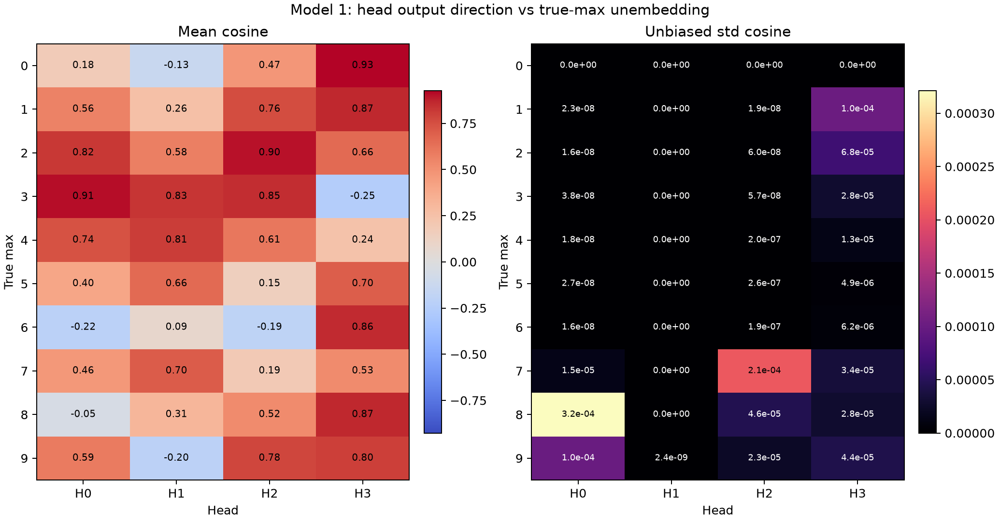

# 2026-07-06

## Model 1: Head Output vs True-Max Unembedding Cosine

Question:

How aligned is each head's actual `[ANS]` output vector with the unembedding
vector for the true maximum digit?

Method:

Enumerated all `100000` Model 1 inputs:

```text
[BOS] n0 [SEP] n1 [SEP] n2 [SEP] n3 [SEP] n4 [ANS]
```

For each batch, formed the pre-attention residual stream:

```text
resid = tok_embed(tokens) + pos_embed(positions)
```

For each layer-0 head `Hh`, used the actual causal post-softmax attention row
at `[ANS]` and the corresponding `W_O` slice:

```text
Hh_vec = head_values[:, 10, :] @ W_O_h.T
target_u = W_U[true_max]
cosine = cosine_similarity(Hh_vec, target_u)
```

Grouped the mean cosine, unbiased std cosine, and count by true max `0..9`.
The max-`0` std is `0.0` because there is only one all-zero input. Repro
script: `scripts/analysis/model1_head_output_target_unembed_cosine.py`.

Result:



Exact values:
[model1_head_output_target_unembed_cosine.json](assets/model1_head_output_target_unembed_cosine.json).

Interpretation:

Several heads point strongly toward the true-max unembedding for specific max
values, but the pattern is head- and value-specific. H3 is strongly aligned for
max `0`, `1`, `6`, `8`, and `9`, while H0/H2 carry high directional alignment
for other bands such as max `2` and `3`.

Within each true-max group the standard deviations are tiny, at most about
`3.3e-4`, so this directional statistic is effectively determined by the true
max value. This should not be read as logit contribution size: cosine measures
direction only, not the vector norm, absolute logit magnitude, or cancellation
against the residual stream and other heads.

Next step:

Pair these directional cosines with direct target-logit and margin
decompositions to separate "points in the right direction" from "moves the
decision boundary."
