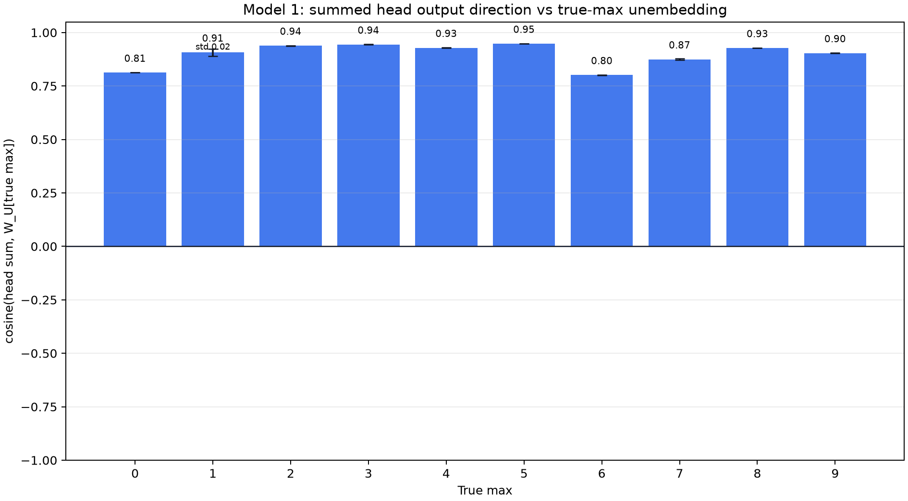
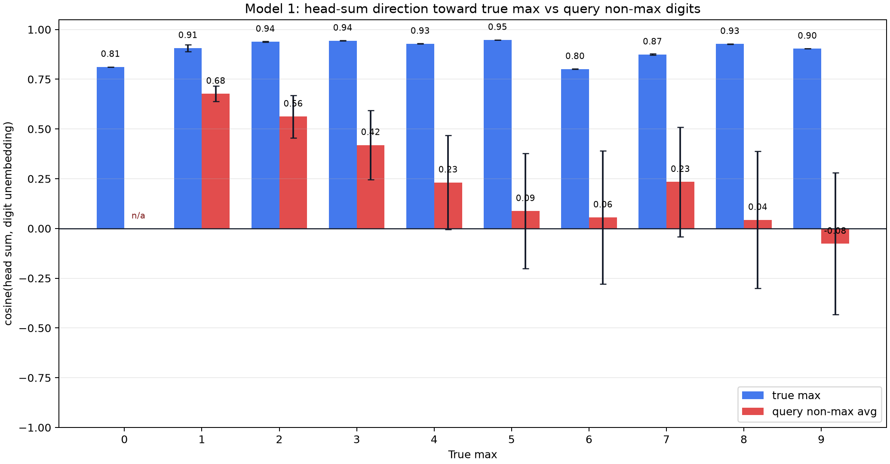
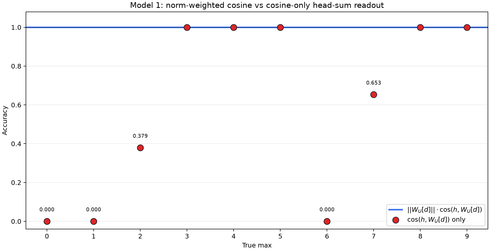
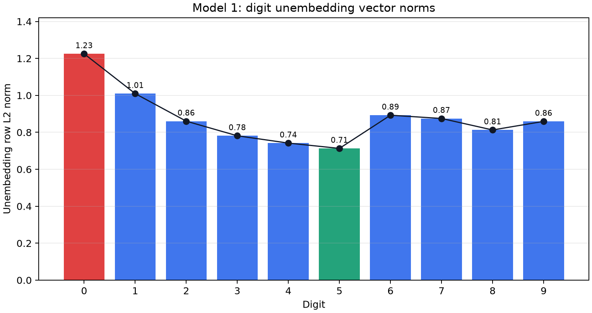

# 2026-07-07

## Model 1: Head-Sum Output vs True-Max Unembedding Cosine

Question:

After summing all four layer-0 head outputs at `[ANS]`, how aligned is that
`1 x 64` vector with the unembedding vector for the true maximum digit?

Method:

Enumerated all `100000` Model 1 inputs:

```text
[BOS] n0 [SEP] n1 [SEP] n2 [SEP] n3 [SEP] n4 [ANS]
```

For each batch, formed the pre-attention residual stream:

```text
resid = tok_embed(tokens) + pos_embed(positions)
```

For each head, used the actual causal post-softmax attention at `[ANS]` and
the corresponding `W_O` slice:

```text
Hh_vec = head_values[:, 10, :] @ W_O_h.T
head_sum = H0_vec + H1_vec + H2_vec + H3_vec
target_u = W_U[true_max]
cosine = cosine_similarity(head_sum, target_u)
```

Grouped the mean cosine, unbiased std cosine, and count by true max `0..9`.
The max-`0` std is `0.0` because there is only one all-zero input. Repro
script: `scripts/analysis/model1_head_sum_target_unembed_cosine.py`.

Result:



Exact values:
[model1_head_sum_target_unembed_cosine.json](assets/model1_head_sum_target_unembed_cosine.json).

Interpretation:

The summed head output points strongly toward the true-max unembedding for
every max value. Mean cosine ranges from about `0.80` for max `6` to about
`0.95` for max `5`, with most groups above `0.90`.

Within-group variation is small. Max `1` has the largest std, about `0.017`;
all other non-singleton max groups have std below `0.004`.

This is a directional statistic only. It does not measure vector norm, raw
target-logit contribution, or cancellations with the original `[ANS]` residual.

## Model 1: Head-Sum Direction vs Query Non-Max Digits

Question:

Is the summed head output specifically aligned with the true max, or is it
also similarly aligned with the other numbers present in the query?

Method:

Used the same all-input head-sum vector:

```text
head_sum = H0_vec + H1_vec + H2_vec + H3_vec
```

For each input, compared two directional statistics:

```text
target_cosine = cosine_similarity(head_sum, W_U[true_max])
nonmax_cosine = mean_i cosine_similarity(head_sum, W_U[n_i])
```

where the `nonmax_cosine` mean is over query positions whose value is not the
true max. Duplicate non-max query entries count as repeated positions. Inputs
with no non-max positions are excluded from the red non-max summary; therefore
max `0` has no red bar.

Repro script: `scripts/analysis/model1_head_sum_target_unembed_cosine.py`.

Result:



Exact values:
[model1_head_sum_target_vs_nonmax_unembed_cosine.json](assets/model1_head_sum_target_vs_nonmax_unembed_cosine.json).

Interpretation:

The summed heads are much more aligned with the true-max unembedding than with
the non-max query-number unembeddings. The blue true-max means remain high,
about `0.80` to `0.95`. The red non-max means fall as the true max increases:
about `0.68` for max `1`, about `0.23` for max `4`, near zero for max `6` and
`8`, and negative for max `9`.

The red error bars are wider because the set of non-max query numbers varies
within each true-max group. This is still a cosine-only direction statistic:
it does not measure vector norm, raw target-logit contribution, or cancellation
with the original `[ANS]` residual.

## Model 1: Cosine-Only Head-Sum Logit Accuracy

Question:

If the head-sum dot-product logits are decomposed into angle and unembedding
row norm, does the model still predict the max when using only angle? This
tests whether direction alone is enough, or whether unembedding scale matters.

Method:

Used the same all-input `head_sum` vector. For each input, let
`h = head_sum` at `[ANS]`. Since `||h||` is common across all digit logits,
the raw dot-product argmax is equivalent to:

```text
norm_weighted_score[d] = ||W_U[d]|| * cosine(h, W_U[d])
cosine_score[d] = cosine(h, W_U[d])
```

For each input, predicted `argmax_d` over digits `0..9`, then grouped accuracy
by true max. Repro script:
`scripts/analysis/model1_head_sum_target_unembed_cosine.py`.

Exact values:
[model1_head_sum_cosine_logit_accuracy.json](assets/model1_head_sum_cosine_logit_accuracy.json).

Result:



There were `0` prediction mismatches between raw `head_sum @ W_U[d]` logits
and `||W_U[d]|| * cosine(h, W_U[d])`, as expected.

| True max | Count | Acc: `argmax ||W_U[d]|| * cosine` | Acc: `argmax cosine` | Cosine-only predictions |
|---:|---:|---:|---:|---|
| 0 | 1 | 1.000 | 0.000 | `1:1` |
| 1 | 31 | 1.000 | 0.000 | `2:31` |
| 2 | 211 | 1.000 | 0.379 | `2:80, 3:131` |
| 3 | 781 | 1.000 | 1.000 | `3:781` |
| 4 | 2101 | 1.000 | 1.000 | `4:2101` |
| 5 | 4651 | 1.000 | 1.000 | `5:4651` |
| 6 | 9031 | 1.000 | 0.000 | `5:9031` |
| 7 | 15961 | 1.000 | 0.653 | `5:5535, 7:10426` |
| 8 | 26281 | 1.000 | 1.000 | `8:26281` |
| 9 | 40951 | 1.000 | 1.000 | `9:40951` |

Interpretation:

Angle alone is not sufficient across all max values. The norm-weighted cosine
score recovers the raw head-sum prediction for every input, but cosine-only
logits solve only true max `3`, `4`, `5`, `8`, and `9`; fail completely for
`0`, `1`, and `6`; and partially fail for `2` and `7`.

For a fixed input, the norm of `head_sum` itself cannot change the `argmax`
among raw digit logits, because it multiplies every digit score by the same
positive factor. The drop from raw accuracy to cosine-logit accuracy therefore
points to dot-product geometry beyond pure angle, especially the scale of
unembedding rows and how those scales interact with the head-sum direction.

Next step:

Inspect the number-unembedding row norms and decompose:

```text
head_sum @ W_U[d] = ||head_sum|| * ||W_U[d]|| * cosine(head_sum, W_U[d])
```

This should identify which boundaries need unembedding scale in addition to
head-sum direction.

## Model 1: Digit Unembedding Vector Norms

Question:

What is the L2 norm of each digit's unembedding vector, and can these row
scales explain why cosine-only head-sum logits differ from raw dot-product
head-sum logits?

Method:

Loaded Model 1 from `andyrdt/04_2026_puzzle_1a` and measured the row norm of
the digit slice of the unembedding matrix:

```text
W_U_digits = model.unembed.weight[:10]      # 10 x 64
norm[d] = ||W_U_digits[d]||_2
```

Repro script: `scripts/analysis/model1_unembedding_norms.py`.

Result:



Exact values:
[model1_unembedding_norms.json](assets/model1_unembedding_norms.json).

| Digit | Unembedding L2 norm |
|---:|---:|
| 0 | 1.225062 |
| 1 | 1.009587 |
| 2 | 0.860454 |
| 3 | 0.781334 |
| 4 | 0.741815 |
| 5 | 0.713061 |
| 6 | 0.892738 |
| 7 | 0.874992 |
| 8 | 0.812856 |
| 9 | 0.859291 |

Interpretation:

The unembedding row norms are not monotonic in digit value. Digit `0` has the
largest unembedding norm (`1.225062`), digit `5` has the smallest (`0.713061`),
and the Pearson correlation between digit value and norm is `-0.530857`.

These scales help explain why cosine-only logits are not equivalent to raw
head-sum logits. For example, the earlier cosine-only experiment overpredicted
`5` for all true-max-`6` inputs despite `||W_U[6]|| > ||W_U[5]||`, so that
failure is not just a missing norm correction. The row scales are still part of
the raw logit geometry and should be included in per-boundary decompositions.

Next step:

For the cosine-only failure cases, inspect the per-digit terms:

```text
||W_U[d]|| * cosine(head_sum, W_U[d])
```

especially the `1` vs `2`, `2` vs `3`, `5` vs `6`, and `5` vs `7` decision
boundaries.
