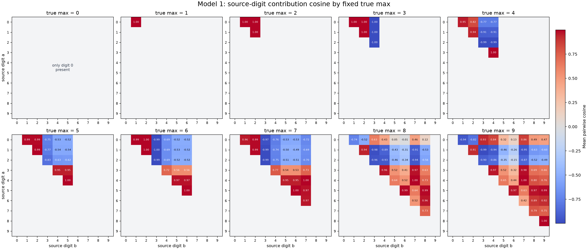
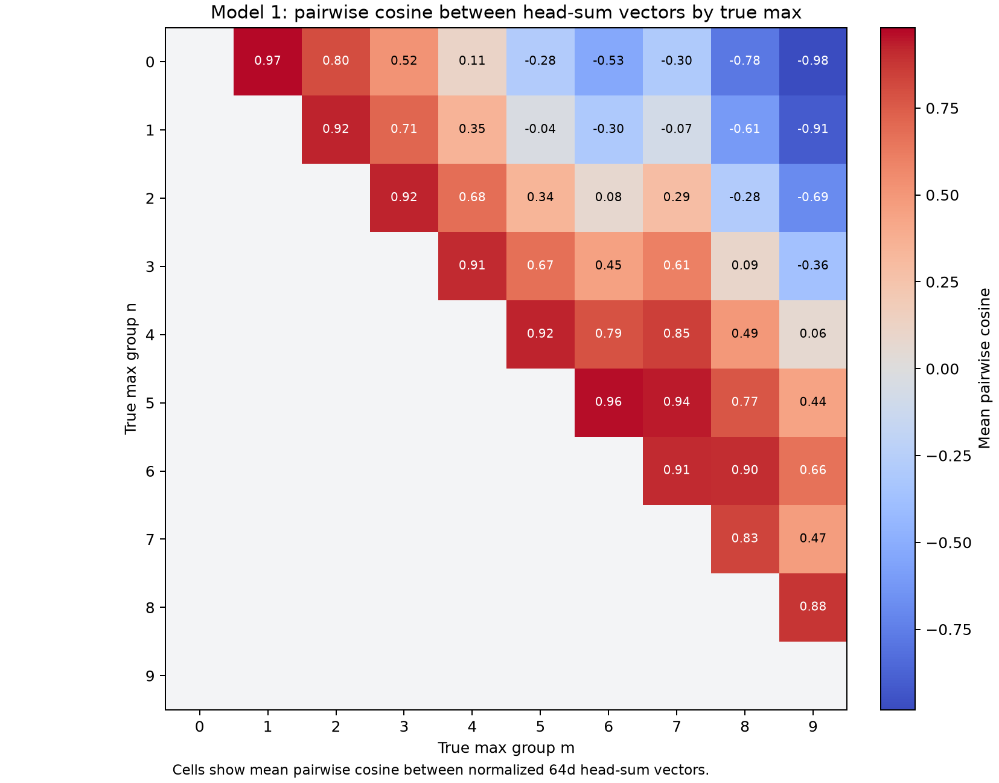

# 2026-07-09

## Model 1: Source-Digit Head-Sum Contribution Geometry By Fixed True Max

Question:

For each fixed true max `n`, how do the 64d head-output contributions from
source digits compare with each other before unembedding? This is the
conditioned view: one matrix for max `0`, one for max `1`, and so on through
max `9`.

Method:

A single input has one final `[ANS]` head-sum vector, so to get a
number-vs-number matrix inside each true-max group, decomposed the `[ANS]`
head output into source-number contributions. For each head `h` and source
number position `p`:

```text
contrib_h,p = attention_h[ANS, p] * V_h(resid_p) @ W_O_h.T
source_digit_contrib_p = sum_h contrib_h,p      # 1 x 64
```

For each input and each of the five number positions, this gives one `1 x 64`
source-digit contribution vector before unembedding. Grouped these vectors by:

```text
(true max, source digit)
```

Then normalized each vector and computed, for each fixed true max `n`, the
average pairwise cosine between source-digit groups `a` and `b`:

```text
mean cosine(source_digit_contrib[a], source_digit_contrib[b] | true_max = n)
```

Duplicate query entries count as repeated source positions. Digits larger than
the fixed true max cannot appear and are blank. The diagonal is also blank in
the plot because the question is about different source digits.

Repro script:
`scripts/analysis/model1_head_sum_source_digit_cosine_by_max.py`.

Result:



Exact values:
[model1_head_sum_source_digit_cosine_by_max.json](assets/model1_head_sum_source_digit_cosine_by_max.json).

Interpretation:

This is the ten-panel conditioned view. Within each panel, the model often
places source digits into a small number of angular clusters:

- For true max `1` and `2`, low source digits are almost collinear.
- When true max is `3`, source digit `3` is nearly opposite to digits `0..2`.
- For true max `4..7`, digits `0..2` tend to form one cluster, while
  higher source digits form another, with source digit `3` often separating
  the two.
- For true max `8` and `9`, the geometry is more mixed: several high digits
  remain strongly aligned, but low digits can flip relative to the middle/high
  groups.

This result is about the per-source contribution vectors that sum into the
final `[ANS]` head output. It is therefore different from the next result,
which compares the final summed head-output vectors between true-max groups.

## Model 1: Pairwise Head-Sum Geometry By True Max

Question:

Before multiplying by the unembedding, do the `1 x 64` head-sum output vectors
for different true maxima point in distinct directions? For each true max `n`,
what is the average cosine between its `[ANS]` head-sum vectors and the
head-sum vectors for the other true-max groups?

Method:

Enumerated all `100000` Model 1 inputs:

```text
[BOS] n0 [SEP] n1 [SEP] n2 [SEP] n3 [SEP] n4 [ANS]
```

For each input, computed the actual `[ANS]` output of each head after the
corresponding `W_O` slice, then summed the four `64d` vectors:

```text
Hh_vec = head_values[:, 10, :] @ W_O_h.T
head_sum = H0_vec + H1_vec + H2_vec + H3_vec      # 1 x 64 per input
unit_head_sum = head_sum / ||head_sum||
```

Grouped `unit_head_sum` by true max `0..9`. For different true-max groups
`n` and `m`, computed the average pairwise cosine:

```text
mean_{i:max_i=n, j:max_j=m} unit_head_sum_i @ unit_head_sum_j
```

The implementation uses the equivalent summed-vector form:

```text
sum_unit[n] @ sum_unit[m] / (count[n] * count[m])
```

The plot shows only the upper-triangle off-diagonal cells because the question
is about different max groups. The JSON also reports within-group average
cosine excluding self-pairs. Repro script:
`scripts/analysis/model1_head_sum_pairwise_max_cosine.py`.

Result:



Exact values:
[model1_head_sum_pairwise_max_cosine.json](assets/model1_head_sum_pairwise_max_cosine.json).

Selected off-diagonal values:

| True max pair | Mean pairwise cosine |
|---:|---:|
| 0, 1 | 0.966934 |
| 0, 5 | -0.282587 |
| 0, 9 | -0.981599 |
| 2, 3 | 0.924352 |
| 4, 7 | 0.850560 |
| 5, 6 | 0.962886 |
| 6, 8 | 0.902812 |
| 8, 9 | 0.879901 |

Within-group head-sum directions are almost fixed. Excluding self-pairs, the
within-group average cosine is at least `0.995855` for all non-singleton true
max groups; max `0` has only one input, so it has no within-group value.

Interpretation:

The head-sum vector already has a strong angular code for the maximum before
unembedding. Adjacent or nearby true-max groups often have high cosine:
`0` vs `1` is `0.966934`, `2` vs `3` is `0.924352`, `5` vs `6` is `0.962886`,
and `8` vs `9` is `0.879901`.

Far-apart groups become weakly aligned or opposite. Max `0` versus max `9` is
nearly opposite at `-0.981599`; max `1` versus max `9` is `-0.907548`; and
max `2` versus max `9` is `-0.689910`.

The geometry is not simply monotone distance from `0` to `9`. For example,
max `7` is closer to max `4` (`0.850560`) and max `5` (`0.935909`) than to
max `9` (`0.469583`). This is consistent with the earlier result that the
head-sum readout is low-dimensional and structured, but not a pure scalar
number line.

Next step:

Compare this head-sum pairwise geometry to the pairwise geometry of the digit
unembedding vectors themselves. That should show how much of the final
decision boundary comes from head-sum direction versus unembedding readout
geometry.
