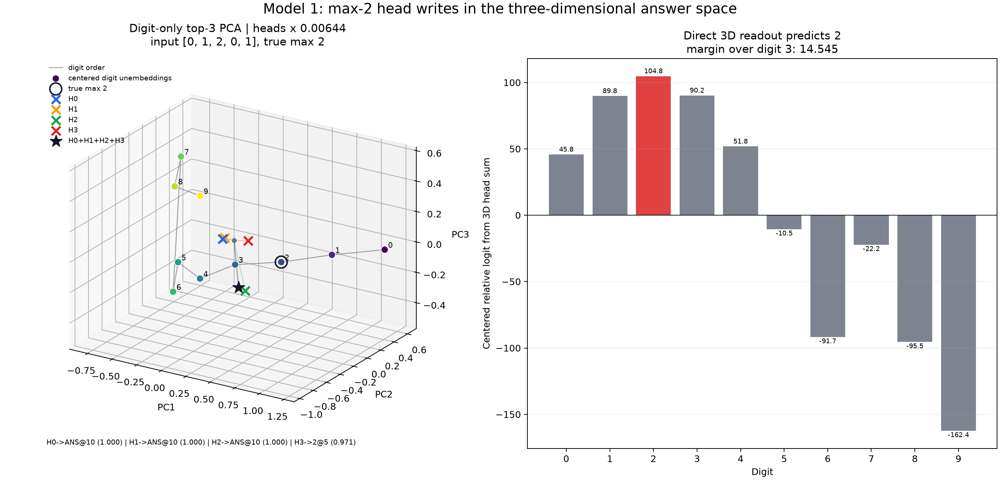
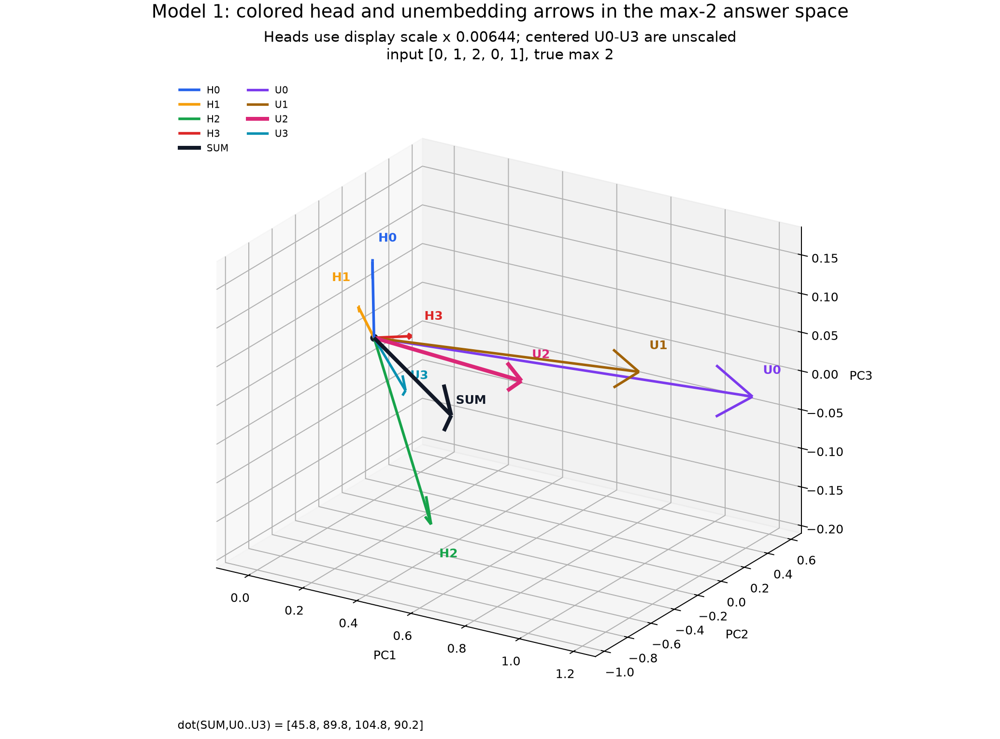
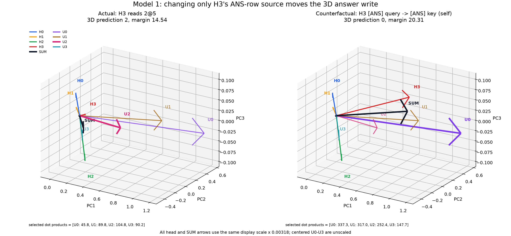
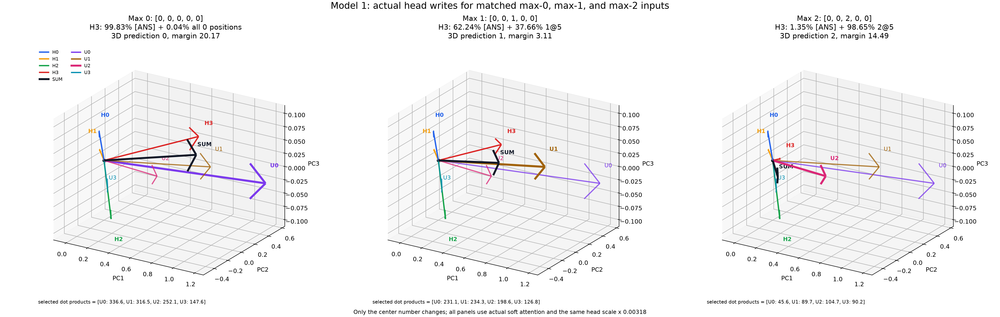
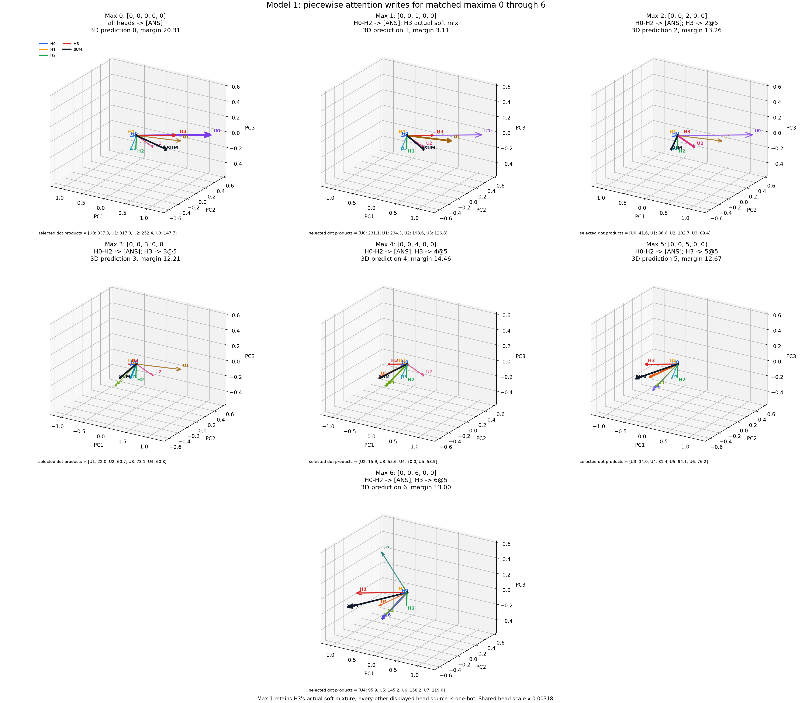

# 2026-07-11

## Model 1: Full-Vocabulary And Digit-Only Unembedding PCA

Question:

Is Model 1's unembedding matrix low-dimensional, both across the complete
14-token vocabulary and across only the ten output digits?

Method:

PyTorch stores the unembedding weight as:

```text
W_U = model.unembed.weight                 # 14 x 64
```

This is the transpose of the `64 x vocab_size` column-vector convention. For
PCA, treated each token's `64d` unembedding vector as one observation and the
residual-stream dimensions as features. Ran two separately centered PCAs:

```text
all vocabulary: W_U                       # 14 tokens x 64 dimensions
digits only:    W_U[0:10]                 # 10 digits x 64 dimensions
```

The full vocabulary is `0..9`, `BOS`, `SEP`, `ANS`, and `EOS`. Because PCA
centers across observations, the maximum possible centered ranks are `13` for
14 tokens and `9` for 10 digits. Repro script:
`scripts/analysis/model1_unembedding_pca.py`.

Result:


The same two PCAs in three dimensions, with the digit tokens connected in
numeric order:


Exact values:
[model1_unembedding_pca.json](assets/model1_unembedding_pca.json).

| PCA set | PC1 | PC2 | PC3 | PC1+PC2 | PC1+PC2+PC3 | PCs for 90% | PCs for 95% | PCs for 99% |
|---|---:|---:|---:|---:|---:|---:|---:|---:|
| All 14 vocabulary tokens | 0.620130 | 0.253596 | 0.066626 | 0.873726 | 0.940352 | 3 | 4 | 9 |
| Digits `0..9` only | 0.694690 | 0.170447 | 0.087468 | 0.865137 | 0.952605 | 3 | 3 | 6 |

Centered numerical ranks:

```text
all vocabulary: 13 / 13 maximum possible
digits only:     9 / 9 maximum possible
```

For the digit-only PCA, Pearson correlation between digit value and the first
three PC scores is:

```text
PC1: -0.956431
PC2: +0.158459
PC3: +0.208738
```

The sign of each PCA direction is arbitrary, so the meaningful PC1 result is
the correlation magnitude `0.956431`.

Interpretation:

The unembedding has a strong low-dimensional structure, but it is not exactly
low-rank. For the digits, one component captures about `69.5%` of centered
variance, two capture `86.5%`, and three capture `95.3%`. However, six
components are needed for `99%`, and the centered digit matrix has full
possible rank `9`.

The digit-only PC1 is approximately a number-value axis: its score is strongly
correlated with digit value. The ordering is not perfectly monotonic, and PC2
curves the digit trajectory, separating endpoints such as `0` and `9` from
middle digits. This is consistent with the earlier observation that the
head-sum output lives on a curved, low-dimensional answer manifold rather than
on a single straight number line.

The 3D view makes the remaining bend clearer. In particular, digit-only PC3
places `6` and `7` on opposite sides of the trajectory, with scores about
`-0.471` and `+0.523`. Thus the third component is not merely diffuse noise;
it resolves structure that overlaps in the PC1/PC2 projection.

Adding `BOS`, `SEP`, `ANS`, and `EOS` reduces the first-three-PC cumulative
variance from `95.3%` to `94.0%`. In the full-vocabulary projection, `BOS`,
`SEP`, and `ANS` cluster together while `EOS` is separated strongly along PC2.

Next step:

Put the digit unembedding geometry into the same two-dimensional basis as the
head-sum output. If `P1` and `P2` are the top head-sum directions, each digit's
2D readout coefficients are:

```text
(P1 dot W_U[d], P2 dot W_U[d])
```

Together with the per-head recruitment deltas, these coefficients define the
linear digit-decision boundaries in the head-sum PCA plane.

## Model 1: Head Outputs In The Top-3 Unembedding PC Spaces

Question:

Do the actual `64d` vectors written by the four attention heads at `[ANS]`
operate primarily in the top three principal directions of the full-vocabulary
or digit-only unembedding matrices?

Method:

Selected one deterministic random example for each of five representative
true maxima using seed `0`:

| True max | Input numbers |
|---:|---|
| 1 | `[1, 0, 0, 1, 1]` |
| 3 | `[3, 0, 1, 2, 1]` |
| 5 | `[2, 5, 1, 3, 4]` |
| 7 | `[7, 7, 4, 0, 1]` |
| 9 | `[9, 2, 1, 4, 2]` |

For each example, used the actual post-softmax attention and extracted each
head's `[ANS]` output after its `W_O` slice:

```text
Hh = head_value_h[:, ANS, :] @ W_O_h.T     # 1 x 64
head_sum = H0 + H1 + H2 + H3               # 1 x 64
```

Separately fit PCA to the centered full-vocabulary and digit-only unembedding
vectors. A head output is a vector written from the residual-stream origin, so
projected it without subtracting the unembedding mean:

```text
head_coordinates = Hh @ PC[0:3].T           # 1 x 3
```

For every head and the sum, measured:

```text
total-vector fraction = ||Hh projected to top 3||^2 / ||Hh||^2
span fraction         = top-3 energy / energy in the complete centered W_U span
logit-effect fraction = top-3 reconstructed centered-logit energy / full centered-logit energy
```

Also tested a genuinely low-dimensional final readout over all `100000`
inputs. For each `k = 1, 2, 3`, computed logits directly in PC coordinates:

```text
z = head_sum @ P_k.T                         # batch x k
U_low = (W_U - mean(W_U)) @ P_k.T            # vocab x k
relative_logits = z @ U_low.T                # batch x vocab
```

No `64d` vector is reconstructed for these evaluated logits. Centering `W_U`
only removes one common scalar from all logits for an input, so it cannot
change the argmax. The full-vocabulary PCA uses a `k x 14` readout and 14-way
argmax; the digit-only PCA uses a `k x 10` readout and 10-way argmax. Repro script:
`scripts/analysis/model1_head_outputs_in_unembedding_pca.py`.

Result:

In each panel, H0-H3 are colored `x` markers and their sum is the black star.
Rows use different true maxima; columns use the two independently fit
unembedding PCA bases.


Combined alignment view:

The centered digit-unembedding points and the head writes have very different
scales: unembedding PC coordinates are about order `1`, while raw head
coordinates reach order `200`. To make both visible, multiplied every head and
head-sum coordinate by one fixed positive display scale within each PCA basis:

```text
full-vocabulary basis: heads x 0.00420505
digit-only basis:      heads x 0.00486440
```

This preserves head directions and relative magnitudes within each column. The
digit points remain at their original centered PCA coordinates. The ring marks
the true maximum and the black star is the summed head write.


Exact values:
[model1_head_outputs_in_unembedding_pca.json](assets/model1_head_outputs_in_unembedding_pca.json).

All-input head-sum-only accuracy from the direct low-dimensional readout:

| PCs retained | Full vocabulary, `k x 14` | Digits only, `k x 10` |
|---:|---:|---:|
| 1 | 0.409520 | 0.409520 |
| 2 | 0.863180 | 0.840390 |
| 3 | **1.000000** | **1.000000** |


For `k = 3`, the complete final computation is therefore:

```text
full vocabulary: (batch x 3) @ (3 x 14) -> batch x 14 logits
digits only:     (batch x 3) @ (3 x 10) -> batch x 10 logits
```

The 14-way top-three readout produced no `BOS`, `SEP`, `ANS`, or `EOS`
predictions. Direct PC-space logits agree with the equivalent centered
projected-`64d` calculation to a maximum absolute difference of about
`1.2e-4`, attributable to float32 multiplication order.

### Pulling The Three-Dimensional Readout Before `W_O`

The same bottleneck can be moved earlier, before constructing any head's
`64d` output. For each head, let `O_h` be its `16 x 64` row-vector output map
and let `P_k` be the `64 x k` unembedding-PC basis. Constructed:

```text
O_h_low = O_h @ P_k                         # 16 x k
z_h = value_h @ O_h_low                     # batch x k
z = z_0 + z_1 + z_2 + z_3                   # batch x k
relative_logits = z @ U_low.T               # batch x vocab
```

This evaluator starts from the actual post-attention, pre-`W_O` value vectors
with shape `batch x 4 x 16`. It never constructs a `64d` head output for the
evaluated logits.

Accuracy over all `100000` inputs:

| Reduced output shape per head | Full vocabulary, 14-way | Digits only, 10-way |
|---:|---:|---:|
| `16 x 1` | 0.409520 | 0.409520 |
| `16 x 2` | 0.863180 | 0.840390 |
| `16 x 3` | **1.000000** | **1.000000** |


The per-head low-dimensional route produced exactly the same predictions as
the sum-then-project route for every input and every `k`. Its summed PC
coordinates differ from the original `64d` route by at most `1.37e-4` because
of float32 multiplication order. The 14-way `16 x 3` route again produced zero
special-token predictions.

Top-three metrics for the summed head output in the five plotted examples:

| True max | Full: total `64d` energy | Full: centered-logit energy | Digits: total `64d` energy | Digits: centered-logit energy |
|---:|---:|---:|---:|---:|
| 1 | 0.988115 | 0.999873 | 0.969632 | 0.999851 |
| 3 | 0.982576 | 0.999859 | 0.911930 | 0.998960 |
| 5 | 0.962678 | 0.999658 | 0.907403 | 0.999200 |
| 7 | 0.956190 | 0.999455 | 0.914519 | 0.998714 |
| 9 | 0.976638 | 0.999747 | 0.980911 | 0.999844 |

Across all four individual heads and the sum in these examples:

| PCA basis | Top-3 total `64d` energy range | Top-3 fraction inside centered `W_U` span | Top-3 centered-logit energy range |
|---|---:|---:|---:|
| Full vocabulary | 0.940979–0.988115 | 0.976500–0.994884 | 0.998748–0.999873 |
| Digits only | 0.811551–0.980911 | 0.964674–0.994021 | 0.998714–0.999851 |

Alignment of the summed write with the centered true-max unembedding in the
top-three space:

| True max | Full: cosine with true max | Full: nearest by cosine | Full: dot-product prediction | Digits: cosine with true max | Digits: nearest by cosine | Digits: dot-product prediction |
|---:|---:|---:|---:|---:|---:|---:|
| 1 | +0.861181 | 2 | 1 | +0.779374 | 2 | 1 |
| 3 | +0.995505 | 3 | 3 | +0.926979 | 3 | 3 |
| 5 | +0.921969 | 4 | 5 | +0.889904 | 5 | 5 |
| 7 | +0.838625 | 5 | 7 | +0.759188 | 5 | 7 |
| 9 | +0.945711 | 8 | 9 | +0.876187 | 8 | 9 |

Interpretation:

There is strong evidence that the output-side computation operates in the top
three unembedding directions. For both independently fit bases, the direct
`3d` head-sum readout preserves all `100000 / 100000` answers, including a
14-way vocabulary argmax. Two directions are not sufficient, so PC3 contains
decision-relevant information, not merely residual variance.

This establishes a three-dimensional final answer computation. More strongly,
the `64d` head writes do not need to be materialized: each head's actual `16d`
attention output can be mapped directly through a derived `16 x 3` output map,
and the four `3d` writes can be summed before unembedding. Across four heads,
this replaces `4 x 16 x 64 = 4096` output-map coefficients with
`4 x 16 x 3 = 192` derived coefficients for this readout, about `21.3x` fewer.

This is an exact linear reparameterization after attention, not evidence that
the complete `16d` value vectors intrinsically lie in three dimensions. It
means only three head-specific linear combinations of each value vector affect
the chosen top-three answer readout. QK attention and `W_V` still operate in
their original dimensions.

The distinction between raw vector energy and logit-effect energy matters.
For example, the digit-only top three retain only about `81.2%` of H1's raw
`64d` energy, but at least `99.87%` of the centered digit-logit effect is
retained across every plotted head and sum. Most output energy outside the top
three therefore does not distinguish among digit logits.

The head trajectories also mirror the attention recruitment circuit. H1 stays
near a fixed self-write; H0 is nearly fixed until max `9`; H2 changes when the
maximum enters its high-number regime; and H3 supplies the broad trajectory
across maxima. Their sum moves through the same three-dimensional readout space
and remains exactly decodable.

The overlay also shows why simple angular alignment is not the complete
readout rule. The black sum star does not always point most closely toward the
true-max vector: for example, max `1` is closest by cosine to digit `2`, and
max `7` is closest to digit `5`. Nevertheless, the true digit has the largest
dot product in every panel. The unembedding vectors' radii and their curved
arrangement therefore matter alongside direction.

Next step:

Pull the same three directions one step farther backward through each head's
value map:

```text
M_h = W_V_h.T @ O_h_low                    # 64 x 3
source_write_h = source_residual @ M_h      # 1 x 3
```

Then decompose `source_write_h(number, position) - source_write_h([ANS])`.
This will connect the attention source selected by QK directly to the causal
three-dimensional arrow written into answer space.

## Model 1: Concrete Max-2 Geometry In The 3D Answer Space

Question:

For a clean true-max-`2` example, where do the four actual head writes and
their sum land relative to the ten digit unembeddings in the digit-only
three-PC space?

Method:

Used the unique-max input:

```text
[BOS] 0 [SEP] 1 [SEP] 2 [SEP] 0 [SEP] 1 [ANS]
```

For each head, used its actual softmax attention and post-attention `1 x 16`
value at `[ANS]`. With `P3` equal to the top three digit-unembedding PCs:

```text
O_h_low = O_h @ P3                         # 16 x 3
z_h = value_h @ O_h_low                    # 1 x 3
z = z_0 + z_1 + z_2 + z_3                  # 1 x 3
relative_logits = z @ U_low.T              # 1 x 10
```

The head coordinates are much larger than the centered digit coordinates, so
the 3D panel multiplies all four heads and their sum by the same positive
display factor `0.00644325`. This preserves their directions and relative
magnitudes. Raw coordinates remain in the JSON. Repro script:
`scripts/analysis/model1_max2_lowdim_head_geometry.py`.

Result:



Arrow-only alignment view:



All nine arrows start at the origin. H0-H3 and their black sum use the common
display multiplier `0.00644325`; centered `U0`, `U1`, `U2`, and `U3` are
unscaled. The display multiplier preserves every head angle and their relative
magnitudes. The corresponding sum-unembedding dot products are:

```text
dot(SUM, U0) =  45.776714
dot(SUM, U1) =  89.792099
dot(SUM, U2) = 104.763389
dot(SUM, U3) =  90.218506
```

Exact values:
[model1_max2_lowdim_head_geometry.json](assets/model1_max2_lowdim_head_geometry.json).

Actual `[ANS]` attention destinations:

| Head | Top source | Top attention | Attention to `[ANS]` | Attention to max digit `2` |
|---:|---|---:|---:|---:|
| H0 | `[ANS]@10` | 0.999997 | 0.999997 | 0.000003 |
| H1 | `[ANS]@10` | 1.000000 | 1.000000 | 0.000000 |
| H2 | `[ANS]@10` | 0.999773 | 0.999773 | 0.000214 |
| H3 | `2@5` | 0.970523 | 0.013301 | 0.970523 |

Raw three-dimensional writes:

| Component | PC1 | PC2 | PC3 |
|---:|---:|---:|---:|
| H0 | +28.292290 | -67.723366 | +23.731972 |
| H1 | -0.168320 | -20.647684 | +8.117725 |
| H2 | +57.790539 | -58.222225 | -27.436180 |
| H3 | +20.498526 | +2.327441 | +1.795946 |
| **Sum** | **+106.413033** | **-144.265839** | **+6.209463** |

The direct three-dimensional relative logits give:

```text
digit 2: +104.763389
digit 3:  +90.218506
digit 1:  +89.792099
```

The prediction is therefore `2`, with a `14.544884` margin over runner-up `3`.

Interpretation:

The observed routing matches the attention abstraction: H0/H1/H2 supply their
`[ANS]` self-write defaults, while H3 reads the unique maximum token `2`. Their
four head-specific `3d` writes add to a point whose largest digit-unembedding
dot product is the correct answer.

The sum is not a nearest-direction classifier. Its cosine with centered
`U[2]` is `0.839933`, while digit `3` is marginally closer by cosine. Digit `2`
still wins by dot product because the unembedding vectors' lengths and curved
arrangement matter in addition to angle.

### Causal H3-to-`[ANS]` Source Swap

Question:

If only H3's `[ANS]` query is changed from reading the maximum token `2` to
reading `[ANS]` itself, does the summed write move to the default answer `0`?

Method:

Kept the same input, weights, PCA basis, and actual H0-H2 outputs. For H3 only,
replaced its final attention row by a one-hot vector in the last column. Both
the query row and key/value column are sequence position `10`, the `[ANS]`
position:

```text
H3 actual:         value_3 = attention_3[ANS, :] @ V_3
H3 counterfactual: value_3 = V_3[ANS]
```

The two panels use identical axes, camera, and a common positive head-display
multiplier `0.00317807`. Thus, changes in direction and relative length are
directly comparable between panels.

Result:



| Condition | H3 source | H3 coordinates `(PC1, PC2, PC3)` | Sum coordinates `(PC1, PC2, PC3)` | 3D prediction | Runner-up | Margin |
|---|---|---|---|---:|---:|---:|
| Actual | mostly `2@5` | `(20.499, 2.327, 1.796)` | `(106.413, -144.266, 6.209)` | **2** | 3 | 14.545 |
| Force H3 to `[ANS]` | `[ANS]` query -> `[ANS]` key/value | `(257.865, 31.420, 23.914)` | `(343.779, -115.173, 28.328)` | **0** | 1 | 20.311 |

For the four displayed digit unembeddings, the raw sum-unembedding dot
products change as follows:

```text
                         U0       U1       U2       U3
actual H3 -> 2:        45.8     89.8    104.8     90.2
forced H3 -> [ANS]:   337.3    317.0    252.4    147.7
```

The exact full `64d` head-sum readout agrees with the reduced plot: it predicts
`2` before the intervention and `0` after it. Therefore, the switch is not an
artifact of discarding the other 61 directions.

Interpretation:

The causal prediction is confirmed: changing only H3's source changes the
answer from `2` to the default `0`. H3's `[ANS]` value write is much larger in
this answer-space projection and shifts the total enough for `U0` to obtain the
largest dot product.

However, "aligned with `U0`" should not mean nearest by angle. After the
intervention, the sum has cosine `0.722` with `U0` and is actually closest by
cosine to `U2` at `0.998`. Digit `0` wins because the model reads answers using
dot products, which combine direction with unembedding-vector length. The
right panel therefore demonstrates a `0`-selecting write, not a pure angular
rotation onto `U0`.

### Actual Max-0, Max-1, And Max-2 Progression

Question:

Where does the natural max-`1` soft H3 mixture sit between the max-`0` H3
self-read and the max-`2` H3 number-read in the same answer space?

Method:

Used three actual-model inputs that differ only in the center number at
position `5`:

```text
max 0: [0, 0, 0, 0, 0]
max 1: [0, 0, 1, 0, 0]
max 2: [0, 0, 2, 0, 0]
```

No attention rows were replaced. Each panel uses the model's actual soft
attention, the same digit-unembedding three-PC basis, identical axes and
camera, and a common head-display multiplier `0.00318213`.

Result:



| True max | H3 on `[ANS]` | H3 on max-digit positions | H3 elsewhere | H3 top source | 3D prediction | Runner-up | Margin |
|---:|---:|---:|---:|---|---:|---:|---:|
| 0 | 99.8301% | 0.0364% | 0.1335% | `[ANS]` | **0** | 1 | 20.166 |
| 1 | 62.2429% | 37.6557% | 0.1014% | `[ANS]` | **1** | 0 | 3.114 |
| 2 | 1.3519% | 98.6459% | 0.0022% | `2@5` | **2** | 3 | 14.490 |

The max-`1` proportion is input-dependent. The previously reported
`41.5376%` on `[ANS]` and `58.3988%` on max-valued `1` positions are averages
over all 31 max-`1` binary inputs. This plot has one `1`, so its concrete split
is `62.2429% [ANS] + 37.6557% 1@5`, with about `0.10%` elsewhere.

The displayed sum-unembedding dot products are:

```text
             U0      U1      U2      U3
max 0:    336.6   316.5   252.1   147.6
max 1:    231.1   234.3   198.6   126.8
max 2:     45.6    89.7   104.7    90.2
```

The actual model, exact `64d` head-sum readout, and three-PC readout all predict
`0`, `1`, and `2` respectively.

Interpretation:

H0, H1, and H2 remain visually almost fixed because they continue to read
`[ANS]`. The main movement is H3: its large self-write produces the `0` region,
the `[ANS]`/`1` mixture places the sum just inside the `1` region, and reading
`2` nearly exclusively moves the sum into the `2` region.

The max-`1` state is a genuine interpolation, not merely a noisy endpoint.
Its `U1-U0` winning margin is only `3.114`; replacing the mixture by either
one-hot H3 endpoint crosses out of the `1` region. This geometrically explains
why the complete attention abstraction must retain H3's soft mix for max `1`.

### Piecewise One-Hot Geometry Through Max 6

Question:

When the verified one-hot attention abstraction is extended through maxima
`3`, `4`, `5`, and `6`, how do the four head writes and their sum move through
the three-dimensional digit-readout space?

Method:

Used the matched inputs `[0, 0, m, 0, 0]` for `m = 0..6`, so the unique
nonzero maximum is always at token position `5`. Applied the verified source
recipe:

```text
max 0:   H0/H1/H2/H3 -> [ANS]
max 1:   H0/H1/H2 -> [ANS]; H3 keeps its actual soft [ANS]+1 mixture
max 2-6: H0/H1/H2 -> [ANS]; H3 -> maximum token at position 5
```

Every arrow except max-`1` H3 therefore uses an exact one-hot source. All seven
panels share the digit-unembedding PCA basis, camera, axis limits, and head
display multiplier `0.00317793`. The displayed unembeddings are `U0-U3` for
max `0-2`, then the user-selected windows `U1-U4`, `U2-U5`, `U3-U6`, and
`U4-U7` for max `3-6`.

Result:



| Max | H3 coordinates `(PC1, PC2, PC3)` | Sum coordinates `(PC1, PC2, PC3)` | Displayed unembeddings | Prediction | Runner-up | Margin |
|---:|---|---|---|---:|---:|---:|
| 0 | `(257.9, 31.4, 23.9)` | `(343.8, -115.2, 28.3)` | `U0-U3` | **0** | 1 | 20.31 |
| 1 | `(171.4, 20.8, 15.9)` | `(257.4, -125.8, 20.3)` | `U0-U3` | **1** | 0 | 3.11 |
| 2 | `(17.1, 1.9, 1.5)` | `(103.0, -144.7, 5.9)` | `U0-U3` | **2** | 3 | 13.26 |
| 3 | `(-50.3, -6.3, -4.8)` | `(35.6, -152.9, -0.3)` | `U1-U4` | **3** | 4 | 12.21 |
| 4 | `(-122.4, -15.1, -11.4)` | `(-36.5, -161.7, -7.0)` | `U2-U5` | **4** | 3 | 14.46 |
| 5 | `(-211.7, -26.0, -19.7)` | `(-125.8, -172.6, -15.3)` | `U3-U6` | **5** | 4 | 12.67 |
| 6 | `(-325.0, -39.8, -30.3)` | `(-239.1, -186.4, -25.8)` | `U4-U7` | **6** | 5 | 13.00 |

For every panel, the three-PC readout, exact full-`64d` head-sum readout, and
actual unmodified model all predict the same true maximum.

H3 is almost perfectly confined to one signed axis. Relative to the max-`0`
H3 direction:

| Max | H3 `3d` norm | Cosine with max-0 H3 |
|---:|---:|---:|
| 0 | 260.87 | +1.000000 |
| 1 | 173.42 | +1.000000 |
| 2 | 17.27 | +0.999933 |
| 3 | 50.95 | -0.999994 |
| 4 | 123.89 | -0.999999 |
| 5 | 214.22 | -1.000000 |
| 6 | 328.83 | -1.000000 |

The same collinearity is present in the original `64d` outputs: the absolute
cosine with the max-`0` H3 vector is at least `0.99958` for every max `0-6`.
Exact values are stored under `piecewise_low_max_0_to_6` in
[model1_max2_lowdim_head_geometry.json](assets/model1_max2_lowdim_head_geometry.json).

Interpretation:

H0-H2 form an exactly fixed baseline in this intervention because all three
always read the same `[ANS]` value. H3 supplies an almost one-dimensional
signed scalar: it is large and positive for the default `0`, becomes smaller
through the max-`1` mixture and max `2`, crosses zero between `2` and `3`, then
grows in the opposite direction through `6`.

Consequently, the sum does not need to explore a general three-dimensional
surface for maxima `0-6`. It travels approximately along a line, while the
curved digit-unembedding vectors divide that line into successive dot-product
decision regions. This is evidence for a nearly one-dimensional H3 OV write,
not merely a visual consequence of the PCA projection.

Next step:

Extend the same grid to max `7`, `8`, and `9`. Those regimes recruit H2 and then
H0, allowing their additional write directions to be compared against this
single-axis H3 mechanism.

### Pairwise Angles Survive This 3D Projection

Question:

Did the digit-unembedding PCA projection manufacture the apparent angular
relationships among H0-H3, or are those relationships already present in the
original `64d` post-`W_O` outputs?

Method:

For each matched max-`0/1/2` example above, compared every H0-H3 angle in the
full output space with the corresponding angle after projection onto the top
three digit-unembedding PCs:

```text
theta_64d(x, y) = acos(cosine(x, y))
theta_3d(x, y)  = acos(cosine(x @ P3.T, y @ P3.T))
```

This PCA basis was fitted to the ten centered digit unembeddings, not to the
head outputs. Its top three directions explain `95.2605%` of digit-unembedding
variance.

Result:

| Comparison across max `0/1/2` | Full `64d` angle range | Projected `3d` angle range | Largest change |
|---|---:|---:|---:|
| H0 vs H3 | 75.400-75.548 degrees | 73.075-73.440 degrees | 2.325 degrees |
| H1 vs H3 | 96.187-96.231 degrees | 94.608-94.936 degrees | 1.623 degrees |
| H2 vs H3 | 58.212-58.453 degrees | 56.067-56.615 degrees | 2.145 degrees |
| H0+H1+H2 vs H3 | 68.561-68.735 degrees | 66.064-66.536 degrees | 2.497 degrees |

The near-constant direction of H3 is also present before projection:

| H3 comparison | Full `64d` angle | Projected `3d` angle |
|---|---:|---:|
| max 0 vs max 1 | 0.063 degrees | 0.020 degrees |
| max 0 vs max 2 | 1.372 degrees | 0.551 degrees |
| max 1 vs max 2 | 1.313 degrees | 0.526 degrees |

Exact measurements are stored under `matched_actual_low_max_cases` in
[model1_max2_lowdim_head_geometry.json](assets/model1_max2_lowdim_head_geometry.json).

Interpretation:

PCA does not generally preserve angles. It preserves variance and minimizes
reconstruction error. If `x = x_parallel + x_perpendicular`, projection removes
the `x_perpendicular` term, which can substantially change both dot products
and vector norms.

Nevertheless, these four relationships change by at most about `2.5` degrees.
Because the basis was selected from the unembeddings rather than the heads,
this is nontrivial evidence that the circuit's important head-output geometry
is organized coherently with the digit readout subspace. It is an example, not
yet a general result: only three matched inputs and H3-related pairs were
tested.

Next step:

Test angle preservation comprehensively over all `100000` inputs, every head
pair, and the head sum. Compare full-`64d` and projected-`k`-dimensional cosine
errors for `k = 1, 2, 3`, stratified by true maximum. This will distinguish a
global low-dimensional property from the clean low-`0/1/2` example seen here.
