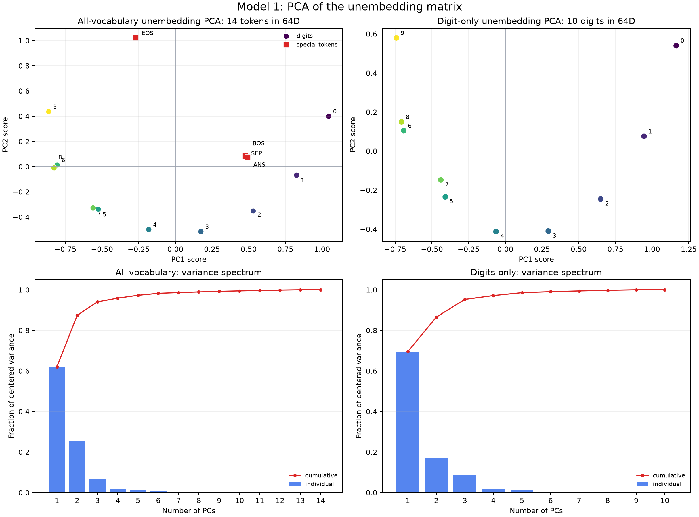
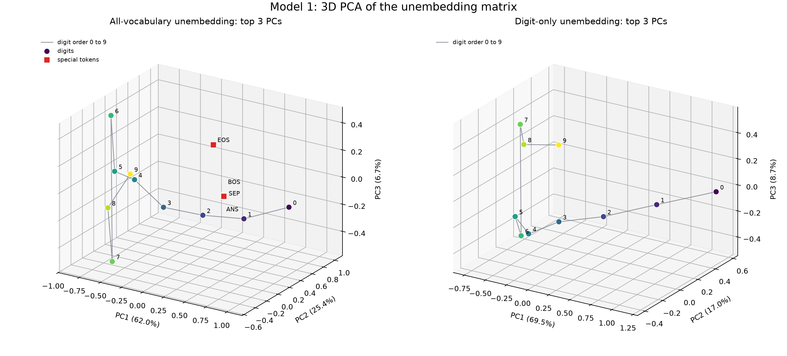
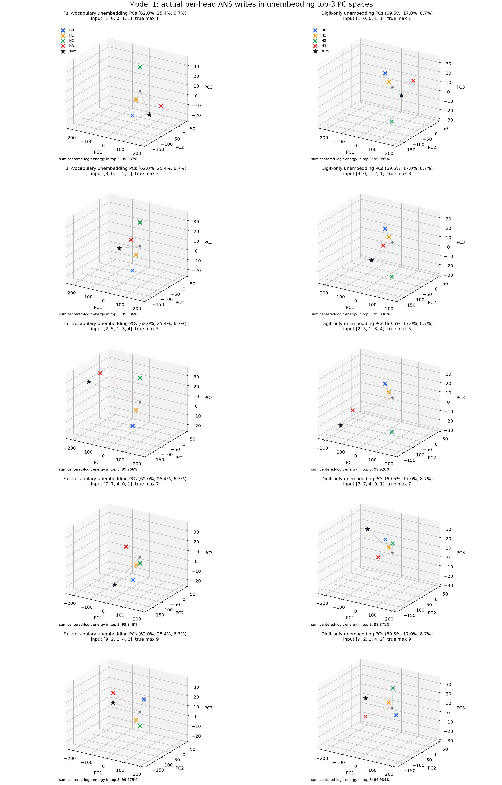
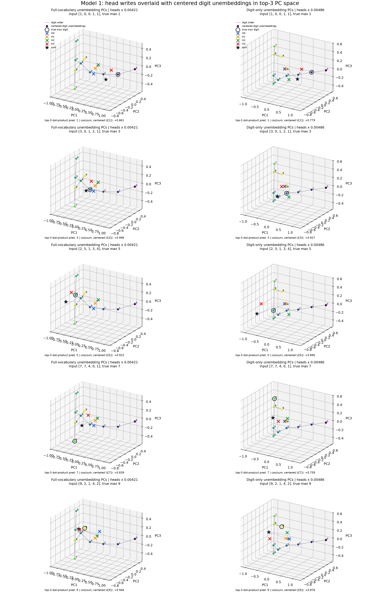
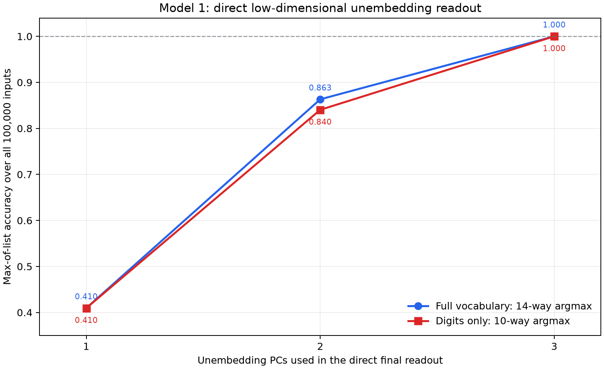
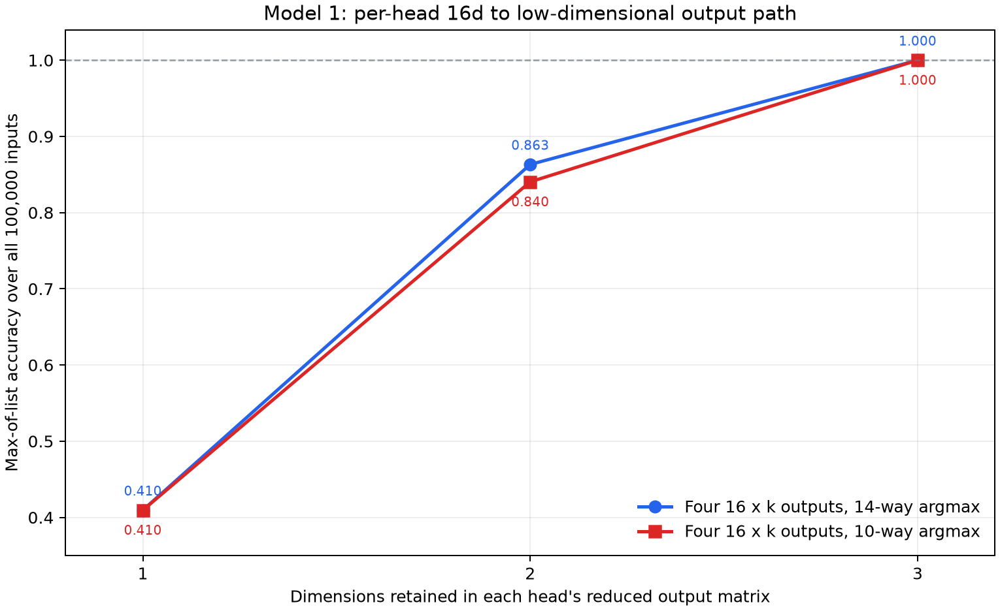

# 2026-07-11

## Model 1: Full-Vocabulary And Digit-Only Unembedding PCA

Question:

Is Model 1's unembedding matrix low-dimensional, both across the complete
14-token vocabulary and across only the ten output digits?

Method:

PyTorch stores the unembedding weight as:

```text
W_U = model.unembed.weight                 # 14 x 64
```

This is the transpose of the `64 x vocab_size` column-vector convention. For
PCA, treated each token's `64d` unembedding vector as one observation and the
residual-stream dimensions as features. Ran two separately centered PCAs:

```text
all vocabulary: W_U                       # 14 tokens x 64 dimensions
digits only:    W_U[0:10]                 # 10 digits x 64 dimensions
```

The full vocabulary is `0..9`, `BOS`, `SEP`, `ANS`, and `EOS`. Because PCA
centers across observations, the maximum possible centered ranks are `13` for
14 tokens and `9` for 10 digits. Repro script:
`scripts/analysis/model1_unembedding_pca.py`.

Result:



The same two PCAs in three dimensions, with the digit tokens connected in
numeric order:



Exact values:
[model1_unembedding_pca.json](assets/model1_unembedding_pca.json).

| PCA set | PC1 | PC2 | PC3 | PC1+PC2 | PC1+PC2+PC3 | PCs for 90% | PCs for 95% | PCs for 99% |
|---|---:|---:|---:|---:|---:|---:|---:|---:|
| All 14 vocabulary tokens | 0.620130 | 0.253596 | 0.066626 | 0.873726 | 0.940352 | 3 | 4 | 9 |
| Digits `0..9` only | 0.694690 | 0.170447 | 0.087468 | 0.865137 | 0.952605 | 3 | 3 | 6 |

Centered numerical ranks:

```text
all vocabulary: 13 / 13 maximum possible
digits only:     9 / 9 maximum possible
```

For the digit-only PCA, Pearson correlation between digit value and the first
three PC scores is:

```text
PC1: -0.956431
PC2: +0.158459
PC3: +0.208738
```

The sign of each PCA direction is arbitrary, so the meaningful PC1 result is
the correlation magnitude `0.956431`.

Interpretation:

The unembedding has a strong low-dimensional structure, but it is not exactly
low-rank. For the digits, one component captures about `69.5%` of centered
variance, two capture `86.5%`, and three capture `95.3%`. However, six
components are needed for `99%`, and the centered digit matrix has full
possible rank `9`.

The digit-only PC1 is approximately a number-value axis: its score is strongly
correlated with digit value. The ordering is not perfectly monotonic, and PC2
curves the digit trajectory, separating endpoints such as `0` and `9` from
middle digits. This is consistent with the earlier observation that the
head-sum output lives on a curved, low-dimensional answer manifold rather than
on a single straight number line.

The 3D view makes the remaining bend clearer. In particular, digit-only PC3
places `6` and `7` on opposite sides of the trajectory, with scores about
`-0.471` and `+0.523`. Thus the third component is not merely diffuse noise;
it resolves structure that overlaps in the PC1/PC2 projection.

Adding `BOS`, `SEP`, `ANS`, and `EOS` reduces the first-three-PC cumulative
variance from `95.3%` to `94.0%`. In the full-vocabulary projection, `BOS`,
`SEP`, and `ANS` cluster together while `EOS` is separated strongly along PC2.

Next step:

Put the digit unembedding geometry into the same two-dimensional basis as the
head-sum output. If `P1` and `P2` are the top head-sum directions, each digit's
2D readout coefficients are:

```text
(P1 dot W_U[d], P2 dot W_U[d])
```

Together with the per-head recruitment deltas, these coefficients define the
linear digit-decision boundaries in the head-sum PCA plane.

## Model 1: Head Outputs In The Top-3 Unembedding PC Spaces

Question:

Do the actual `64d` vectors written by the four attention heads at `[ANS]`
operate primarily in the top three principal directions of the full-vocabulary
or digit-only unembedding matrices?

Method:

Selected one deterministic random example for each of five representative
true maxima using seed `0`:

| True max | Input numbers |
|---:|---|
| 1 | `[1, 0, 0, 1, 1]` |
| 3 | `[3, 0, 1, 2, 1]` |
| 5 | `[2, 5, 1, 3, 4]` |
| 7 | `[7, 7, 4, 0, 1]` |
| 9 | `[9, 2, 1, 4, 2]` |

For each example, used the actual post-softmax attention and extracted each
head's `[ANS]` output after its `W_O` slice:

```text
Hh = head_value_h[:, ANS, :] @ W_O_h.T     # 1 x 64
head_sum = H0 + H1 + H2 + H3               # 1 x 64
```

Separately fit PCA to the centered full-vocabulary and digit-only unembedding
vectors. A head output is a vector written from the residual-stream origin, so
projected it without subtracting the unembedding mean:

```text
head_coordinates = Hh @ PC[0:3].T           # 1 x 3
```

For every head and the sum, measured:

```text
total-vector fraction = ||Hh projected to top 3||^2 / ||Hh||^2
span fraction         = top-3 energy / energy in the complete centered W_U span
logit-effect fraction = top-3 reconstructed centered-logit energy / full centered-logit energy
```

Also tested a genuinely low-dimensional final readout over all `100000`
inputs. For each `k = 1, 2, 3`, computed logits directly in PC coordinates:

```text
z = head_sum @ P_k.T                         # batch x k
U_low = (W_U - mean(W_U)) @ P_k.T            # vocab x k
relative_logits = z @ U_low.T                # batch x vocab
```

No `64d` vector is reconstructed for these evaluated logits. Centering `W_U`
only removes one common scalar from all logits for an input, so it cannot
change the argmax. The full-vocabulary PCA uses a `k x 14` readout and 14-way
argmax; the digit-only PCA uses a `k x 10` readout and 10-way argmax. Repro script:
`scripts/analysis/model1_head_outputs_in_unembedding_pca.py`.

Result:

In each panel, H0-H3 are colored `x` markers and their sum is the black star.
Rows use different true maxima; columns use the two independently fit
unembedding PCA bases.



Combined alignment view:

The centered digit-unembedding points and the head writes have very different
scales: unembedding PC coordinates are about order `1`, while raw head
coordinates reach order `200`. To make both visible, multiplied every head and
head-sum coordinate by one fixed positive display scale within each PCA basis:

```text
full-vocabulary basis: heads x 0.00420505
digit-only basis:      heads x 0.00486440
```

This preserves head directions and relative magnitudes within each column. The
digit points remain at their original centered PCA coordinates. The ring marks
the true maximum and the black star is the summed head write.



Exact values:
[model1_head_outputs_in_unembedding_pca.json](assets/model1_head_outputs_in_unembedding_pca.json).

All-input head-sum-only accuracy from the direct low-dimensional readout:

| PCs retained | Full vocabulary, `k x 14` | Digits only, `k x 10` |
|---:|---:|---:|
| 1 | 0.409520 | 0.409520 |
| 2 | 0.863180 | 0.840390 |
| 3 | **1.000000** | **1.000000** |



For `k = 3`, the complete final computation is therefore:

```text
full vocabulary: (batch x 3) @ (3 x 14) -> batch x 14 logits
digits only:     (batch x 3) @ (3 x 10) -> batch x 10 logits
```

The 14-way top-three readout produced no `BOS`, `SEP`, `ANS`, or `EOS`
predictions. Direct PC-space logits agree with the equivalent centered
projected-`64d` calculation to a maximum absolute difference of about
`1.2e-4`, attributable to float32 multiplication order.

### Pulling The Three-Dimensional Readout Before `W_O`

The same bottleneck can be moved earlier, before constructing any head's
`64d` output. For each head, let `O_h` be its `16 x 64` row-vector output map
and let `P_k` be the `64 x k` unembedding-PC basis. Constructed:

```text
O_h_low = O_h @ P_k                         # 16 x k
z_h = value_h @ O_h_low                     # batch x k
z = z_0 + z_1 + z_2 + z_3                   # batch x k
relative_logits = z @ U_low.T               # batch x vocab
```

This evaluator starts from the actual post-attention, pre-`W_O` value vectors
with shape `batch x 4 x 16`. It never constructs a `64d` head output for the
evaluated logits.

Accuracy over all `100000` inputs:

| Reduced output shape per head | Full vocabulary, 14-way | Digits only, 10-way |
|---:|---:|---:|
| `16 x 1` | 0.409520 | 0.409520 |
| `16 x 2` | 0.863180 | 0.840390 |
| `16 x 3` | **1.000000** | **1.000000** |



The per-head low-dimensional route produced exactly the same predictions as
the sum-then-project route for every input and every `k`. Its summed PC
coordinates differ from the original `64d` route by at most `1.37e-4` because
of float32 multiplication order. The 14-way `16 x 3` route again produced zero
special-token predictions.

Top-three metrics for the summed head output in the five plotted examples:

| True max | Full: total `64d` energy | Full: centered-logit energy | Digits: total `64d` energy | Digits: centered-logit energy |
|---:|---:|---:|---:|---:|
| 1 | 0.988115 | 0.999873 | 0.969632 | 0.999851 |
| 3 | 0.982576 | 0.999859 | 0.911930 | 0.998960 |
| 5 | 0.962678 | 0.999658 | 0.907403 | 0.999200 |
| 7 | 0.956190 | 0.999455 | 0.914519 | 0.998714 |
| 9 | 0.976638 | 0.999747 | 0.980911 | 0.999844 |

Across all four individual heads and the sum in these examples:

| PCA basis | Top-3 total `64d` energy range | Top-3 fraction inside centered `W_U` span | Top-3 centered-logit energy range |
|---|---:|---:|---:|
| Full vocabulary | 0.940979–0.988115 | 0.976500–0.994884 | 0.998748–0.999873 |
| Digits only | 0.811551–0.980911 | 0.964674–0.994021 | 0.998714–0.999851 |

Alignment of the summed write with the centered true-max unembedding in the
top-three space:

| True max | Full: cosine with true max | Full: nearest by cosine | Full: dot-product prediction | Digits: cosine with true max | Digits: nearest by cosine | Digits: dot-product prediction |
|---:|---:|---:|---:|---:|---:|---:|
| 1 | +0.861181 | 2 | 1 | +0.779374 | 2 | 1 |
| 3 | +0.995505 | 3 | 3 | +0.926979 | 3 | 3 |
| 5 | +0.921969 | 4 | 5 | +0.889904 | 5 | 5 |
| 7 | +0.838625 | 5 | 7 | +0.759188 | 5 | 7 |
| 9 | +0.945711 | 8 | 9 | +0.876187 | 8 | 9 |

Interpretation:

There is strong evidence that the output-side computation operates in the top
three unembedding directions. For both independently fit bases, the direct
`3d` head-sum readout preserves all `100000 / 100000` answers, including a
14-way vocabulary argmax. Two directions are not sufficient, so PC3 contains
decision-relevant information, not merely residual variance.

This establishes a three-dimensional final answer computation. More strongly,
the `64d` head writes do not need to be materialized: each head's actual `16d`
attention output can be mapped directly through a derived `16 x 3` output map,
and the four `3d` writes can be summed before unembedding. Across four heads,
this replaces `4 x 16 x 64 = 4096` output-map coefficients with
`4 x 16 x 3 = 192` derived coefficients for this readout, about `21.3x` fewer.

This is an exact linear reparameterization after attention, not evidence that
the complete `16d` value vectors intrinsically lie in three dimensions. It
means only three head-specific linear combinations of each value vector affect
the chosen top-three answer readout. QK attention and `W_V` still operate in
their original dimensions.

The distinction between raw vector energy and logit-effect energy matters.
For example, the digit-only top three retain only about `81.2%` of H1's raw
`64d` energy, but at least `99.87%` of the centered digit-logit effect is
retained across every plotted head and sum. Most output energy outside the top
three therefore does not distinguish among digit logits.

The head trajectories also mirror the attention recruitment circuit. H1 stays
near a fixed self-write; H0 is nearly fixed until max `9`; H2 changes when the
maximum enters its high-number regime; and H3 supplies the broad trajectory
across maxima. Their sum moves through the same three-dimensional readout space
and remains exactly decodable.

The overlay also shows why simple angular alignment is not the complete
readout rule. The black sum star does not always point most closely toward the
true-max vector: for example, max `1` is closest by cosine to digit `2`, and
max `7` is closest to digit `5`. Nevertheless, the true digit has the largest
dot product in every panel. The unembedding vectors' radii and their curved
arrangement therefore matter alongside direction.

Next step:

Pull the same three directions one step farther backward through each head's
value map:

```text
M_h = W_V_h.T @ O_h_low                    # 64 x 3
source_write_h = source_residual @ M_h      # 1 x 3
```

Then decompose `source_write_h(number, position) - source_write_h([ANS])`.
This will connect the attention source selected by QK directly to the causal
three-dimensional arrow written into answer space.
