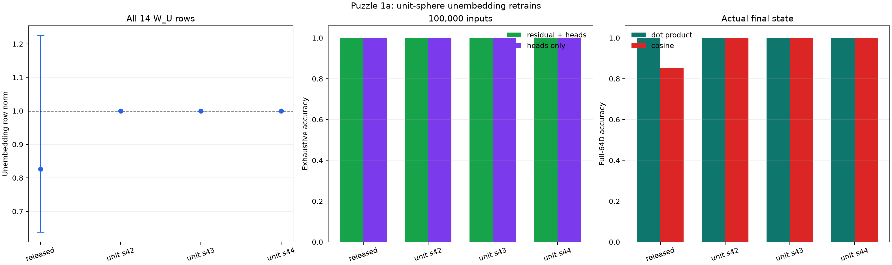
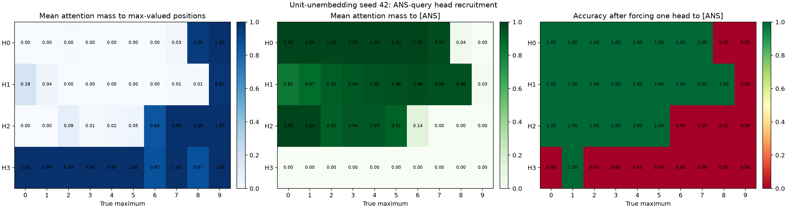
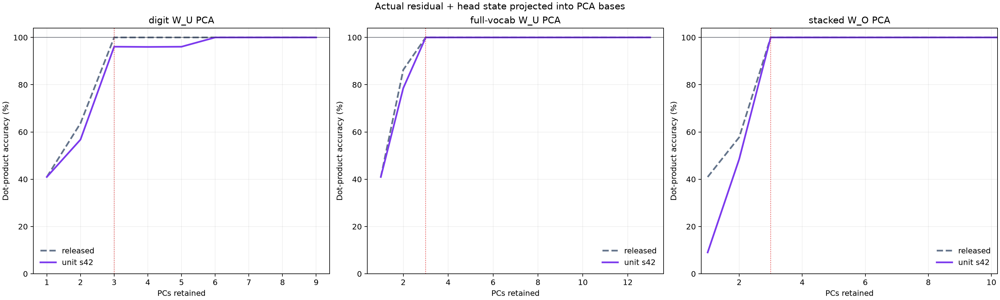
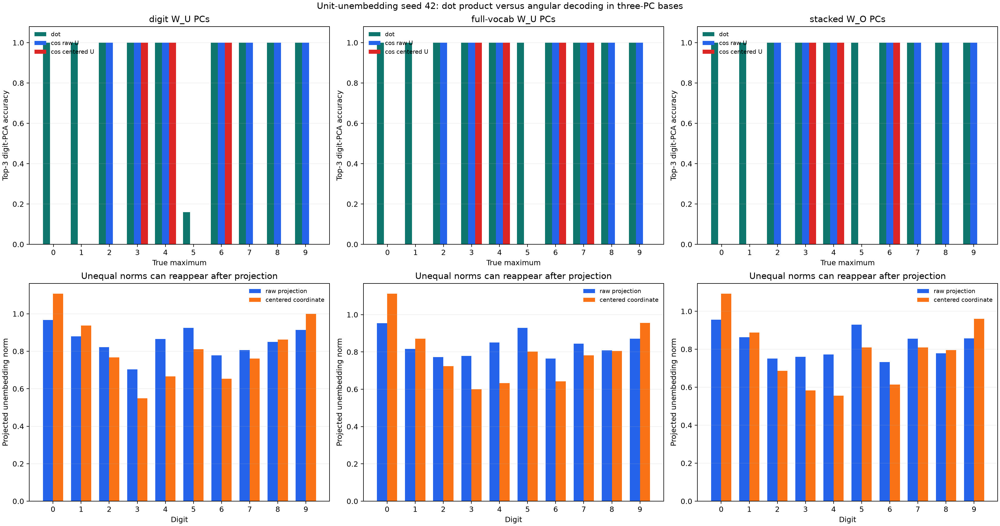
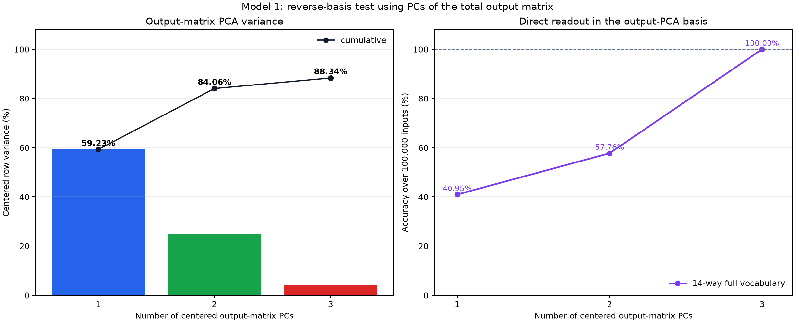
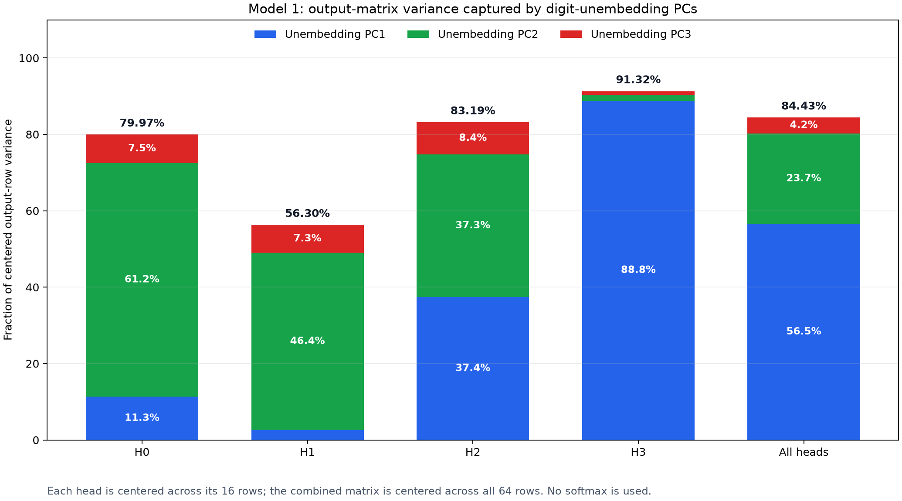
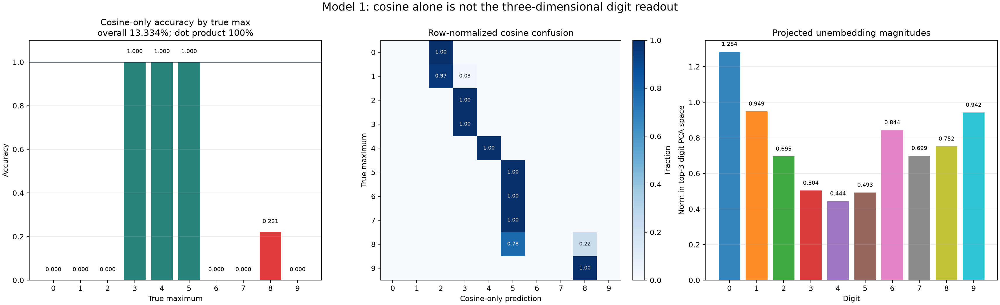
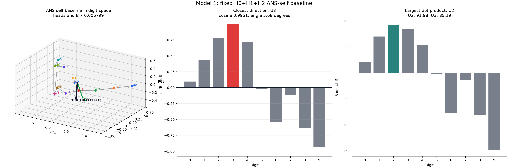

# Results - 2026-07-12

## Model 1 Retrain: Unit-Norm Unembedding Rows

Question:

The released model often predicts the correct digit by dot product even when
another digit unembedding is closer by angle. If every vocabulary row of
`W_U` is constrained to norm one during training, can the model retain perfect
accuracy, preserve the head-recruitment and low-dimensional mechanisms, and
become a purely angular decoder?

Method:

Vendored the upstream Puzzle 1a trainer from `andyrdt/puzzles` commit
`7857375da7dd7560fd5751c7e4fff42630295a3e`. The architecture, data, AdamW
optimizer, cosine schedule, and masked cross-entropy objective were unchanged:

```text
loss positions:
  [ANS] -> maximum digit
  maximum digit -> [EOS]

W_U shape: 14 x 64
```

The only intervention was projected optimization on all 14 unembedding rows:

```text
normalize_rows(W_U)                    # before the first forward pass

for each step:
    loss = cross_entropy(...)
    loss.backward()
    optimizer.step()
    normalize_rows(W_U)                # before the next forward pass
```

Trained seeds `42`, `43`, and `44` for the original `20000` steps. Each model
saw `10240000` examples. The primary mechanistic model is seed 42 because it
is exhaustively perfect and has the largest minimum digit margin.

All evaluations below cover every one of the `10^5` five-digit inputs. The
primary state is the actual last-position residual:

```text
h_final[ANS] = E_ANS + P_10 + sum_h head_write_h       # 1 x 64
logits       = h_final[ANS] @ W_U.T                    # 1 x 14
```

The head-sum-only state was tested separately. Repro scripts:
`04_2026/puzzle1a/train.py`,
`scripts/analysis/model1_unit_unembed_experiment.py`, and
`scripts/analysis/model1_unit_unembed_interactive.py`.

### Training And Full-Space Angular Readout



| Model | `W_U` row-norm range | Held-out accuracy | Exhaustive accuracy | Heads-only accuracy | Full-64d cosine accuracy | Minimum digit margin |
|---|---:|---:|---:|---:|---:|---:|
| Released | `0.6381-1.2251` | 100% | 100% | 100% | **85.200%** | not compared |
| Unit seed 42 | `0.99999994-1.00000012` | 100% | **100%** | **100%** | **100%** | **12.8516** |
| Unit seed 43 | `1.00000000-1.00000012` | 100% | **100%** | **100%** | **100%** | 0.3431 |
| Unit seed 44 | `1.00000000-1.00000012` | 100% | **100%** | **100%** | **100%** | 6.4040 |

No constrained model produced a special-token answer. The 40k fallback was
not needed.

The full-space angular result follows directly from the constraint. For a
nonzero final state and `||U_d|| = 1`:

```text
h dot U_d = ||h|| cosine(h, U_d)
```

`||h||` is shared by all candidate tokens, so dot-product and cosine argmaxes
must agree. The exhaustive check confirms the implementation obeys this
identity on all inputs; it is a sanity check, not evidence that a new angular
algorithm independently emerged.

Checkpoints and configurations:

- [seed 42 weights](assets/model1_unit_unembed_seed42.pt) and [config](assets/model1_unit_unembed_seed42_config.json)
- [seed 43 weights](assets/model1_unit_unembed_seed43.pt) and [config](assets/model1_unit_unembed_seed43_config.json)
- [seed 44 weights](assets/model1_unit_unembed_seed44.pt) and [config](assets/model1_unit_unembed_seed44_config.json)

### Head Recruitment In Seed 42



The actual `[ANS]` attention has sharp number thresholds:

| True maximum | H0 top source | H1 top source | H2 top source | H3 top source | Minimal exhaustively perfect one-hot scheme |
|---:|---|---|---|---|---|
| 0 | `[ANS]` | `[ANS]` | `[ANS]` | max `0` | H3 -> max |
| 1 | `[ANS]` | `[ANS]` | `[ANS]` | max `1` | all heads -> `[ANS]` |
| 2-5 | `[ANS]` | `[ANS]` | `[ANS]` | max | H3 -> max |
| 6-7 | `[ANS]` | `[ANS]` | max | max | H2, H3 -> max |
| 8 | max | `[ANS]` | max | max | H0, H2, H3 -> max |
| 9 | max | max | max | max | all four heads -> max |

All unspecified heads in the final column read `[ANS]`. For tied maxima,
force-max selects the maximum occurrence receiving the largest actual
attention for that head.

The routing thresholds are causally sharp. Forcing H3 back to `[ANS]` gives
zero accuracy for maxima `0` and `2-9`; forcing H2 back gives zero accuracy for
maxima `6-9`; forcing H0 back gives zero accuracy for `8-9`; and forcing H1
back gives zero accuracy for `9`. Max `1` is the exception: H3 actually reads
the `1`, but replacing that read with `[ANS]` remains 100% accurate, so this
particular attention choice is redundant.

The broader recruitment idea therefore reappears, but with shifted thresholds:

```text
released model: H3 at 2, H2 at 7, H0 at 9; H1 never
unit seed 42:   H3 at 0/2, H2 at 6, H0 at 8, H1 at 9
```

The exact head identities are not seed-invariant. Seed 44 assigns the main
low-digit role to H1, while seed 43 relies more on soft mixtures and does not
admit a perfect binary `[ANS]`/max scheme for every maximum. Unit-norm
unembeddings preserve the threshold-correction strategy, not one unique head
permutation.

### Low-Dimensional Computation



For each basis `Q_k`, projected the actual final state and unembeddings into
the same subspace:

```text
h_k = h_final @ Q_k
U_k = W_U @ Q_k
projected_logits = h_k @ U_k.T
```

The implementation also computed each head directly as
`value_h @ O_h @ Q_k`; this agrees with projecting the completed head sum to
within `3.1e-4` across every model and basis.

Primary seed 42:

| PCA basis | Top-3 centered variance | 3-PC dot accuracy | Minimum PCs for 100% dot accuracy | 3-PC raw-cosine accuracy | Minimum PCs for 100% raw cosine |
|---|---:|---:|---:|---:|---:|
| Digit `W_U` (`10 x 64`) | 74.72% | 96.091% | 6 | 95.317% | 6 |
| Full-vocabulary `W_U` (`14 x 64`) | 67.53% | **100%** | **3** | 95.317% | 9 |
| Stacked `W_O` (`64 x 64`) | 79.73% | **100%** | **3** | 95.317% | 23 |

Thus, the unit-row model still has a genuine three-dimensional computation,
but the successful basis is now the full-vocabulary `W_U` basis or the reverse
`W_O` basis. The digit-only basis needs six dimensions.

The dimensionality is seed-dependent:

| Model | Digit-`W_U` PCs for 100% | Full-`W_U` PCs for 100% | `W_O` PCs for 100% |
|---|---:|---:|---:|
| Released | 3 | 3 | 3 |
| Unit seed 42 | 6 | **3** | **3** |
| Unit seed 43 | 7 | 12 | 5 |
| Unit seed 44 | 4 | 7 | **3** |

For seed 42, the principal angles between the top-three digit-`W_U` and `W_O`
subspaces are `12.40`, `14.69`, and `22.04` degrees, compared with `6.94`,
`13.49`, and `19.04` degrees in the released model.

### Does Three-Dimensional Angular Coding Emerge?



No: equal norms in `64d` do not imply equal norms after projection. In seed
42's top-three `W_O` space, for example, the ten raw projected unembedding
norms range from `0.732` to `0.956`. Consequently:

```text
top-3 W_O dot-product accuracy: 100.000%
top-3 W_O raw-cosine accuracy:   95.317%

cosine-only errors:
  true max 0 -> 1
  true max 1 -> 2
  true max 5 -> 6
```

The same three failures occur in the other top-three raw-projection views.
Using conventional centered PCA coordinates changes the angles again and is
even less accurate: `11.913%` in the digit-`W_U` and `W_O` bases, and `27.874%`
in the full-vocabulary `W_U` basis. Centering preserves dot-product argmaxes
because it adds one candidate-independent score offset, but it does not
preserve cosines.

Interactive comparison:

[Open the unit-unembedding geometry explorer](assets/model1_unit_unembed_interactive.html){ target=_blank }

<iframe
  src="../assets/model1_unit_unembed_interactive.html"
  title="Interactive unit-unembedding angular geometry"
  style="width: 100%; height: 940px; border: 1px solid #d1d5db;"
  loading="lazy"
  allowfullscreen>
</iframe>

The controls select the released model or any constrained seed, the three PCA
bases, raw versus centered unembedding coordinates, and true maximum `0-9`.
The left scene shows H0-H3, the initial `[ANS]` residual, the head sum, final
state, and digit unembeddings. The right panels display the unscaled dot and
cosine scores.

Exact exhaustive values:
[model1_unit_unembed_experiment.json](assets/model1_unit_unembed_experiment.json).
Interactive coordinates:
[model1_unit_unembed_interactive.json](assets/model1_unit_unembed_interactive.json).

Interpretation:

The hypothesis is confirmed in full residual space and rejected in three
dimensions. Constraining `W_U` to the unit sphere is sufficient for exact
full-`64d` angular decoding, but orthogonal projection discards a different
amount of each token vector and recreates unequal radii. Low-dimensional
dot-product computation and low-dimensional angular coding are therefore
distinct properties.

The experiment also separates static geometry from learned mechanism. The
model can satisfy the same max objective with several head permutations and
different dimensional concentration, while repeatedly rediscovering a
thresholded strategy in which additional heads read the maximum for larger
digits.

Next step:

Test a second, explicitly different hypothesis: constrain the digit
unembeddings to a learned three-dimensional unit sphere, or regularize their
top-three projected norms. That would directly target reduced-space angular
coding, but it should remain a separate experiment because it adds an angular
objective beyond the unit-row intervention tested here.

## Model 1: Are The W_O And W_U Top-Three PC Subspaces The Same?

Question:

Does the reverse-basis experiment work because the top-three output-matrix PCs
and digit-unembedding PCs identify the same residual-stream subspace?

Method:

Fitted the two PCA bases independently after centering rows:

```text
U_digits = model.unembed.weight[0:10]                 # 10 x 64
O_all    = stack(O_0, O_1, O_2, O_3)                 # 64 x 64

Q_U = top 3 right singular vectors of centered U     # 64 x 3
Q_O = top 3 right singular vectors of centered O     # 64 x 3
C   = Q_U.T @ Q_O                                    # 3 x 3
```

Each entry `C[i,j]` is the exact `64d` cosine between digit-unembedding PC `i`
and output-matrix PC `j`. Output-PC signs were chosen so the same-index
cosines are positive. This resolves the arbitrary sign of PCA directions but
does not change either subspace.

The principal angles between the complete subspaces are:

```text
theta_i = arccos(singular_value_i(C))
```

If the subspaces were exactly equal, all three singular values would be `1`
and all three angles would be `0` degrees.

The union of two distinct `3d` subspaces can span up to six dimensions, so six
`64d` vectors cannot generally be displayed exactly in one `3d` scene. The
interactive therefore has two mathematically explicit views:

```text
W_U frame: W_U PCs = I; W_O PCs = coordinates Q_U.T @ Q_O
W_O frame: W_O PCs = I; W_U PCs = coordinates Q_O.T @ Q_U
```

The selected frame's three PCs are exact unit axes. The other three arrows are
orthogonal projections; a shortened arrow indicates a component outside the
displayed subspace. The adjacent heatmap always shows the exact `64d` cosines.
Source:
`scripts/analysis/model1_output_unembedding_pc_alignment_interactive.py`.

Result:

[Open the interactive W_O/W_U PC comparison](assets/model1_output_unembedding_pc_alignment.html){ target=_blank }

<iframe
  src="../assets/model1_output_unembedding_pc_alignment.html"
  title="Interactive comparison of output-matrix and digit-unembedding PCs"
  style="width: 100%; height: 840px; border: 1px solid #d1d5db;"
  loading="lazy"
  allowfullscreen>
</iframe>

Exact values:
[model1_output_unembedding_pc_alignment.json](assets/model1_output_unembedding_pc_alignment.json).

The exact `64d` PC cosine matrix is:

| | W_O PC1 | W_O PC2 | W_O PC3 |
|---|---:|---:|---:|
| **digit W_U PC1** | **0.9694** | 0.1880 | -0.0225 |
| **digit W_U PC2** | -0.1978 | **0.9261** | 0.0294 |
| **digit W_U PC3** | 0.0416 | -0.0233 | **0.9741** |

| Quantity | PC1 | PC2 | PC3 |
|---|---:|---:|---:|
| Same-index PC cosine | 0.9694 | 0.9261 | 0.9741 |
| Principal angle between subspaces | 6.94 degrees | 13.49 degrees | 19.04 degrees |
| Digit-W_U variance per PC | 69.47% | 17.04% | 8.75% |
| Output-W_O variance per PC | 59.23% | 24.83% | 4.28% |

The cumulative top-three variance is `95.26%` for the centered digit
unembeddings and `88.34%` for the centered output matrix.

Interpretation:

The bases are very similar, but not identical. PC3 is almost directly matched,
while PC1 and PC2 include a visible rotation into one another, represented by
the approximately `+0.188` and `-0.198` off-diagonal cosines. At the subspace
level, even the largest principal angle is only `19.04` degrees.

This strong overlap is likely a major reason the reverse experiment works:
both PCA procedures recover nearby parts of residual space containing the
digit-readout computation. It is not, by itself, a complete explanation of
perfect accuracy. Perfect accuracy additionally says that the differences
between these subspaces and the discarded directions never move any tested
example across a competing digit's dot-product decision boundary.

Next step:

Decompose actual head-sum writes into the shared principal-vector directions
and the subspace-specific remainders. Testing accuracy after removing each
part would distinguish the genuinely shared computation from directions that
are unique to one PCA basis but behaviorally redundant.

## Model 1: Piecewise Writes In The Output-Matrix PCA Basis

Question:

How does the same staged head-write mechanism look when its three-dimensional
basis is fitted to the output matrix `O_all = W_O.weight.T`, rather than to the
digit unembedding matrix?

Method:

Reused the exact full-`64d` baseline and attention-source corrections from the
earlier unembedding-PCA animation. Only the basis used to display and score
those vectors was changed. The new orthonormal basis is fitted to the centered
rows of the total output matrix:

```text
O_all       = stack(O_0, O_1, O_2, O_3)              # 64 x 64
O_centered  = O_all - mean_rows(O_all)
Q_O         = top 3 right singular vectors            # 64 x 3

z_h         = value_h @ O_h @ Q_O                     # 1 x 3
U_digit_3d  = (U_digits - mean_rows(U_digits)) @ Q_O  # 10 x 3
score[d]    = sum_h(z_h) dot U_digit_3d[d]
```

Centering the digit unembeddings subtracts the same scalar from every digit's
score, so it cannot change the winning digit. For easier visual comparison,
each output-PC axis was sign-flipped when necessary to have positive dot
product with the same-index digit-unembedding PC. Axis sign flips do not alter
the dot-product bars or predictions.

The staged endpoint recipes are unchanged:

```text
max 0:    B + H3([ANS])
max 1:    B + H3(actual soft attention row)
max 2-6:  B + H3(max)
max 7-8:  B + H3(max) + [H2(max) - H2([ANS])]
max 9:    B + H3(max) + [H2(max) - H2([ANS])] + [H0(max) - H0([ANS])]
```

Here `B = H0([ANS]) + H1([ANS]) + H2([ANS])`. Source:
`scripts/analysis/model1_output_pca_piecewise_interactive.py`.

Result: interactive comparison

[Open the output-matrix-PCA interactive](assets/model1_output_pca_piecewise_interactive.html){ target=_blank }

[Open the earlier unembedding-PCA interactive](assets/model1_piecewise_write_animation.html){ target=_blank }

<iframe
  src="../assets/model1_output_pca_piecewise_interactive.html"
  title="Interactive piecewise head writes in the output-matrix PCA basis"
  style="width: 100%; height: 900px; border: 1px solid #d1d5db;"
  loading="lazy"
  allowfullscreen>
</iframe>

Exact coordinates and validation:
[model1_output_pca_piecewise_interactive.json](assets/model1_output_pca_piecewise_interactive.json).

The output-derived top-three basis explains `88.34%` of the centered output
matrix's row variance. It preserves `100%` accuracy over all `100000` actual
inputs, and all ten forced piecewise endpoints also predict their intended
digit. More strongly, the completed-stage winners are identical to those in
the unembedding-derived basis:

```text
0: 2 -> 0       5: 2 -> 5
1: 2 -> 1       6: 2 -> 6
2: 2 -> 2       7: 2 -> 3 -> 7
3: 2 -> 3       8: 2 -> 4 -> 8
4: 2 -> 4       9: 2 -> 4 -> 8 -> 9
```

The two three-dimensional subspaces are close but not identical. Their
principal angles are `6.94`, `13.49`, and `19.04` degrees. After the display-only
sign alignment, same-index PC cosines are `0.969`, `0.926`, and `0.974`.

Interpretation:

The visible coordinates and arrow directions change because this is genuinely
an output-derived subspace. Nevertheless, the same causal writes cross the
same digit decision boundaries in the same order. This supports a shared
low-dimensional readout geometry: both the output weights and the digit
unembeddings concentrate strongly around nearby three-dimensional residual
subspaces that preserve the model's max computation.

This does not show that every use of `W_O` is three-dimensional. The output
matrix has substantial variance outside these PCs, and the claim here is only
that its top-three centered PCs preserve this task's tested digit argmaxes and
piecewise interventions.

Next step:

Place both interactives in a synchronized side-by-side view so that the same
target, stage, and interpolation value can be compared directly across bases.

## Model 1: Reverse-Basis Test Using Output-Matrix PCs

Question:

If the low-dimensional basis is fitted to the total `64 x 64` output matrix
instead of the unembedding matrix, can the model still perform the complete
max-of-list task using only one, two, or three dimensions?

Method:

Constructed the mathematical row-vector output map by stacking the four
per-head maps:

```text
O_all = stack(O_0, O_1, O_2, O_3)                    # 64 x 64
      = stored PyTorch W_O.weight.T
```

Centered its 64 output-direction rows and fitted PCA:

```text
O_centered = O_all - mean_rows(O_all)                 # 64 x 64
_, S, Vh = svd(O_centered)
Q_k = Vh[:k].T                                        # 64 x k
```

The output-row mean is used only to fit the PCA directions. It is not
subtracted from actual head writes and is not added back as an affine term.
Thus the accuracy test uses the pure linear span of the first `k` centered
output PCs.

For all `100000` inputs, extracted each head's actual post-attention,
pre-`W_O` value at `[ANS]` and evaluated the task without constructing a `64d`
head output:

```text
O_h_low = O_h @ Q_k                                  # 16 x k
z_h     = value_h @ O_h_low                          # batch x k
z       = sum_h z_h                                  # batch x k
U_low   = (W_U - mean_rows(W_U)) @ Q_k                # vocab x k
logits  = z @ U_low.T                                 # batch x vocab
```

Tested both a digit-only `10`-way readout and a full-vocabulary `14`-way
readout. Centering `W_U` only removes a candidate-independent score offset; the
implementation asserted that centered and raw projected unembeddings produce
identical argmaxes. It also asserted that the per-head route above agrees with
`full_head_sum @ Q_k` to within `9.16e-5`.

Repro script:
`scripts/analysis/model1_output_pca_readout_accuracy.py`.

Result:



Exact values:
[model1_output_pca_readout_accuracy.json](assets/model1_output_pca_readout_accuracy.json).

| Output PCs retained | Variance contributed by this PC | Cumulative output variance | Digit-only accuracy | Full-vocabulary accuracy | Special-token predictions |
|---:|---:|---:|---:|---:|---:|
| 1 | 59.23% | 59.23% | 40.952% | 40.952% | 0 |
| 2 | 24.83% | 84.06% | 57.758% | 57.758% | 0 |
| **3** | **4.28%** | **88.34%** | **100.000%** | **100.000%** | **0** |

The full `64d` head-sum baseline is also `100000 / 100000` for both candidate
sets. Accuracy is identical between the `10`-way and `14`-way projected
readouts at every tested dimensionality.

The errors at lower dimension are structured:

```text
k = 1: only true maxima 0 and 9 are correct
k = 2: maxima 0-6 and 9 are correct
       every max-7 input is predicted as 5
       every max-8 input is predicted as 6
k = 3: every true maximum 0-9 is correct
```

Interpretation:

The reverse construction succeeds: the top three PCs of the centered total
output matrix define another `3d` residual-stream basis in which the entire
task can be computed. Each `16 x 64` head output map can be pulled back to a
`16 x 3` map in this basis, just as it could in the unembedding-PC basis.

Variance magnitude alone does not determine decision relevance. Output PC3
adds only `4.28%` of centered output-row variance, but raises accuracy from
`57.758%` to `100%` by restoring the max-`7` and max-`8` decision regions. This
is another case where a low-variance direction is causally essential for the
argmax computation.

The centered output matrix still has rank `63`, so this does not mean `W_O` is
rank three. It means its leading three centered row-variation directions are
sufficient for this task's projected digit-logit readout. The omitted `11.66%`
of static output-row variance is unnecessary for the tested argmaxes.

Next step:

Calculate the principal angles between the three-dimensional output-PCA and
digit-unembedding-PCA subspaces. This will show whether both perfect readouts
recover nearly the same residual subspace or whether different three-dimensional
spaces happen to preserve the same ten decision regions.

## Model 1: How Much Output-Matrix Variance Lies In The Unembedding PC Space?

Question:

How much centered row variance of the combined `64 x 64` output matrix, and of
each head's `16 x 64` output matrix separately, lies in the top-three
digit-unembedding principal directions?

Method:

Used the same digit-only PCA basis as the low-dimensional mechanism. The ten
digit unembeddings were centered across tokens, and their top three right
singular vectors were collected as orthonormal columns of `Q`:

```text
U_digits       = W_U[0:10, :]                         # 10 x 64
U_centered     = U_digits - mean_rows(U_digits)       # 10 x 64
Q              = top 3 residual-space PCs            # 64 x 3
```

In row-vector notation, each per-head matrix is `O_h: 16 x 64`, so
`value_h @ O_h` is a `1 x 64` residual write. Stacking the four matrices gives:

```text
O_all = stack(O_0, O_1, O_2, O_3)                    # 64 x 64
      = stored PyTorch W_O.weight.T
```

For each head, centered its 16 rows around that head's own row mean. For the
combined result, centered all 64 stacked rows around one global row mean. With
`n = 16` for one head or `n = 64` for the combined matrix:

```text
O_c = O - mean_rows(O)
C_O = O_c.T @ O_c / (n - 1)                           # 64 x 64

fraction_j = q_j.T @ C_O @ q_j / trace(C_O)
top3_fraction = trace(Q.T @ C_O @ Q) / trace(C_O)
              = ||O_c @ Q||_F^2 / ||O_c||_F^2
```

No softmax is used. The implementation also asserted that the covariance,
direct projection-energy, and projected-reconstruction calculations agree.
Repro script:
`scripts/analysis/model1_output_variance_in_unembedding_pcs.py`.

Result:



Exact values:
[model1_output_variance_in_unembedding_pcs.json](assets/model1_output_variance_in_unembedding_pcs.json).

Each PC column below is its contribution as a percentage of that matrix's own
total centered row variance:

| Output matrix | Total centered variance | PC1 | PC2 | PC3 | Top three | Outside top three |
|---|---:|---:|---:|---:|---:|---:|
| H0 `O_0` | 1.672285 | 11.34% | **61.15%** | 7.48% | **79.97%** | 20.03% |
| H1 `O_1` | 0.822413 | 2.58% | **46.40%** | 7.31% | **56.30%** | 43.70% |
| H2 `O_2` | 2.118856 | **37.40%** | **37.35%** | 8.45% | **83.19%** | 16.81% |
| H3 `O_3` | 5.188508 | **88.82%** | 1.57% | 0.93% | **91.32%** | 8.68% |
| **All heads `O_all`** | **2.377940** | **56.55%** | **23.70%** | **4.19%** | **84.43%** | **15.57%** |

The same three PCs explain `95.26%` of the centered digit-unembedding variance.
For the combined output matrix, they capture absolute centered variance
`2.007718` out of `2.377940`, or `84.43%`.

Interpretation:

The high task accuracy after projection is supported by a strong static weight
alignment: most of the combined output matrix's centered row variance already
lies in the three-dimensional digit-readout subspace. The alignment is also
head-specific:

```text
H0: primarily PC2
H1: primarily PC2, but with the weakest total three-PC concentration
H2: almost evenly divided between PC1 and PC2
H3: overwhelmingly PC1
```

H3's `88.82%` concentration in PC1 is consistent with the earlier observation
that its max-`0` through max-`6` writes form an almost one-dimensional signed
axis. This weight-only result does not by itself show which rows are activated
by actual value vectors, but it shows that H3's available output directions are
already strongly aligned with the leading digit-unembedding direction.

The combined `84.43%` is not an average of the four per-head percentages. Each
head is centered using its own mean and normalized by its own variance, whereas
the combined matrix uses one mean and one normalization over all 64 rows.

Next step:

Repeat the same variance-capture calculation on actual post-`W_O` head outputs
over all `100000` inputs. That activation-weighted analysis will show whether
the model preferentially uses the aligned parts of each `O_h`, including the
`43.70%` of H1's static row variance outside this three-dimensional subspace.

## Model 1: Piecewise Head Writes From Baseline To Answer

Question:

Can the complete attention-routing abstraction be visualized as a fixed
low-dimensional baseline plus the head writes recruited for each maximum?

Method:

Used one matched input for each digit, `[0, 0, m, 0, 0]`, and the same top-three
centered digit-unembedding PCA basis as the earlier figures. At the `[ANS]`
position, each selected `1 x 16` value was mapped through its head's `16 x 64`
output slice and then into the common three-dimensional basis:

```text
z_h = value_h @ O_h @ P3.T                       # 1 x 3
z   = sum_h z_h                                  # 1 x 3
relative_logit[d] = z dot U3[d]                  # scalar
```

The staged construction starts from the fixed baseline:

```text
B = H0([ANS]) + H1([ANS]) + H2([ANS])
```

It then applies these exact endpoint recipes:

```text
max 0:    B + H3([ANS])
max 1:    B + H3(actual soft attention row)
max 2-6:  B + H3(max)
max 7-8:  B + H3(max) + [H2(max) - H2([ANS])]
max 9:    B + H3(max) + [H2(max) - H2([ANS])] + [H0(max) - H0([ANS])]
```

The subtraction terms are replacement bookkeeping, not extra negative heads.
`B` already contains `H2([ANS])` and `H0([ANS])`, so changing either source to
the maximum requires adding `Hh(max) - Hh([ANS])`. The animation labels these
operations directly as `H2: [ANS] -> max` and `H0: [ANS] -> max`.

For max `1`, H3 uses the measured attention row rather than one-hot attention:

```text
62.2429% [ANS] + 37.6557% 1@5 + 0.1014% other positions
```

All intermediate `B + lambda*x` frames are explanatory linear interpolations.
Only the `lambda=1` endpoints are claimed as exact attention interventions.
The arrows use one common positive display scale; the live bars show the raw,
unscaled `z dot U3[d]` values.

Source:
`scripts/analysis/model1_piecewise_write_animation.py`.

Result: video

<video
  controls
  preload="metadata"
  poster="../assets/model1_piecewise_write_animation_poster.png"
  style="width: 100%; height: auto; border: 1px solid #d1d5db;"
>
  <source src="../assets/model1_piecewise_write_animation.mp4" type="video/mp4">
  Your browser does not support embedded MP4 video.
</video>

<a href="../assets/model1_piecewise_write_animation.mp4" download>Download the 1080p MP4</a>

Result: interactive version

[Open the rotatable staged animation](assets/model1_piecewise_write_animation.html){ target=_blank }

<a href="../assets/model1_piecewise_write_animation.html" download>Download the self-contained interactive HTML file</a>

<iframe
  src="../assets/model1_piecewise_write_animation.html"
  title="Interactive piecewise head-write animation"
  style="width: 100%; height: 900px; border: 1px solid #d1d5db;"
  loading="lazy"
  allowfullscreen>
</iframe>

Exact values and validation:
[model1_piecewise_write_animation.json](assets/model1_piecewise_write_animation.json).

The right-hand readout changes winners at the exact stages below:

| Intended max | 3D winner after `B` and each completed write |
|---:|---|
| 0 | `2 -> 0` |
| 1 | `2 -> 1` |
| 2 | `2 -> 2` |
| 3 | `2 -> 3` |
| 4 | `2 -> 4` |
| 5 | `2 -> 5` |
| 6 | `2 -> 6` |
| 7 | `2 -> 3 -> 7` |
| 8 | `2 -> 4 -> 8` |
| 9 | `2 -> 4 -> 8 -> 9` |

Every final recipe predicts its intended digit in all three checks:

```text
top-3 digit-PCA head-sum readout: 10 / 10
full 64D head-sum readout:         10 / 10
actual model on matched inputs:    10 / 10
```

Interpretation:

This makes the piecewise mechanism concrete. `B` begins in digit `2`'s linear
decision cell. H3 supplies the main low-to-middle digit write. For maxima `7`
and `8`, H3 alone leaves the state in cells `3` and `4`; replacing H2's
`[ANS]` source with the maximum supplies the correction that crosses into cells
`7` and `8`. For max `9`, the H2 replacement first reaches cell `8`, and the H0
replacement supplies the final boundary crossing to cell `9`.

The recruited heads therefore do not need to make the sum nearest to the target
by cosine. They need to change the ten dot products enough that the target's
linear score becomes largest.

Next step:

Draw the relevant pairwise decision planes for the high-digit stages, especially
`3 -> 7`, `4 -> 8`, and `8 -> 9`, and measure each correction's signed distance
across the boundary.

## Model 1: Interactive Max-3 And Max-4 Geometry

Question:

Does the rotatable three-dimensional geometry confirm that the max-`3` sum is
closer to `U3` than `U4`, and that the max-`4` sum is closer to `U4` than `U5`?

Method:

Reused the exact piecewise one-hot vectors recorded on 2026-07-11:

```text
input: [0, 0, max, 0, 0]
H0/H1/H2 -> [ANS] self one-hot
H3 -> unique maximum at position 5 one-hot
```

The Plotly artifact contains independent max-`3` and max-`4` scenes. It uses
equal data-unit scaling on PC1, PC2, and PC3 so that rotation does not introduce
unequal-axis distortion. H0-H3 and `SUM` use the same positive display factor
`0.00317793`; unembedding vectors are unscaled. Hovering over an unembedding
shows its norm, cosine, spatial angle, and dot product with `SUM`.

Source:
`scripts/analysis/model1_max34_interactive_geometry.py`.

Result:

[Open the standalone interactive plot](assets/model1_max34_piecewise_interactive.html){ target=_blank }

<a href="../assets/model1_max34_piecewise_interactive.html" download>Download the self-contained HTML file</a>

<iframe
  src="../assets/model1_max34_piecewise_interactive.html"
  title="Interactive max-3 and max-4 head geometry"
  style="width: 100%; height: 840px; border: 1px solid #d1d5db;"
  loading="lazy"
  allowfullscreen>
</iframe>

Numerical confirmation:

| Case | Candidate | Cosine with `SUM` | Spatial angle | Dot product |
|---|---|---:|---:|---:|
| max 3 | **U3** | **0.924051** | **22.474 degrees** | **73.05498** |
| max 3 | U4 | 0.872934 | 29.199 degrees | 60.84348 |
| max 4 | **U4** | **0.950897** | **18.029 degrees** | **70.04760** |
| max 4 | U5 | 0.658965 | 48.779 degrees | 53.87319 |

Interpretation:

There is no unembedding-index error. In both cases, the correct digit is
closest by cosine and also wins by dot product. The misleading static view came
from flattening a three-dimensional scene into a fixed two-dimensional camera
view, compounded by the static plot's unequal box aspect.

Next step:

Use the interactive format for max `7-9`, where H2 and H0 recruitment adds new
head directions and makes static-camera interpretation more difficult.

## Model 1: How Much Does Cosine Determine The 3D Readout?

Question:

Across all `100000` inputs, is the correct digit the unembedding vector most
closely aligned by cosine with the summed four-head output in the top-three
digit-unembedding PCA space?

Method:

For every input, computed the actual four-head sum at `[ANS]`, then projected
both it and the ten centered digit unembeddings into the same digit-only PCA
basis:

```text
z      = head_sum @ P3.T                         # batch x 3
U3[d]  = (W_U[d] - mean(W_U[0:10])) @ P3.T      # 3

dot_score[d]     = z dot U3[d]
cosine_score[d]  = cosine(z, U3[d])
weighted_score[d] = ||U3[d]|| * cosine(z, U3[d])
```

Because `||z||` is common to every candidate digit for one input,
`weighted_score` must have the same argmax as `dot_score`. Tested that identity
numerically as well as comparing the pure cosine argmax with the true maximum.

Repro script:
`scripts/analysis/model1_lowdim_cosine_readout.py`.

Result:



Exact values:
[model1_lowdim_cosine_readout.json](assets/model1_lowdim_cosine_readout.json).

Overall results:

```text
3D dot-product accuracy:             100000 / 100000 = 100.000%
3D norm-weighted cosine accuracy:    100000 / 100000 = 100.000%
3D cosine-only accuracy:              13334 / 100000 =  13.334%
macro cosine-only accuracy by max:                         32.207%
dot vs norm-weighted mismatches:                               0
```

| True max | Count | Dot-product accuracy | Cosine-only accuracy | Cosine-only predictions |
|---:|---:|---:|---:|---|
| 0 | 1 | 1.000 | 0.000 | `2: 1` |
| 1 | 31 | 1.000 | 0.000 | `2: 30, 3: 1` |
| 2 | 211 | 1.000 | 0.000 | `3: 211` |
| 3 | 781 | 1.000 | **1.000** | `3: 781` |
| 4 | 2101 | 1.000 | **1.000** | `4: 2101` |
| 5 | 4651 | 1.000 | **1.000** | `5: 4651` |
| 6 | 9031 | 1.000 | 0.000 | `5: 9031` |
| 7 | 15961 | 1.000 | 0.000 | `5: 15961` |
| 8 | 26281 | 1.000 | 0.221 | `5: 20480, 8: 5801` |
| 9 | 40951 | 1.000 | 0.000 | `8: 40951` |

Cosine alone therefore identifies the answer for every input only when the
true maximum is `3`, `4`, or `5`, and for `22.1%` of max-`8` inputs. It fails
for every input in the other six true-max groups.

### Confirming The Max-0 Norm Effect

The single max-`0` input gives:

| Digit | Cosine with `z` | `||U3[d]||` | Dot product |
|---:|---:|---:|---:|
| **0** | 0.721753 | **1.284165** | **336.63205** |
| 1 | 0.918481 | 0.948663 | 316.46655 |
| 2 | **0.998083** | 0.695354 | 252.06847 |

Thus pure cosine predicts `2`, not `0`. Digit `0` wins because its projected
unembedding norm is sufficiently larger. This confirms that the max-`0`
readout depends critically on unembedding magnitude, not only alignment.

Interpretation:

The three-dimensional bottleneck is sufficient, but it is not an angular
nearest-neighbor classifier. The actual decision rule is:

```text
argmax_d ||U3[d]|| * cosine(z, U3[d])
```

The norm of `z` itself cannot affect the winning digit, but the ten projected
unembedding norms are unequal, ranging from about `0.444` for `U4` to `1.284`
for `U0`. Those radii move the linear decision boundaries substantially.

Cosine provides part of the code: it is sufficient in the middle range
`3-5`, and sometimes for `8`. Across the complete task, however, unembedding
magnitude is indispensable. The low-dimensional computation should therefore
be understood as a structured dot-product readout over a curved, unequal-radius
set of digit vectors.

Next step:

For every failure group, decompose the boundary between the true digit and the
cosine-selected digit into its angular and unembedding-norm terms. This should
show exactly how much radial scale is needed to rescue `0`, `1`, `2`, `6`, `7`,
`8`, and `9`.

## Model 1: Mechanism Synthesis And Interactive Digit Geometry

Question:

What mechanism is supported jointly by the attention-routing results, the
three-dimensional output bottleneck, and the failure of cosine-only decoding?

Current mechanism:

For each head, attention first selects or mixes source values. The digit-PCA
basis can then be pulled backward through that head's output matrix:

```text
value_h       = attention_h[ANS, :] @ V_h             # 1 x 16
O_h_low       = O_h @ P3.T                             # 16 x 3
z_h           = value_h @ O_h_low                      # 1 x 3
z             = z_0 + z_1 + z_2 + z_3                 # 1 x 3
relative_logit[d] = z dot U3[d]                        # scalar
```

Here `P3` contains the top three centered digit-unembedding directions and
`U3[d] = (W_U[d] - mean(W_U[0:10])) @ P3.T`.

The same PCA basis is therefore useful on both sides of the readout, but this
needs precise wording. It does not show that each raw `O_h` is rank three or
that every head output has all of its `64d` energy in this space. It shows that
the head-output components relevant for distinguishing digit logits can be
compressed through `O_h_low` while retaining `100%` task accuracy.

The routing and write mechanism currently looks like:

```text
H0/H1/H2 self-reads establish a default baseline.
H3 supplies an almost one-dimensional signed write for maxima 0-6.
H2 is routed to high-number sources for maxima 7-9.
H0 is additionally routed to the maximum for max 9.
H1 remains a stable [ANS] self-reader.
```

The recruited heads should not be described as simply rotating `z` toward the
correct unembedding by cosine. Their causal role is to move `z` across the
dot-product decision boundaries:

```text
digit t beats digit j iff (U3[t] - U3[j]) dot z > 0
```

Because the `U3[d]` vectors have unequal radii, crossing these boundaries can
happen without making `U3[t]` the nearest vector by angle.

Result: interactive unembedding geometry

[Open all ten digit unembeddings in interactive 3D](assets/model1_digit_unembedding_3d_interactive.html){ target=_blank }

<a href="../assets/model1_digit_unembedding_3d_interactive.html" download>Download the self-contained digit-unembedding HTML file</a>

<iframe
  src="../assets/model1_digit_unembedding_3d_interactive.html"
  title="Interactive three-dimensional digit unembedding geometry"
  style="width: 100%; height: 840px; border: 1px solid #d1d5db;"
  loading="lazy"
  allowfullscreen>
</iframe>

The vectors are centered digit unembeddings in the exact PCA orientation used
by the earlier head-write figures. The connected path shows digit order
`0 -> 9`; every vector starts at the residual-stream origin. Equal data-unit
scaling is used, and hovering reports each coordinate and radius.

Interpretation:

The interactive view makes the readout geometry explicit: the digit vectors
form a curved path with substantially unequal lengths. The head circuit writes
a low-dimensional state into this geometry, and the unembedding performs a
linear multiclass classification by dot product. Attention recruitment is best
understood as adding head-specific correction vectors that place the final sum
inside the desired digit's dot-product cell, rather than forcing nearest-cosine
alignment.

Next step:

Project the max-`7`, max-`8`, and max-`9` H2/H0 recruitment deltas into this
same interactive scene and draw the relevant pairwise decision planes. That
would show exactly which boundary each additional head crosses.

## Model 1: The Fixed H0+H1+H2 ANS-Self Baseline

Question:

If H0, H1, and H2 each read `[ANS]` with a one-hot final attention row while
H3 is omitted, where does their summed output land in the three-dimensional
digit-unembedding space?

Method:

For each head `h = 0,1,2`, used the `[ANS]` residual at sequence position `10`
as its sole value source, then applied that head's own value and output maps:

```text
value_h = residual[ANS] @ W_V_h.T                 # 1 x 16
Hh      = value_h @ O_h @ P3.T                    # 1 x 3
B       = H0 + H1 + H2                            # 1 x 3
```

Here `P3` is the same centered digit-unembedding PCA basis used in all previous
low-dimensional plots. H3 is not included. Repro script:
`scripts/analysis/model1_h012_ans_baseline_geometry.py`.

Result:



[Open the rotatable baseline overlay](assets/model1_h012_ans_baseline_interactive.html){ target=_blank }

<a href="../assets/model1_h012_ans_baseline_interactive.html" download>Download the self-contained baseline HTML file</a>

<iframe
  src="../assets/model1_h012_ans_baseline_interactive.html"
  title="Interactive H0 H1 H2 ANS-self baseline geometry"
  style="width: 100%; height: 840px; border: 1px solid #d1d5db;"
  loading="lazy"
  allowfullscreen>
</iframe>

Exact values:
[model1_h012_ans_baseline_geometry.json](assets/model1_h012_ans_baseline_geometry.json).

The projected writes are:

| Component | PC1 | PC2 | PC3 |
|---|---:|---:|---:|
| H0 `[ANS]` self | +28.292 | -67.724 | +23.732 |
| H1 `[ANS]` self | -0.168 | -20.648 | +8.118 |
| H2 `[ANS]` self | +57.803 | -58.235 | -27.442 |
| **B = H0+H1+H2** | **+85.927** | **-146.606** | **+4.408** |

The baseline is almost exactly directed toward `U3`, but dot product selects
`U2`:

| Candidate | Cosine with `B` | Spatial angle | `||U3[d]||` | Dot product |
|---:|---:|---:|---:|---:|
| **U2** | 0.778183 | 38.906 degrees | **0.695355** | **91.98342** |
| U3 | **0.995091** | **5.680 degrees** | 0.503619 | 85.18961 |

Therefore:

```text
nearest by cosine: U3
largest dot product: U2
```

Interpretation:

H0+H1+H2 do not by themselves encode the default answer `0`. Their fixed
baseline lies in digit `2`'s dot-product decision cell, despite pointing almost
directly toward `U3`. The norm difference between `U2` and `U3` changes the
winner.

This sharpens the H3 mechanism for maxima `0-6`. Starting from the fixed
baseline `B`, H3 adds an almost one-dimensional signed write:

```text
final z(max) = B + H3_write(max)
```

A large positive H3 self-write moves the result to `0`; the max-`1` soft mix
produces an intermediate positive write; the max-`2` read is near zero; and
max-`3` through max-`6` produce increasingly negative writes. The resulting
line crosses the successive dot-product cells for digits `0-6`.

Next step:

Plot the scalar coefficient of H3 along its common axis against digit value and
calculate the exact intersections of `B + alpha * H3_axis` with each pairwise
digit decision plane. This would turn the visual `0-6` trajectory into an
explicit one-dimensional threshold model.
