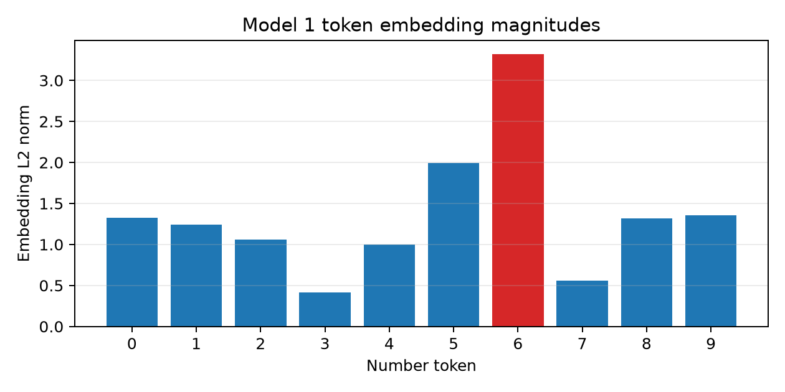
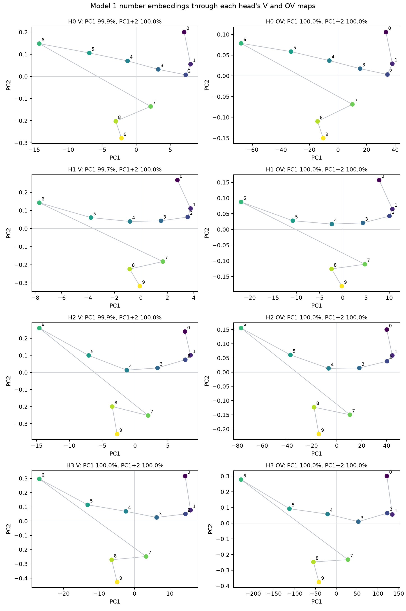
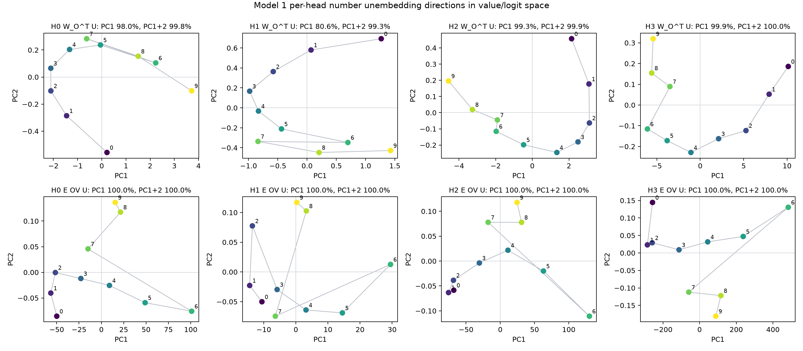
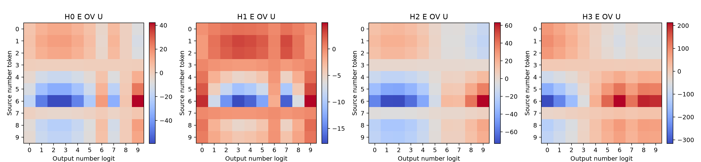
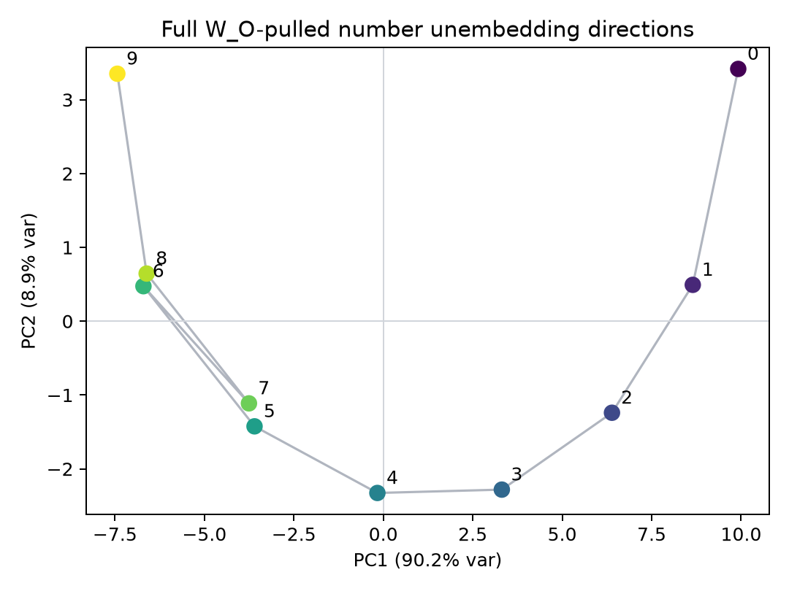
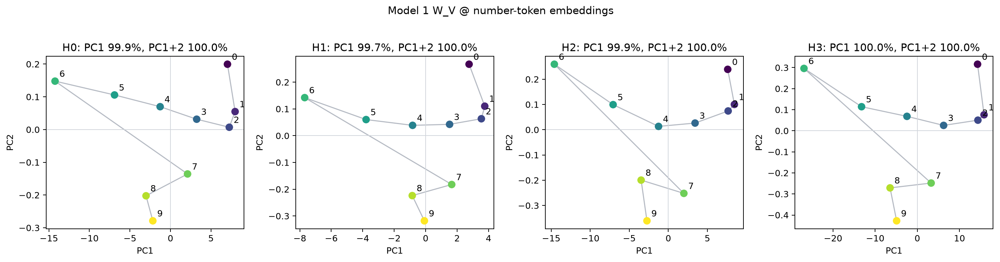
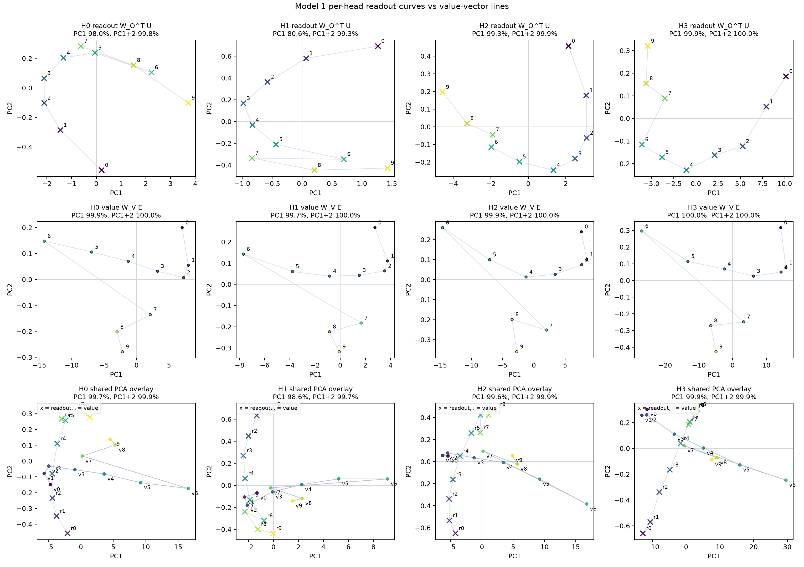
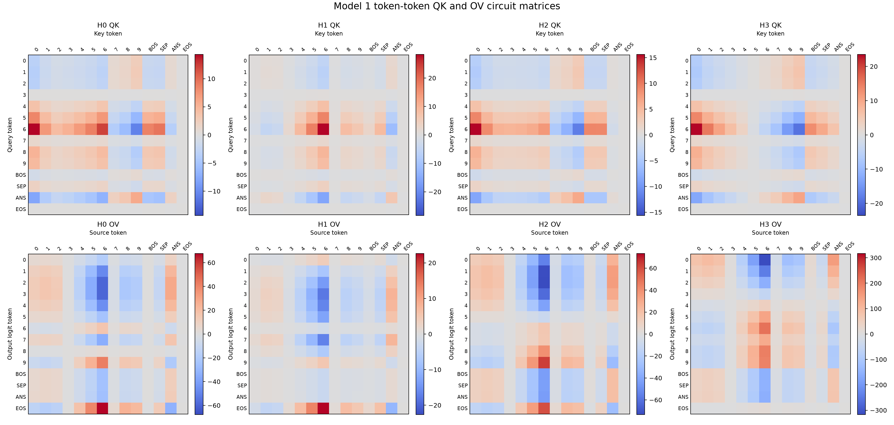

# Experiments

Use this page as the chronological log of experiments worth keeping.

## Template

```markdown
## YYYY-MM-DD HH:MM - Short experiment name

Question:

Method:

Result:

Interpretation:

Next step:
```

## 2026-06-24 - Environment smoke test

Question:

Can the local environment load Puzzle 1a and run inference?

Method:

Loaded `andyrdt/04_2026_puzzle_1a` with the upstream architecture and evaluated
`[3, 7, 2, 9, 4]`.

Result:

The model predicted `9`, matching the true maximum.

Interpretation:

The local environment, dependencies, HuggingFace cache, and CUDA setup are
working for the first part of the challenge.

Next step:

Inspect attention from the `[ANS]` row and begin head-level attribution.

## 2026-06-25 - Model 1 token embedding norms

Question:

Are the number token embedding magnitudes ordered by numeric value?

Method:

Loaded Puzzle 1a and computed the L2 norm of `raw_model_1.tok_embed.weight[i]`
for number tokens `0` through `9`. Repro script:
`scripts/analysis/model1_embedding_norms.py`.

Result:

| Token | Embedding L2 norm |
|---:|---:|
| 0 | 1.323310 |
| 1 | 1.239690 |
| 2 | 1.058119 |
| 3 | 0.411200 |
| 4 | 1.000883 |
| 5 | 1.991620 |
| 6 | 3.318140 |
| 7 | 0.562022 |
| 8 | 1.314045 |
| 9 | 1.355165 |



The largest embedding norm is token `6`, not token `9`. The norm/token-value
Pearson correlation is `0.180522`, and the sequence is not monotonic.

Interpretation:

The model is not simply representing larger numbers as larger token embedding
magnitudes. Any numeric ordering is likely represented by directions or by how
embeddings interact with attention and unembedding weights, not by raw L2 norm.

Next step:

Check whether number order appears in a learned direction, such as direct
logit-lens scores from embeddings, PCA directions, or query/key dot products.

## 2026-06-25 - Model 1 per-head V and OV PCA

Question:

If number embeddings are passed through each head's value map and output map,
do the numbers become arranged in a low-dimensional numeric order?

Method:

For each head `h`, used number embeddings as row vectors:

```text
E_numbers: 10 x 64
W_V_h.weight: 16 x 64
W_O_h: 64 x 16, where W_O_h = W_O.weight[:, 16h:16(h+1)]
```

Then computed:

```text
V_h  = E_numbers @ W_V_h.T       # 10 x 16
OV_h = V_h @ W_O_h.T             # 10 x 64
```

PCA was run across the 10 number-token observations. Repro script:
`scripts/analysis/model1_head_ov_pca.py`.

Result:

| Space | Head | PC1 var | PC2 var | PC3 var | corr(PC1, token) | PC1 monotonic? |
|---|---:|---:|---:|---:|---:|---|
| V | 0 | 0.999450 | 0.000490 | 0.000025 | -0.634570 | false |
| OV | 0 | 0.999993 | 0.000006 | 0.000000 | -0.634620 | false |
| V | 1 | 0.996937 | 0.002610 | 0.000295 | -0.503944 | false |
| OV | 1 | 0.999862 | 0.000109 | 0.000024 | -0.502700 | false |
| V | 2 | 0.999107 | 0.000787 | 0.000061 | -0.660124 | false |
| OV | 2 | 0.999989 | 0.000010 | 0.000001 | -0.660198 | false |
| V | 3 | 0.999654 | 0.000317 | 0.000013 | -0.663936 | false |
| OV | 3 | 0.999996 | 0.000004 | 0.000000 | -0.663824 | false |



The token order along PC1 is mostly:

```text
6, 5, 8, 9, 4, 7, 3, 0, 2, 1
```

with head 1 slightly different around tokens `4`, `8`, and `9`.

Interpretation:

Each head's value and OV outputs for the number embeddings are almost
one-dimensional. However, that dominant direction is not the numeric order
`0, 1, ..., 9`. It looks closer to a shared embedding/value direction dominated
by tokens such as `6` and `5`, then amplified by `W_O`.

This rules out a simple story where each head's OV map alone places number
tokens on a clean low-dimensional max-order line.

Next step:

Check directions that are directly tied to prediction, especially `OV_h @
unembed.T` effects on number logits and attention-weighted contributions at the
`[ANS]` position.

## 2026-06-25 - Model 1 W_O and OV rank spectra

Question:

Is the near-1D structure in per-head OV PCA caused by `W_O` itself being low
rank?

Method:

Computed singular values for the full `W_O`, each per-head `W_O` slice, each
head's `W_V`, and each composed per-head map `W_O_h @ W_V_h`. Repro script:
`scripts/analysis/model1_wo_rank.py`.

Result:

The full `W_O.weight` has shape `64 x 64` and is full rank at both `1e-6` and
`1e-3` thresholds.

| Matrix | Shape | Rank > 1e-3 | Top-1 energy | Top-2 energy | Top-4 energy |
|---|---:|---:|---:|---:|---:|
| full `W_O` | 64 x 64 | 64 | 0.589645 | 0.838488 | 0.894329 |
| H0 `W_O_h @ W_V_h` | 64 x 64 | 16 | 0.998256 | 0.998570 | 0.999070 |
| H1 `W_O_h @ W_V_h` | 64 x 64 | 16 | 0.982839 | 0.989166 | 0.992695 |
| H2 `W_O_h @ W_V_h` | 64 x 64 | 16 | 0.998593 | 0.998870 | 0.999220 |
| H3 `W_O_h @ W_V_h` | 64 x 64 | 16 | 0.999686 | 0.999855 | 0.999909 |

Interpretation:

`W_O` itself is not low rank. It is full rank, though its spectrum is
top-heavy. The much stronger rank-1 behavior appears in the per-head OV
composition `W_O_h @ W_V_h`. Each head's `W_O` slice and `W_V` are also
top-heavy, and their leading directions align so the composed map is almost
rank-1 by energy.

This explains why the prior PCA found nearly all variance on PC1 after each
head's value/output path.

Next step:

Project each head's OV direction into logit space with `unembed @ OV_h` to see
which output tokens each head promotes or suppresses.

## 2026-06-25 - Model 1 per-head unembedding directions in value space

Question:

If number-output unembedding directions are pulled back through each head's
output slice into the 16d value space, are they ordered by numeric value?

Method:

For each head:

```text
U_numbers: 10 x 64
W_O_h: 64 x 16

value_read_dirs = W_O_h.T @ U_numbers.T    # 16 x 10
```

The 10 columns are the number-output directions expressed in that head's 16d
value space. Also computed the more direct source-token to output-logit map:

```text
E_numbers @ W_V_h.T @ W_O_h.T @ U_numbers.T    # 10 x 10
```

Repro script: `scripts/analysis/model1_head_unembed_value_space.py`.

Result:

| Head | `W_O_h.T @ U` PC1 var | PC2 var | corr(PC1, token) | norm monotonic? | largest norm token | smallest norm token |
|---:|---:|---:|---:|---|---:|---:|
| 0 | 0.979964 | 0.018033 | 0.695456 | false | 3 | 8 |
| 1 | 0.805748 | 0.187238 | 0.135253 | false | 3 | 6 |
| 2 | 0.992889 | 0.006006 | -0.947758 | false | 2 | 5 |
| 3 | 0.998847 | 0.000952 | -0.936161 | false | 0 | 4 |



The direct source-token to output-logit matrices are also nearly 1D under PCA,
but the row argmax patterns are not identity maps:

| Head | Row argmax of `E OV U`, source tokens 0-9 |
|---:|---|
| 0 | `3, 3, 3, 9, 9, 9, 9, 9, 9, 9` |
| 1 | `3, 3, 3, 9, 9, 9, 9, 9, 9, 9` |
| 2 | `2, 2, 2, 1, 9, 9, 9, 9, 9, 9` |
| 3 | `0, 0, 0, 0, 6, 6, 6, 6, 6, 6` |



Interpretation:

The pulled-back unembedding directions are low-dimensional for heads 0, 2, and
3, less so for head 1, but neither their norms nor PC1 coordinates are cleanly
monotonic in number value. The direct OV-logit effect looks more like coarse
threshold/category behavior than exact number copying.

Clarification: the top row of the figure, `W_O_h.T @ U`, does show the number
output directions arranged along a curved low-dimensional path, especially for
heads 2 and 3. The point is that the numeric order follows the path only
approximately; PC1 and PC2 are not themselves strict monotonic number axes.

Next step:

Combine this with attention patterns at `[ANS]`: the model may use attention to
select sources and OV directions to promote coarse output regions, rather than
each head individually writing the exact selected number.

## 2026-06-25 - Model 1 full W_O-pulled unembedding PCA

Question:

Do the number-output unembedding directions, pulled back through the full
`W_O`, form an ordered low-dimensional curve?

Method:

Computed:

```text
U_numbers: 10 x 64
W_O: 64 x 64

X = (W_O.T @ U_numbers.T).T    # 10 x 64
```

Rows are the 10 number-output directions expressed in concatenated-head output
space. PCA was run across the 10 rows. Repro script:
`scripts/analysis/model1_full_wo_unembed_pca.py`.

Result:

| Component | Variance | corr(component, token) | Strictly monotonic? |
|---|---:|---:|---|
| PC1 | 0.901955 | -0.960483 | false |
| PC2 | 0.089332 | 0.090434 | false |
| PC3 | 0.008467 | -0.215136 | false |



PC1 is strongly ordered by token value, but not strictly monotonic:

```text
0:+9.9187 1:+8.6487 2:+6.3901 3:+3.3122 4:-0.1656
5:-3.5988 6:-6.7037 7:-3.7548 8:-6.6138 9:-7.4331
```

Token `7` is the main break in the otherwise decreasing PC1 trend. PC2 is not
a monotonic number axis; it captures curvature, with higher values near tokens
`0` and `9` and lower values in the middle.

Interpretation:

The full `W_O`-pulled number unembedding directions do form a strong
two-dimensional curve: PC1 and PC2 together explain `0.991287` of the variance.
However, it is more accurate to describe this as an approximate ordered curve
than as PC1/PC2 being individually monotonic.

Next step:

Compare this curve to the attention-head write directions and to the actual
logit updates at `[ANS]` on concrete prompts.

## 2026-06-25 - Model 1 head-output ablation accuracy

Question:

Which heads are necessary for the Model 1 max algorithm?

Method:

Evaluated all `10^5` length-5 inputs. For each ablation, zeroed the selected
head output before the shared `W_O` projection, then measured accuracy at the
`[ANS]` position. Repro script:
`scripts/analysis/model1_head_ablation_accuracy.py`.

Result:

| Ablated heads | Accuracy |
|---|---:|
| none | 1.000000 |
| 0 | 0.363110 |
| 1 | 0.999970 |
| 2 | 0.514700 |
| 3 | 0.416880 |
| 0+1 | 0.501480 |
| 0+2 | 0.092430 |
| 0+3 | 0.571230 |
| 1+2 | 0.859080 |
| 1+3 | 0.416880 |
| 2+3 | 0.417320 |

Interpretation:

Head 1 is nearly nonessential under this ablation: it causes only 3 errors on
the exhaustive dataset when removed. Heads 0, 2, and 3 are the main circuit
components. This matches the geometry probes: head 1's `W_O_h.T @ U` curve is
distorted and its direct OV-logit effects are much smaller than the other
heads.

Next step:

Focus mechanistic interpretation on heads 0, 2, and 3, treating head 1 as a
minor correction or training artifact unless a specific edge case requires it.

## 2026-06-25 - Model 1 W_V applied to number embeddings

Question:

What geometry do the number embeddings have after each head's value map?

Method:

For each head, computed the user's requested matrix:

```text
W_V_h @ W_E_numbers.T    # 16 x 10
```

Then transposed it to `10 x 16` so the 10 number tokens are PCA observations.
Repro script: `scripts/analysis/model1_wv_embedding_pca.py`.

Result:

| Head | PC1 var | PC2 var | PC3 var | corr(PC1, token) | PC1 order ascending |
|---:|---:|---:|---:|---:|---|
| 0 | 0.999450 | 0.000490 | 0.000025 | -0.634570 | `6-5-8-9-4-7-3-0-2-1` |
| 1 | 0.996937 | 0.002610 | 0.000295 | -0.503944 | `6-5-8-4-9-3-7-0-2-1` |
| 2 | 0.999107 | 0.000787 | 0.000061 | -0.660123 | `6-5-8-9-4-7-3-0-2-1` |
| 3 | 0.999654 | 0.000317 | 0.000013 | -0.663936 | `6-5-8-9-4-7-3-0-2-1` |



Interpretation:

Each head's value map sends number embeddings to an almost perfectly
one-dimensional set of value vectors. The ordering is shared across heads and
is not numeric order. This means the value vectors alone are not representing
`0 < 1 < ... < 9`; their role must be interpreted together with the output
readout curves `W_O_h.T @ U` and the attention weights.

Next step:

Compare the value-vector line against the per-head unembedding curve by taking
dot products `value_x^h . readout_y^h`, which is exactly the direct OV-logit
effect.

## 2026-06-25 - Model 1 value vectors vs readout curves

Question:

How do each head's number value vectors compare visually to the corresponding
number-output readout directions in the same 16d value space?

Method:

For each head:

```text
value_x   = W_V_h @ W_E[x]       # 16d, one point for each source number x
readout_y = W_O_h.T @ U[y]       # 16d, one point for each output number y
```

The figure has three rows:

- top: PCA of `readout_y` points, matching the earlier top row of
  `model1_head_unembed_value_space_pca.png`;
- middle: PCA of `value_x` points, matching `model1_wv_embedding_pca.png`;
- bottom: shared PCA over both point sets in the same 16d head value space,
  with `x = readout` and `.` = value.

Repro script: `scripts/analysis/model1_value_vs_readout_pca.py`.

Result:



The shared PCA overlay shows that the value vectors and readout curves occupy
related low-dimensional regions, but they are not identical curves. The
mechanistic object is the dot product between them:

```text
logit_effect_h(source=x, output=y) = value_x . readout_y
```

Interpretation:

The readout curve says which directions in value space increase each output
number logit. The value-vector line says where each source number is written by
`W_V`. Their relative placement determines whether attending to source number
`x` pushes low, middle, or high output logits. This is a compact geometric way
for a head to implement coarse ordinal evidence without exact number copying.

The middle row looks similar across heads even though the four `W_V` matrices
are not equal. Pairwise flat cosine similarities between full `W_V` matrices
range from about `-0.09` to `0.33`. The similarity comes from their dominant
input singular directions: the top right-singular-vector alignments are high
for the important heads (`H0-H2 = 0.986598`, `H0-H3 = 0.955021`,
`H2-H3 = 0.971986`). Since `W_V @ W_E_numbers.T` is almost entirely controlled
by that top direction, the 10 number value-vector geometries look nearly the
same up to rotation, sign, and scale.

Next step:

Use the shared geometry to interpret concrete `[ANS]` attention patterns:
which source positions each active head reads from, and what output-logit
region that source then promotes.

## 2026-06-28 - Model 1 token-token QK and OV matrices

Question:

What do the transformer-circuits QK and OV matrices look like for each Model 1
attention head?

Method:

Used token-only embeddings and excluded positional embeddings. For Model 1,
`vocab_size = 14`, so each matrix is `14 x 14`.

For QK, rows are query tokens and columns are key tokens:

```text
QK_h[query, key] = W_E @ W_Q_h.T @ W_K_h @ W_E.T / sqrt(d_head)
```

For OV, rows are output-logit tokens and columns are source tokens:

```text
OV_h[output, source] = W_U @ W_O_h @ W_V_h @ W_E.T
```

This is the transpose of the earlier row-vector source-to-output matrix.
Repro script: `scripts/analysis/model1_qk_ov_matrices.py`.

Result:



Separate high-resolution figures:

- [QK matrices](assets/model1_qk_matrices.png)
- [OV matrices](assets/model1_ov_matrices.png)

Interpretation:

These matrices show the token-only circuit components. QK indicates which key
tokens each query token prefers before adding positional effects and the causal
mask. OV indicates which output logits are promoted or suppressed when a head
attends to a source token. The runtime computation also includes positional
embeddings, so these are not the complete attention scores or logit updates,
but they are the standard token-token view of the learned circuits.

Next step:

Compare token-only QK with actual attention patterns at `[ANS]`, where the
query is the `[ANS]` token plus its learned position embedding and keys include
both source tokens and their positions.
