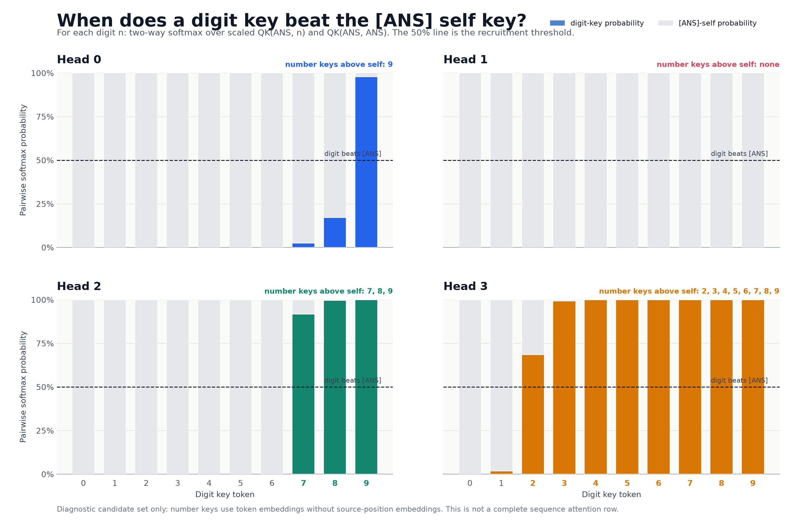

---
hide:
  - navigation
  - toc
---

# Main results

## Notation

### Matrices

| Matrix | Shape | Symbol |
|---|---:|---:|
| Embedding matrix | `14 x 64` | $W_E$ |
| Unembedding matrix | `64 x 14` | $W_U$ |
| Query matrix of head "h" | `64 x 16` | $W_Q^h$ |
| Key matrix of head "h" |  | $W_K^h$ |
| Value matrix of head "h" |  | $W_V^h$ |
| $W_O$ of each head | `16 x 64` | $W_O^h$ |

It is generally considered to be one large matrix while computing (`64 x 64`).
But to interpret its easy to think that each head has its own output matrix.

### Value vector

Value vector after doing weighted attention of head h (`N x 16`, but last row
would suffice to explain so considered `1 x 16`): $V_h$, which is basically
(Attention x ($W_V$ x residual stream)).

### Sum of head outputs

Sum of all heads output just before multiplying with unembdding matrix (`N x
64`, but last row suffices so `1 x 64`):

$$
\Sigma_h W_O^h V_h
$$

!!! note "Notation check"
    The draft above is preserved. With the displayed row-vector shapes,
    $V_h$ is `1 x 16` and $W_O^h$ is `16 x 64`, so the dimensionally
    consistent product is $V_h W_O^h$. The summed final-row write is therefore
    $\sum_h V_h W_O^h$. PyTorch stores linear-layer weights transposed relative
    to this mathematical row-vector convention.

## Looking at attention patterns in each head at ANS token

The final response we care about is the prediction of the model at last token
(ANS token). So its sufficient to look at last row of the prediction logits
which is of size `N x Vocab Size`. We only need `-1 x Vocab size`. If we trace
back down, in each head, all that matters for the computation is the last row
of the attention matrix. The last row of the attention matrix checks what
tokens the ANS token attends to?

Below is the plot for

$$
W_Q^h [\text{ANS token in residual stream}] \cdot
W_K^h [\text{Embedding vector of n}]
$$

> **Plot specification**
> Plot a `4 x 9` plot. `4` is for `4` heads, and `9` is for `9` columns.
> You can plot it like bar graph, with token number written at x-axis. Also do
> a softmax before making bar graph.

<figure class="main-results-plot">
  <picture>
    <source
      media="(max-width: 760px)"
      srcset="../assets/main_results_ans_qk_pairwise_softmax_mobile.png"
    >
    
  </picture>
  <figcaption>
    Pairwise softmax between each token-only digit key and the
    <code>[ANS]@position-10</code> self key. Crossing 50% means the digit key
    scores above the self key.
  </figcaption>
</figure>

[Open the exact plotted values](assets/main_results_ans_qk_pairwise_softmax.json){ .main-results-data-link }

- $W_Q$ ANS x $W_K$ max number vs $W_Q$ ANS x $W_K$ ANS in each head

!!! info "How to read this diagnostic"
    There are ten number tokens (`0` through `9`), so the completed figure has
    four head panels with ten digit bars rather than nine columns. Each bar is
    a two-way softmax over one digit-key score and the `[ANS]` self-key score.
    This makes the self-crossing threshold visible at `50%`.

    This is not a complete sequence attention distribution. Actual attention
    normalizes over every source position, and an actual number key also
    contains its source-position embedding. The plot intentionally uses the
    token-only number keys specified above.

