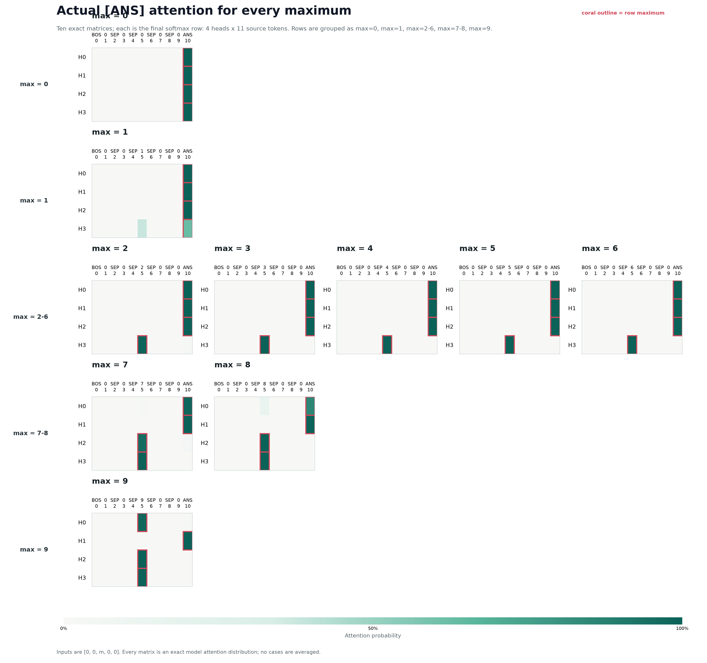

---
hide:
  - navigation
toc_depth: 3
---

# Main results

## Model and notation

### Transformer architecture

  
Loading transformer architecture...

### Matrices

| Matrix | Shape | Symbol |
|---|---:|---:|
| Embedding matrix | `14 x 64` | $W_E$ |
| Unembedding matrix | `64 x 14` | $W_U$ |
| Query matrix of head "h" | `64 x 16` | $W_Q^h$ |
| Key matrix of head "h" | `64 x 16` | $W_K^h$ |
| Value matrix of head "h" | `64 x 16` | $W_V^h$ |
| $W_O$ of each head | `16 x 64` | $W_O^h$ |

It is generally considered to be one large matrix while computing (`64 x 64`).
But to interpret its easy to think that each head has its own output matrix.

## Attention routing at the `[ANS]` token

### Looking at attention patterns in each head at ANS token

The final response we care about is the prediction of the model at last token
(ANS token). So its sufficient to look at last row of the prediction logits
which is of size `N x Vocab Size`. We only need `-1 x Vocab size`. If we trace
back down, in each head, all that matters for the computation is the last row
of the attention matrix. The last row of the attention matrix checks what
tokens the ANS token attends to?

Using the notation in the architecture diagram, the query, keys, and final
attention row for head $h$ are

$$
Q_h = R W_Q^h,
\qquad
K_h = R W_K^h,
\qquad
a_h = \operatorname{softmax}\left(
\frac{Q_h[-1,:]K_h^\top}{\sqrt{16}} + M_{\mathrm{causal}}[-1,:]
\right).
$$

Below, each row is the resulting $a_h \in \mathbb{R}^{1 \times N}$.

> **Display specification**
>
> Show every maximum from `0` through `9` separately. In each case, show a
> colored `4 x 11` matrix: four attention heads by `11` source tokens, with token
> identities at the top. Matrices are laid out in rows as:
> `0`, `1`, `2–6`, `7–8`, and `9` so that similar regimes are easy to compare.

<figure class="main-results-plot attention-explorer">
  

    
Loading exact attention matrices...

  

  <noscript>
    <picture>
      <source
        media="(max-width: 760px)"
        srcset="../assets/main_results_ans_attention_by_max_mobile.png"
      >
      
    </picture>
  </noscript>
  

    Actual final-row softmax attention for the <code>[ANS]</code> query. Each
    matrix has four head rows and eleven source-token columns. Matrices are shown in grouped rows (`0`, `1`, `2–6`, `7–8`, `9`) so similar regimes can be compared side by side. All ten maxima are shown separately; no attention matrices are averaged.
  

</figure>

[Open the exact plotted values](assets/main_results_ans_attention_regimes.json){ .main-results-data-link }

!!! info "How to read this diagnostic"
    These are the model's actual attention distributions after softmax over all
    `11` source positions. The coral outline marks the largest entry in each
    head row. Inputs use the matched form `[0, 0, m, 0, 0]`, with the unique
    nonzero maximum at source position `5`.

    Max `1` is the important soft case: H3 gives approximately `62%` to
    `[ANS]` and `38%` to the `1` token. From max `2` onward, the recruited
    heads place nearly all their attention on the maximum token.

### Causal manipulation of the `[ANS]` attention rows

As the maximum number increases, more heads are recruited. The all-head
`[ANS]`-self pattern acts as a baseline that decodes as `0`. A recruited head
changes $a_h$ from `[ANS]` to the maximum-number token, thereby changing
$V_h = a_h S_h$ and the residual-stream write $z_h = V_h W_O^h$. H3 is
recruited for maxima `2–6`; H2 joins H3 for maxima `7–8`; and H0 joins H2 and
H3 for maximum `9`.

This interpretation makes a causal prediction: changing only $a_h$ should
change the answer, even while every model weight, token embedding, positional
embedding, and all earlier attention rows remain fixed. The prediction holds.

#### H3 steers `[2, 3, 4, 5, 6]`

The unmodified model answers `6`. In each intervention below, $a_0$, $a_1$,
and $a_2$ are forced one-hot to `[ANS]`; only $a_3$ is forced one-hot to a
selected digit position.

| Input | Forced attention rows $a_h$ | Model output |
|---|---|---:|
| `[2, 3, 4, 5, 6]` | $a_0,a_1,a_2 \rightarrow$ `[ANS]`; $a_3 \rightarrow 2$ | **2** |
| `[2, 3, 4, 5, 6]` | $a_0,a_1,a_2 \rightarrow$ `[ANS]`; $a_3 \rightarrow 3$ | **3** |
| `[2, 3, 4, 5, 6]` | $a_0,a_1,a_2 \rightarrow$ `[ANS]`; $a_3 \rightarrow 4$ | **4** |
| `[2, 3, 4, 5, 6]` | $a_0,a_1,a_2 \rightarrow$ `[ANS]`; $a_3 \rightarrow 5$ | **5** |

#### H2 is recruited at `7`

The unmodified model answers `8` for `[4, 5, 6, 7, 8]`. Targets `4–6` use
the lower-number circuit: $a_2$ stays on `[ANS]` while $a_3$ reads the
requested digit. To produce `7`, both $a_2$ and $a_3$ must read the `7` token.

| Input | Forced attention rows $a_h$ | Model output |
|---|---|---:|
| `[4, 5, 6, 7, 8]` | $a_0,a_1,a_2 \rightarrow$ `[ANS]`; $a_3 \rightarrow 4$ | **4** |
| `[4, 5, 6, 7, 8]` | $a_0,a_1,a_2 \rightarrow$ `[ANS]`; $a_3 \rightarrow 5$ | **5** |
| `[4, 5, 6, 7, 8]` | $a_0,a_1,a_2 \rightarrow$ `[ANS]`; $a_3 \rightarrow 6$ | **6** |
| `[4, 5, 6, 7, 8]` | $a_0,a_1 \rightarrow$ `[ANS]`; $a_2,a_3 \rightarrow 7$ | **7** |

## Low-dimensional computation

For the `[ANS]` prediction, head $h$ uses the quantities defined in the
architecture diagram:

$$
S_h = R W_V^h \in \mathbb{R}^{N \times 16},
\qquad
a_h = A_h[-1,:] \in \mathbb{R}^{1 \times N},
$$

$$
V_h = a_h S_h \in \mathbb{R}^{1 \times 16},
\qquad
z_h = V_h W_O^h \in \mathbb{R}^{1 \times 64}.
$$

Except for the soft-attention case at maximum `1`, the successful one-hot
interventions make $a_h$ select either the `[ANS]` row or a number row of
$S_h$. The four head writes are then added:

$$
z = \sum_{h=0}^{3} z_h \in \mathbb{R}^{1 \times 64}.
$$

The actual model computes

$$
R_{\mathrm{final}}[-1,:] = R[-1,:] + z,
\qquad
\ell = R_{\mathrm{final}}[-1,:] W_U.
$$

For this model, the isolated head readout $\ell_{\mathrm{heads}} = z W_U$
already gives `100%` accuracy over all `100,000` possible five-digit inputs.
The experiment below therefore studies this sufficient head-write computation
without adding the original `[ANS]` residual.

### Output-matrix PCA

Let the four output maps be stacked into the mathematical `64 x 64` output
matrix:

$$
O_{\mathrm{all}} =
\begin{bmatrix}
W_O^0 \\
W_O^1 \\
W_O^2 \\
W_O^3
\end{bmatrix}.
$$

PCA is fitted after centering the `64` rows of $O_{\mathrm{all}}$. If $Q_k$
contains its top $k$ principal directions (`64 x k`), each head's output map
and the unembedding can be expressed in the same reduced basis:

$$
\widetilde{W}_O^h = W_O^h Q_k
    \in \mathbb{R}^{16 \times k},
\qquad
\widetilde{W}_U = Q_k^\top W_{U,c}
    \in \mathbb{R}^{k \times |\mathcal{V}|}.
$$

The complete reduced computation is then

$$
z_k = \sum_h V_h \widetilde{W}_O^h
    \in \mathbb{R}^{1 \times k},
\qquad
\ell_k = z_k \widetilde{W}_U.
$$

$W_{U,c}$ is centered over vocabulary items. This subtracts the same scalar
from every candidate logit and therefore cannot change the argmax. Although
centering is used to fit PCA, no output-matrix mean is subtracted from the
actual head writes.

### Accuracy as dimensions are added

The projected computation was evaluated exhaustively on all `100,000` inputs
using the full `14`-token vocabulary. Every column below uses the same basis
$Q_k$, obtained only from PCA of the centered output matrix. The output column
reports how much centered output-matrix variance this basis captures. The
unembedding column reports how much centered `14 x 64` unembedding variance is
captured after projecting it onto that same output-derived basis; PCA is not
fitted to the unembedding matrix.

| Output-PCA basis retained | Output-matrix variance captured | Unembedding variance captured | 14-way accuracy |
|---|---:|---:|---:|
| PC1 | 59.23% | 59.25% | 40.952% |
| PC1 + PC2 | 84.06% | 85.04% | 57.758% |
| **PC1 + PC2 + PC3** | **88.34%** | **91.51%** | **100.000%** |

PC3 contributes only `4.28%` additional output-matrix variance, but raises
exhaustive accuracy from `57.758%` to `100%`.

!!! success "Three dimensions are sufficient"
    Each head's learned `16 x 64` output map can be replaced, for this task, by
    the derived `16 x 3` map $W_O^h Q_3$. The four `1 x 3` head writes are
    summed and scored against the unembedding projected into the same basis.
    This reduced computation preserves every one of the model's `100,000`
    max-of-five decisions.

### Interactive three-dimensional computation

Because three dimensions suffice, the answer-writing computation can be shown
directly. Both panels use the same $Q_3$ basis obtained from PCA of the output
matrix.

#### Baseline plus recruited corrections

The first panel presents the computation as a fixed baseline followed by
answer-dependent corrections. The baseline is
$B=z_0([\mathrm{ANS}])+z_1([\mathrm{ANS}])+z_2([\mathrm{ANS}])$, where
$z_h(x)$ denotes the write produced when $a_h$ reads source $x$. The term
$z_3$ supplies the first answer-dependent write. For outputs `7–9`,
$z_2([\mathrm{ANS}])$ is replaced by $z_2(n)$; for output `9`, $z_0$ is
replaced in the same way. Thus the $z_2$ and $z_0$ arrows are replacement
differences such as $z_2(n)-z_2([\mathrm{ANS}])$, avoiding double-counting the
self write already in $B$.

[Open the baseline-and-corrections interactive](assets/model1_output_pca_piecewise_interactive.html){ target=_blank .main-results-data-link }

<iframe
  src="../assets/model1_output_pca_piecewise_interactive.html"
  title="Baseline and recruited head corrections in the output-matrix PCA basis"
  style="width: 100%; height: 900px; border: 1px solid #d1d5db;"
  loading="lazy"
  allowfullscreen>
</iframe>

Exact values:
[model1_output_pca_piecewise_interactive.json](assets/model1_output_pca_piecewise_interactive.json).
Source: `scripts/analysis/model1_output_pca_piecewise_interactive.py`.

#### Direct output from each head

The second panel regroups the same endpoint as four direct head writes rather
than a baseline and corrections. Each colored arrow starts at the origin and
is the projected vector $V_hW_O^h$. The black arrow is their sum
$z=\sum_h V_hW_O^h$. Select an output `0–9` to see which source each head reads
and how the resulting sum scores all `14` vocabulary tokens.

For output `1`, $a_3$ is the measured soft `[ANS]`/`1` attention row. Every
other endpoint uses the verified one-hot attention recipe. For all ten
requested outputs, both the `3d` and full `64d` head sums predict the requested
token.

[Open the direct-head-writes interactive](assets/model1_output_pca_head_contributions_interactive.html){ target=_blank .main-results-data-link }

<iframe
  src="../assets/model1_output_pca_head_contributions_interactive.html"
  title="Four direct head output vectors and their sum in the output-matrix PCA basis"
  style="width: 100%; height: 900px; border: 1px solid #d1d5db;"
  loading="lazy"
  allowfullscreen>
</iframe>

Exact values:
[model1_output_pca_head_contributions_interactive.json](assets/model1_output_pca_head_contributions_interactive.json).
Source:
`scripts/analysis/model1_output_pca_head_contributions_interactive.py`.

The same three output-derived directions capture `88.34%` of the centered
output matrix's variance and about `91.5%` of the centered unembedding
variance. This supports a shared low-dimensional read/write subspace: the
heads write answer-relevant information into directions that the unembedding
also reads strongly.

This is a sufficiency result, not a matrix-rank claim. The centered output
matrix has rank `63`, and `11.66%` of its variance lies outside the three-PC
subspace. Those discarded directions may change logit values, but they are not
needed to preserve the argmax on this complete input space. The two interactive
panels above decompose the head-specific `[ANS]` baseline and recruited
corrections inside this `3d` space.

Reproducible analysis:
`scripts/analysis/model1_output_pca_readout_accuracy.py`.
[Open the exact PCA, variance, and accuracy values](assets/model1_output_pca_readout_accuracy.json){ .main-results-data-link }

### Unembedding-matrix PCA works too

The construction also works in the other direction. Instead of obtaining the
low-dimensional basis from the output matrix, PCA can be fitted to the
centered full `14 x 64` unembedding matrix. The resulting `64 x k` basis is
then used to reduce every head's `16 x 64` output map to `16 x k`. The four
heads write and sum directly in `k` dimensions before the full `14`-token
unembedding readout.

This version was also evaluated exhaustively over all `100,000` inputs. Every
column below uses the basis obtained only from full-vocabulary unembedding
PCA. The output-matrix variance column measures how much variance that same
unembedding-derived basis captures after being applied to the centered output
matrix.

| Full-unembedding PCA basis retained | Unembedding variance captured | Output-matrix variance captured | 14-way accuracy |
|---|---:|---:|---:|
| PC1 | 62.01% | 56.45% | 40.952% |
| PC1 + PC2 | 87.37% | 82.01% | 86.318% |
| **PC1 + PC2 + PC3** | **94.04%** | **86.23%** | **100.000%** |

!!! success "Either matrix supplies a sufficient three-dimensional basis"
    Using the top three full-unembedding PCs, each head's `16 x 64` output map
    can be replaced by a derived `16 x 3` map. The resulting three-dimensional
    computation predicts the correct token for all `100,000` inputs and never
    predicts `[BOS]`, `[SEP]`, `[ANS]`, or `[EOS]`.

### Why both bases work

The leading output and unembedding directions are close in residual-stream
space. The [July 12 PC-alignment experiment](2026-07-12.md#model-1-are-the-w_o-and-w_u-top-three-pc-subspaces-the-same)
first showed this using the ten digit-unembedding rows. Repeating the same
calculation with the full `14`-token unembedding basis used in the table above
gives the following exact `64d` cosine matrix:

| | Output PC1 | Output PC2 | Output PC3 |
|---|---:|---:|---:|
| **Full-$W_U$ PC1** | **0.9689** | 0.1840 | 0.0302 |
| **Full-$W_U$ PC2** | -0.2011 | **0.9655** | 0.0703 |
| **Full-$W_U$ PC3** | -0.0267 | -0.0763 | **0.9676** |

| Comparison | PC1 | PC2 | PC3 |
|---|---:|---:|---:|
| Same-index PC cosine | 0.9689 | 0.9655 | 0.9676 |
| Principal angle between the two top-three subspaces | 5.24 degrees | 11.03 degrees | 14.34 degrees |

The bases are strongly aligned but not identical. This overlap explains why
either set of PCs captures most of the other matrix's variance and preserves
the same low-dimensional read/write computation. Alignment alone does not
guarantee perfect accuracy: the remaining requirement is that discarding the
other directions never moves an input across a competing token's
dot-product decision boundary. Exhaustive evaluation confirms that condition
for this task at `k = 3`.

Reproducible analysis:
`scripts/analysis/model1_unembedding_pca_readout_accuracy.py`.
[Open the exact full-unembedding PCA, alignment, variance, and accuracy values](assets/model1_unembedding_pca_readout_accuracy.json){ .main-results-data-link }
