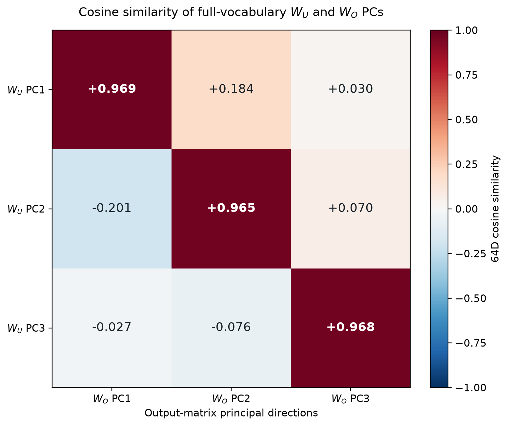

---
hide:
  - navigation
toc_depth: 3
---

# Main results

This analysis was developed for the
[Bau Lab April challenge](https://puzzles.baulab.info/april-2026.html).

## Model and notation

### Transformer computation

The model has one attention-only layer, a `64`-dimensional residual stream,
and four `16`-dimensional attention heads. For a generic head $h$:

| Stage | Notation |
|---|---|
| Input residual stream | $R = W_E[\text{token}] + P \in \mathbb{R}^{N \times 64}$ |
| Attention processing | $Q_h = R W_Q^h,\quad K_h = R W_K^h,\quad V_h = R W_V^h \in \mathbb{R}^{N \times 16}$ $A_h = \operatorname{softmax}\!\left(\frac{Q_h K_h^T}{\sqrt{16}} + M_{\text{causal}}\right) \in \mathbb{R}^{N \times N}$ $a_h = A_h[-1,:] \in \mathbb{R}^{1 \times N}$ $V_h^a = a_h V_h \in \mathbb{R}^{1 \times 16}$ |
| Attention output multiplied with output matrix | $z_h = V_h^a W_O^h \in \mathbb{R}^{1 \times 64},\quad W_O^h \in \mathbb{R}^{16 \times 64}$ |
| Addition of all heads | $z = \sum_{h=0}^{3} z_h \in \mathbb{R}^{1 \times 64}$ |
| Residual addition at `[ANS]` | $R_{\text{final}}[-1,:] = R[-1,:] + z$ |
| Unembedding | $F = R_{\text{final}}[-1,:] W_U \in \mathbb{R}^{1 \times 14},\quad W_U \in \mathbb{R}^{64 \times 14}$ |
| Prediction | $\operatorname*{argmax}_t F_t$ |

## Attention routing at the `[ANS]` token

### Looking at attention patterns

We only care about the model's response at the `[ANS]` token, which is the
final score vector $F$ in the table above. In each head, the attention
component that influences $F$ is $a_h$: the vector that says which source
tokens `[ANS]` attends to. Below, we visualize this attention when each digit
$d$ is the maximum number. For each input, attention to repeated occurrences
of the same token is first summed; these token-level distributions are then
averaged over every input whose true maximum is $d$.

<figure class="main-results-plot attention-explorer">
  

    
Loading conditional mean attention matrices...

  

  <noscript>
    <picture>
      <source
        media="(max-width: 760px)"
        srcset="../assets/main_results_ans_attention_by_max_mobile.png"
      >
      
    </picture>
  </noscript>
  

    Conditional mean of the final-row softmax attention for the
    <code>[ANS]</code> query. Each matrix is 4 heads x 14 token identities and
    includes every five-digit input whose true maximum is <code>d</code>. If a
    token occurs more than once in an input, its attention mass is summed
    before averaging. The ten conditions partition all 100,000 inputs, and
    every head row sums to 100%.
  

</figure>

### Causal manipulation of the `[ANS]` attention rows

As the maximum number increases, more heads are recruited. The all-head
`[ANS]`-self pattern acts as a baseline that decodes as `0`. A recruited head
changes $a_h$ from `[ANS]` to the maximum-number token, thereby changing
$V_h^a = a_h V_h$ and the residual-stream write $z_h = V_h^a W_O^h$. H3 is
recruited for maxima `2–6`; H2 joins H3 for maxima `7–8`; and H0 joins H2 and
H3 for maximum `9`.

This interpretation makes a causal prediction: changing only $a_h$ should
change the answer, even while every model weight, token embedding, positional
embedding, and all earlier attention rows remain fixed. The prediction holds.

#### H3 steers `[2, 3, 4, 5, 6]`

The unmodified model answers `6`. In each intervention below, $a_0$, $a_1$,
and $a_2$ are forced one-hot to `[ANS]`; only $a_3$ is forced one-hot to a
selected digit position.

| Input | Forced attention rows $a_h$ | Model output |
|---|---|---:|
| `[2, 3, 4, 5, 6]` | $a_0,a_1,a_2 \rightarrow$ `[ANS]`; $a_3 \rightarrow 2$ | **2** |
| `[2, 3, 4, 5, 6]` | $a_0,a_1,a_2 \rightarrow$ `[ANS]`; $a_3 \rightarrow 3$ | **3** |
| `[2, 3, 4, 5, 6]` | $a_0,a_1,a_2 \rightarrow$ `[ANS]`; $a_3 \rightarrow 4$ | **4** |
| `[2, 3, 4, 5, 6]` | $a_0,a_1,a_2 \rightarrow$ `[ANS]`; $a_3 \rightarrow 5$ | **5** |

#### H2 is recruited at `7`

The unmodified model answers `8` for `[4, 5, 6, 7, 8]`. Targets `4–6` use
the lower-number circuit: $a_2$ stays on `[ANS]` while $a_3$ reads the
requested digit. To produce `7`, both $a_2$ and $a_3$ must read the `7` token.

| Input | Forced attention rows $a_h$ | Model output |
|---|---|---:|
| `[4, 5, 6, 7, 8]` | $a_0,a_1,a_2 \rightarrow$ `[ANS]`; $a_3 \rightarrow 4$ | **4** |
| `[4, 5, 6, 7, 8]` | $a_0,a_1,a_2 \rightarrow$ `[ANS]`; $a_3 \rightarrow 5$ | **5** |
| `[4, 5, 6, 7, 8]` | $a_0,a_1,a_2 \rightarrow$ `[ANS]`; $a_3 \rightarrow 6$ | **6** |
| `[4, 5, 6, 7, 8]` | $a_0,a_1 \rightarrow$ `[ANS]`; $a_2,a_3 \rightarrow 7$ | **7** |

## Low-dimensional computation

There are only `10` possible digit answers, while the residual stream has `64`
dimensions. It is therefore reasonable to expect that the answer-writing
computation may use a much lower-dimensional representation.

To test this, we perform PCA on the model's `64 x 64` output matrix $W_O$. If
$Q_k$ contains the top $k$ principal directions, projecting $W_O$ into this
basis reduces it from `64 x 64` to `64 x k`. Equivalently, each head's
`16 x 64` output matrix $W_O^h$ becomes `16 x k`.

We then use the same output-derived basis for the unembedding matrix. This
reduces $W_U$ from `64 x V` to `k x V`. Thus the heads write into a shared
$k$-dimensional space, and the unembedding reads from that same space. The PCA
basis is obtained only from $W_O$; PCA is not fitted separately to $W_U$.

### How many dimensions are sufficient?

We keep increasing the number of retained principal components and evaluate
the projected computation exhaustively on all `100,000` possible inputs. The
prediction is taken over the full `14`-token vocabulary.

| Output-PCA basis retained | Output-matrix variance captured | Unembedding variance captured | 14-way accuracy |
|---|---:|---:|---:|
| PC1 | 59.23% | 59.25% | 40.952% |
| PC1 + PC2 | 84.06% | 85.04% | 57.758% |
| **PC1 + PC2 + PC3** | **88.34%** | **91.51%** | **100.000%** |

With only three principal components, the projected model reaches `100%`
accuracy. The four head outputs can therefore be added and read by the
unembedding inside a three-dimensional subspace without changing any of the
model's decisions. This shows that the computation needed to solve this task
is low-dimensional.

### Visualizing the three-dimensional computation

Because three dimensions are sufficient, we can plot the ten digit
unembedding vectors and the head outputs in the same space. Both interactives
below use the top three principal directions obtained from $W_O$.

#### Baseline plus recruited corrections

When all heads attend to `[ANS]`, their combined output gives the baseline
answer `0`. The first interactive shows how this baseline is corrected as
heads are recruited to read higher digits. Each arrow shows the change
contributed by a recruited head, and the endpoint shows the resulting summed
head output in the three-dimensional unembedding space.

In the displayed decomposition, the fixed vector $B$ contains the `[ANS]`
writes from H0, H1, and H2, while H3 is shown as the first answer-dependent
arrow. For outputs `7–9`, H2 replaces its `[ANS]` write with a digit write; H0
does the same for output `9`.

[Open the baseline-and-corrections interactive](assets/model1_output_pca_piecewise_interactive.html){ target=_blank .main-results-data-link }

<iframe
  src="../assets/model1_output_pca_piecewise_interactive.html"
  title="Baseline and recruited head corrections in the output-matrix PCA basis"
  style="width: 100%; height: 900px; border: 1px solid #d1d5db;"
  loading="lazy"
  allowfullscreen>
</iframe>

#### Direct output from each head

The second interactive shows the same computation without regrouping it into
a baseline and corrections. The selected maximum is the enlarged green dot.
Each thin colored arrow is one head's complete output
$z_h = V_h^a W_O^h$ in the three-dimensional space. The thicker black arrow is
the sum of all four head outputs. The bar chart shows the dot product of this
sum with each vocabulary token's projected unembedding vector.

[Open the direct-head-writes interactive](assets/model1_output_pca_head_contributions_interactive.html){ target=_blank .main-results-data-link }

<iframe
  src="../assets/model1_output_pca_head_contributions_interactive.html"
  title="Four direct head output vectors and their sum in the output-matrix PCA basis"
  style="width: 100%; height: 900px; border: 1px solid #d1d5db;"
  loading="lazy"
  allowfullscreen>
</iframe>

## Supplementary results

### QK score hints at head recruitment

For each head, the responsible query vector is the query of the `[ANS]`
token. We can compare this query with the key vector of each number and with
the key vector of `[ANS]` itself. Using the notation above:

$$
q_h^{\text{ANS}} = R[-1,:]W_Q^h,
\qquad
k_h(n) = W_E[n]W_K^h,
\qquad
k_h^{\text{ANS}} = R[-1,:]W_K^h.
$$

The figure compares the scaled QK scores

$$
s_h(n) = \frac{q_h^{\text{ANS}}k_h(n)^T}{\sqrt{16}}
\qquad \text{and} \qquad
s_h(\text{ANS}) =
\frac{q_h^{\text{ANS}}(k_h^{\text{ANS}})^T}{\sqrt{16}}.
$$

When $s_h(n) > s_h(\text{ANS})$, the `[ANS]` query has a larger dot product
with the number key than with its own key. In this model, these crossings
reproduce the head-recruitment thresholds: H3 crosses `[ANS]` for numbers
`2`-`9`, H2 for `7`-`9`, H0 only for `9`, and H1 never crosses it.

<figure class="main-results-plot">
  
  <figcaption>
    Number-key QK scores for each head. The horizontal line is the
    <code>[ANS]</code> self-key score. The <code>[ANS]</code> query and self key
    include the fixed position embedding at position 10; the plotted number
    keys use the number-token embeddings.
  </figcaption>
</figure>

### H0's partial attention to `8` is inconsequential

Although `7` and `8` are placed in the same row of the attention figure, the
max-`8` pattern is slightly different. Across all `26,281` inputs whose true
maximum is `8`, H0 assigns `16.83%` of its attention to token `8`, while
`82.40%` remains on `[ANS]`. Thus H0 partially attends to `8`, but `[ANS]` is
still its largest source.

This H0 attention to `8` is not consequential. We tested two interventions
while leaving the measured outputs of H1, H2, and H3 unchanged:

1. Set H0's attention to every `8` position to zero and move exactly that
   probability mass to the `[ANS]` position.
2. Replace H0's complete attention row with one-hot attention to `[ANS]`.

Both interventions were checked in the full model and in the
three-dimensional computation.

| H0 attention at `[ANS]` | Full 64D model | Top 3 output-matrix PCs | Top 3 unembedding PCs |
|---|---:|---:|---:|
| Measured attention | 26,281 / 26,281 | 26,281 / 26,281 | 26,281 / 26,281 |
| Move all H0 `8` mass to `[ANS]` | **26,281 / 26,281** | **26,281 / 26,281** | **26,281 / 26,281** |
| Force H0 one-hot to `[ANS]` | **26,281 / 26,281** | **26,281 / 26,281** | **26,281 / 26,281** |

Therefore H0's secondary `16.83%` read of token `8` is unnecessary for the
max-`8` decision, including inside either three-dimensional subspace. H2 and
H3 already supply sufficient routing for the model to answer `8`.

### PCs of the unembedding matrix also work

Above, we used the basis obtained from PCA of the output matrix. Since the
output and unembedding matrices operate in nearby low-dimensional subspaces,
the construction can also be reversed: fit PCA to the full `14`-token
unembedding matrix, use those same directions to reduce each head's output
matrix, and perform the readout in that shared basis.

The following check again covers all `100,000` inputs and takes the argmax over
the full `14`-token vocabulary. Every row uses PCs obtained only from the
centered unembedding matrix.

| Unembedding-PCA basis retained | Unembedding-matrix variance captured | Output-matrix variance captured | 14-way accuracy |
|---|---:|---:|---:|
| PC1 | 62.01% | 56.45% | 40.952% |
| PC1 + PC2 | 87.37% | 82.01% | 86.318% |
| **PC1 + PC2 + PC3** | **94.04%** | **86.23%** | **100.000%** |

Thus the PCs of the unembedding matrix also work: three dimensions still give
`100%` accuracy when the same basis is applied to the output matrix.

The two top-three subspaces are close, though not exactly identical. The plot
below shows the exact `64`-dimensional cosine between each full-vocabulary
$W_U$ PC and each stacked-output $W_O$ PC. Because a PCA axis has an arbitrary
sign, each $W_O$ PC is sign-aligned with the corresponding $W_U$ PC before the
matrix is displayed.

<figure class="main-results-plot">
  
  <figcaption>
    Same-index PC cosines are 0.969, 0.965, and 0.968. The principal angles
    between the complete three-dimensional subspaces are 5.24, 11.03, and
    14.34 degrees.
  </figcaption>
</figure>

### The angle mystery

If you have used the interactive panel above, you may notice a strange result. When
the maximum is `1`, the final output is more closely aligned by cosine with the
unembedding of `2`, yet its dot product is highest with the unembedding of `1`.
Similarly, when the maximum is `2`, the output aligns more closely with the
unembedding of `3`, while the dot product is highest for `2`.

The interactive displays the head sum $z$. The table below goes one step
further and uses the actual final state
$R_{\text{final}}[-1,:] = R[-1,:] + z$, so the effect is not caused by omitting
the initial `[ANS]` residual. These are the canonical interactive examples
`[0, 0, 1, 0, 0]` and `[0, 0, 2, 0, 0]` in the same top-three output-PCA basis.

| True maximum | Candidate $d$ | Cosine with $R_{\text{final}}^{(3)}[-1,:]$ | $\lVert U_d^{(3)}\rVert$ | Dot product |
|---:|---:|---:|---:|---:|
| 1 | **1** | 0.931245 | **0.822791** | **222.0728** |
| 1 | 2 | **0.993939** | 0.643628 | 185.4116 |
| 2 | **2** | 0.916275 | **0.643628** | **108.2686** |
| 2 | 3 | **0.973806** | 0.539593 | 96.4673 |

For one input, the norm of $R_{\text{final}}^{(3)}[-1,:]$ is common to every
candidate. Therefore the only candidate-dependent norm in the dot-product
argmax is the norm of the projected unembedding vector:

$$
F_d^{(3)} = \lVert R_{\text{final}}^{(3)}[-1,:] \rVert
             \lVert U_d^{(3)} \rVert \cos(\theta_d).
$$

One might therefore expect that forcing every unembedding vector to norm `1`
would create a purely angular decoder. In the full `64`-dimensional space it
does. However, projection does not preserve those individual norms: in the
unit-unembedding retrain, the top-three output-PCA unembedding norms range from
`0.732` to `0.956`. Its three-dimensional dot-product accuracy remains `100%`,
while cosine-only accuracy is `95.317%`. The full-space angular code therefore
does not remain purely angular after projection. See the
[unit-norm retraining experiment](2026-07-12.md#model-1-retrain-unit-norm-unembedding-rows)
for the complete check.

### Why we did not add the initial residual stream

It turns out that just using the output of the heads and processing it through
the unembedding matrix already gives `100%` accuracy. We therefore skipped one
extra step in the low-dimensional explanation because it does not change any
of the model's decisions.

| State passed to the full $14$-token unembedding | Correct | Accuracy |
|---|---:|---:|
| Head sum only, $z$ | 100,000 / 100,000 | **100.000%** |
| Full state, $R[-1,:] + z$ | 100,000 / 100,000 | **100.000%** |

The initial residual is not numerically zero and it does change the logits. It
is omitted here only because it never changes the argmax on this task.

### Head 1 is almost, but not completely, dispensable

From the attention figures, H1 never switches from `[ANS]` to a digit token.
However, attending to `[ANS]` still produces a nonzero output vector. The
zero-ablation experiment shows that removing the complete output of H1
preserves near-perfect accuracy.

| Intervention | Correct | Accuracy |
|---|---:|---:|
| No ablation | 100,000 / 100,000 | **100.000%** |
| Set the complete H1 output to zero | 99,997 / 100,000 | **99.997%** |

It gets all but three cases correct. The H1-ablation failures are:

| Input | Correct answer | Output after H1 ablation |
|---|---:|---:|
| `[0, 0, 0, 1, 0]` | 1 | 0 |
| `[0, 0, 1, 0, 0]` | 1 | 0 |
| `[8, 8, 8, 8, 8]` | 8 | 9 |

[Analysis code](https://github.com/rakaar/april-2026-max-of-list-mech-interp/blob/main/scripts/analysis/model1_main_results_supplementary.py)
